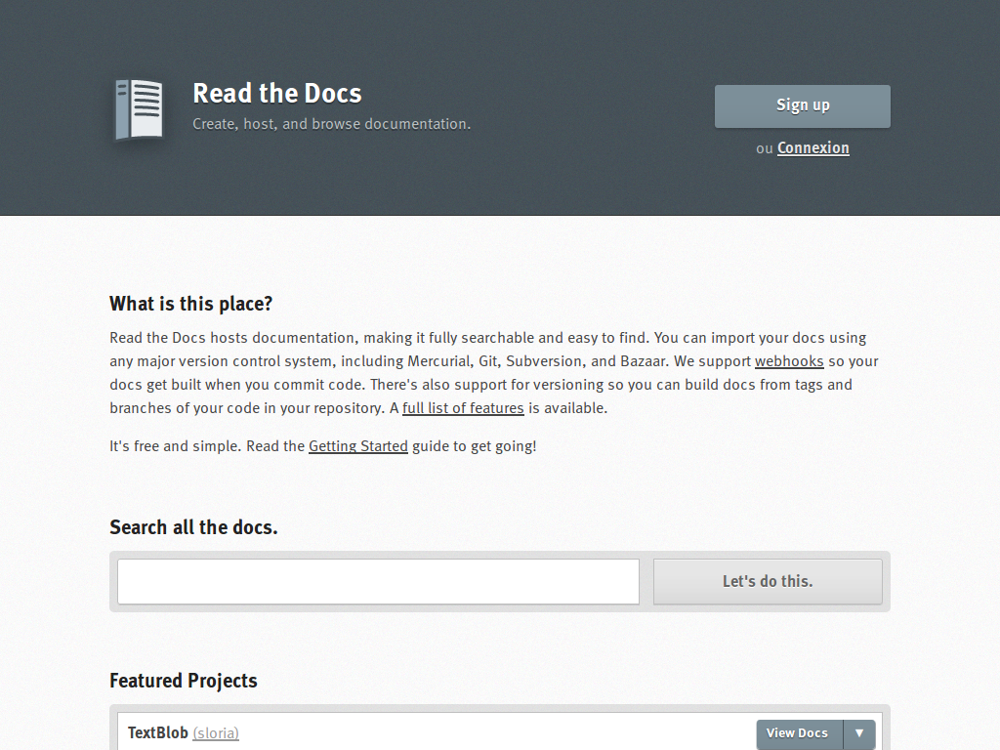
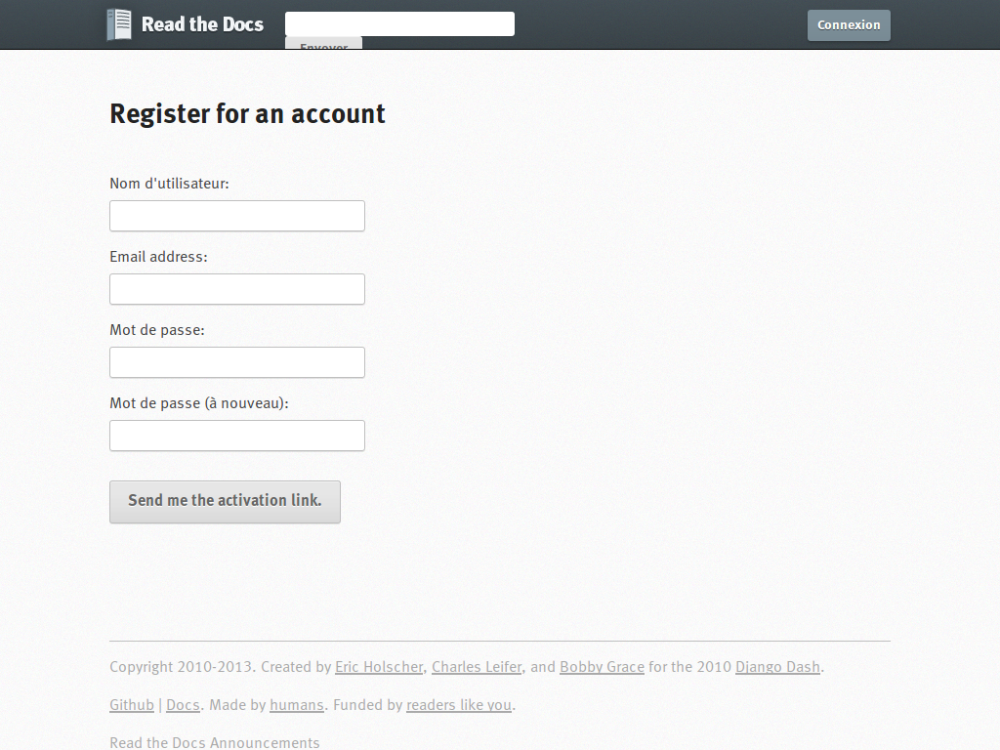
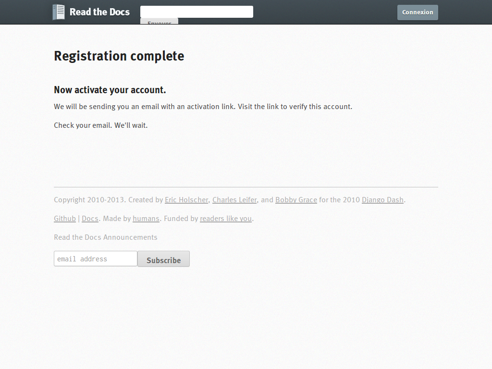
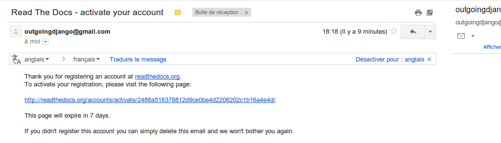
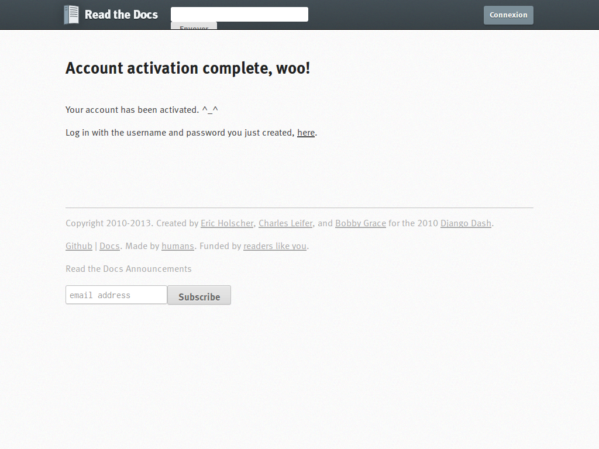

.. _documentation:

################
La documentation
################

.. warning::

   Cette rubrique est en cours de rédaction.

Tous les éléments qui suivent concernant la documentation sont les bonnes
pratiques qui permettent à toute la communauté openMairie de travailler sur
les mêmes bases et avec les mêmes références.

*********
Préambule
*********

******
Sphinx
******

Installer sphinx
================

**********************************
Structure type d'une documentation
**********************************

Le manuel de l'utilisateur
==========================

Le guide du développeur
=======================

**********
github.com
**********

Contribuer à une documentation
==============================

***************
ReadTheDocs.org
***************

Public(s) concerné(s) : Administrateur de projet openMairie.

Action(s) à effectuer : 

* Importer un nouveau projet
* Paramétrer une nouvelle version d'un projet existant

ReadTheDocs.org est un site qui héberge de la documentation, la rendant
accessible et facile à trouver. Il est possible d'importer les
documentations sur ce site depuis les système de gestion de version tel
que Subversion, Git ou d'autres. Ce site permet de gérer la mise à jour
automatique des documentations à chaque commit dans ces systèmes de gestion
de version. Le site supporte également le support des versions mais seulement
pour Git et non pas pour Subversion à l'heure où cette documentation est
rédigée.

L'objectif d'utiliser ce site est donc de ne pas avoir à se soucier de la 
génération des documentations. C'est ReadTheDcs.org qui s'en occupe et 
dans tous les formats html, pdf, epub, ... 

Créer son utilisateur sur RTD
=============================

C'est une opération très simple. D'abord il faut se connecter, grâce à son
navigateur à l'adresse http://readthedocs.org pour obtenir l'écran d'accueil
suivant.

Ensuite il faut cliquer sur le bouton "Sign up" en haut à droite de l'écran 
pour obtenir le formulaire de création de son utilisateur.

Ensuite il faut remplir le formulaire puis valider en cliquant sur le bouton
"Send me the activation link". Si l'écran suivant n'apparaît pas, il faut 
corriger les erreurs indiquées jusqu'à obtenir l'écran suivant.

Importer un nouveau projet sur RTD
==================================

*******************
docs.openmairie.org
*******************

Ce site permet de lister l'ensemble des documentation du projet openMairie.
