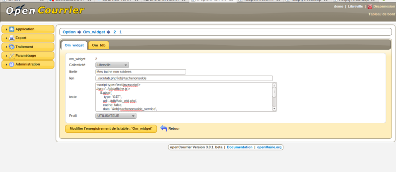
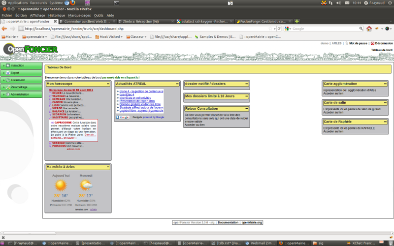
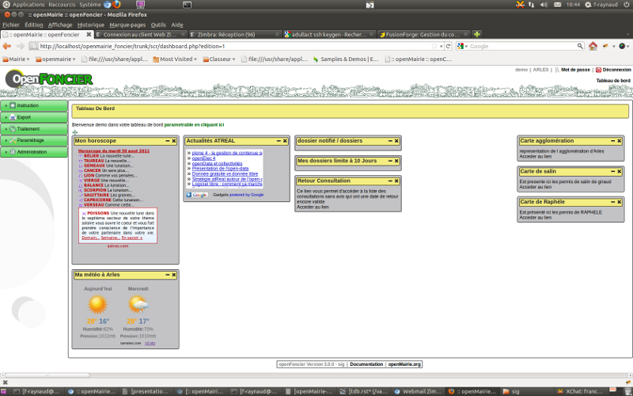

.. _tdb:

##########################
Tableau de bord et widgets
##########################

========
principe
========

Il est proposé dans ce chapître de décrire le tableau de bord paramètrable pour
les utilisateurs

-----------
paramétrage
-----------

l'accès au tableau de bord paramètrable dyn/dashboard.inc.php

(voir framework/paramétrage)

Par défaut, le tableau de bord paramétrable est activé, il peut être déconnecté en
enlevant le commentaire // die().

-----------
les widgets
-----------

Les widgets sont des liens et/ou de petits scripts paramétrables qui peuvent être rajoutés dans
le tableau de bord. Ces scripts sont conservés dans la table om_widget.

Chaque utilisateur paramètre son tableau de bord.

-------------------------------
le tableau de bord paramètrable
-------------------------------

Chaque utilisateur choisit ses widgets parmi ceux proposés dans l'application par
l'administrateur. Il peut placer ses widgets où il veut dans son tableau de bord.
Le paramétrage est conservé dans la table om_tdb

======
widget
======

Le widget est un petit script qui s'exécute dans le tableau de bord
dans une fenêtre normalisée.

Le script peut faire appel à l'application en cours ou a une application externe.
Nous avons mis quelques exemples dans les deux derniers paragraphes. 
Il est proposé d'abord de vous aider à créer les widgets.

---------------------
la création de widget
---------------------

La saisie des widget se fait dans administration -> om_widget.

La grille de saisie est la suivante ::

    libellé du widget qui apparaitra à l adition du widget dans le tableau de bord
    lien qui sera implémenté (# : pas de lien)
    texte : texte du widget (iframe, javascript, ajax ...)
    profil : profil autorisé pour le tableau de bord

Le tableau de bord, peut gérer toutes sortes d'informations internes ou externes à
l'application ::

    les taches non soldees pour openCourrier
    les appels à la maintenance
    l'horoscope, la météo, une vidéo, des photos ...

--------------------
Les widgets internes
--------------------

les liens sur les cartes (à mettre danbs le champ lien)::

    la carte de raphele avec tab_sig_point.php
    ../scr/tab_sig_point_db.php?obj=raphele_1&zoom=6
    celle de mas thibert :
    ../scr/tab_sig_point.php?obj=odp_6&zoom=7

les accès personnalisés "ajax"au travers de son code utilisateur (dans openCourrier) ::

    
    

Ce code lance dans le widget ../app/tab_wid.php?obj=tachenonsolde_service

tachenonsolde_service est initialisé dans sql/mysql/tachenonsolde_service.inc

Il ne s'affichera que la première page (paramétrer $serie pour le nombre d'enregistrement affichés)

Attention si vous affichez plusieurs widgets "openmairie", mettre un id different
pour chaque div (ici aff3)

--------------------
Les widgets externes
--------------------

Les autres applications openMairie peuvent aussi être accessibles par widget de la même
manière que le paragraphe ci dessus.

D'autres widgets externes sont accessibles en mettant dans le champ texte les
scripts suivants :

Acces à une video externe avec un "iframe" ::

    <iframe width='200' height='150'
        src='http://www.youtube.com/embed/gS5B4LlqkfI'
        frameborder='0' allowfullscreen>
    </iframe>

La meteo grace à un javascript du site tameteo.com ::

    

        <h2 id='h_f5089b722555454d1872b91f52beafd4'>
        <a href='http://www.tameteo.com/' title='Météo'>Météo</a></h2>
        
        
    

Horoscope au travers d un iframe qui pointe sr astroo.com ::

    <!--DEBUT CODE ASTROO-->
    <!--debut code perso-->
    <iframe width='232' height='302' marginheight='0' marginwidth='0' frameborder='0'
        align='center' src='http://www.astroo.com/horoscope.htm'
        name='astroo' allowtransparency='true'>
    <!--fin code perso-->
    <a href='http://www.astroo.com/horoscope.php' target='_top'
        title='Cliquez-ici pour afficher l'horoscope quotidien'>
        <b>afficher l'horoscope du jour</b>
        </a>
    </iframe>
    <noscript>
    <a href='http://www.astroo.com/horoscope.php' target='_blank'>horoscope</a>
    </noscript>
    <!--FIN CODE ASTROO-->

Acces à un fil rss avec un module ajax google ::

    

Affichage de photos avec flick 'r (appel javascript)::

    <table><tr>
    

    
    

    </tr></table>

===============================
le tableau de bord paramétrable
===============================

ce paragraphe propose de décrire l'utilisation du tableau de bord paramétrable par utilisateur

------------------------
accès au tableau de bord
------------------------

Le paramétrage se fait en cliquant sur le lien "paramétrer son tableau de bord"

Il apparait alors ::

    un "plus"  pour ajouter un widget pour une colone
    une croix pour supprimer un widget
    
Le déplacement du widget de haut en bas ou de gauche à droite se fait par copier/glisser avec la souris.

En cliquant sur "+", il est possible de rajouter des widgets dans son tableau de
bord

---------------
la table om_tdb
---------------

La table om_tbd comprend les champs suivants ::

    om_tdb int(8) NOT NULL,  : numero d ordre
    login varchar(40) NOT NULL, : login de l'utilisateur
    bloc varchar(10) NOT NULL, : bloc ou colone (c1 ou c2 ou c3)
    position int(8),   : position dans la colone
    om_widget int(8) NOT NULL, : numero de widget dans om_widget
    

Attention, en cas de changement de login, un utilisateur perd ses paramètres
