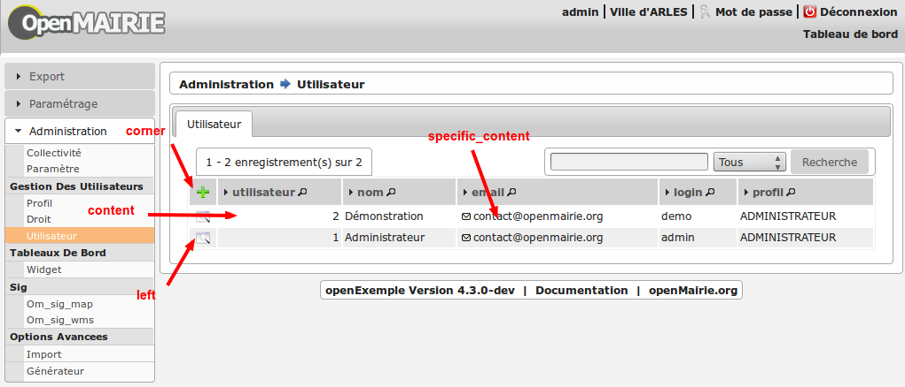

.. _actions-form:

############################
Les actions vers formulaires
############################

Les liens vers les formulaires sont principalement dans les tableaux et
formulaires de consultation d'objets.

====================
Actions des tableaux
====================

La surcharge des actions de tableaux se fait via les scripts
``sql/sgbd/objet.inc.php``.

L'ajout d'actions se présente de cette façon :

  .. code-block:: php

    <?php
        // Actions en coin ('corner') : ajouter
        $tab_actions['corner']['ajouter'] =
            array('lien' => 'form.php?obj='.$obj.'&amp;action=0',
                  'id' => '&amp;advs_id='.$advs_id.'&amp;tricol='.$tricol.
                          '&amp;valide='.$valide.'&amp;retour=tab',
                  'lib' => ''._('Ajouter').'',
                  'rights' => array('list' => array($obj, $obj.'_ajouter'),
                                      'operator' => 'OR'),
                  'ordre' => 10,);

        // Actions à gauche ('left'): consulter
        $tab_actions['left']['consulter'] =
            array('lien' => 'form.php?obj='.$obj.'&amp;action=3'.'&amp;idx=',
                  'id' => '&amp;premier='.$premier.'&amp;advs_id='.$advs_id.
                          '&amp;recherche='.$recherche1.'&amp;tricol='.$tricol.
                          '&amp;selectioncol='.$selectioncol.'&amp;valide='.
                          $valide.'&amp;retour=tab',
                  'lib' => ''.
                            _('Consulter').'',
                  'rights' => array('list' => array($obj, $obj.'_consulter'),
                              'operator' => 'OR'),
                  'ordre' => 10,);

        // Action sur la cinquième colonne de contenu
        $tab_actions['specific_content'][4] =
            array('lien' => 'form.php?obj='.$obj.'&amp;action=2'.'&amp;idx=',
                  'id' => '&amp;premier='.$premier.'&amp;advs_id='.$advs_id.
                          '&amp;recherche='.$recherche1.'&amp;tricol='.$tricol.
                          '&amp;selectioncol='.$selectioncol.
                          '&amp;valide='.$valide.'&amp;retour=tab',
                  'lib' => ''.
                            _('Consulter').'',
                  'rights' => array('list' => array($obj, $obj.'_consulter'),
                                    'operator' => 'OR'),
                  'ordre' => 10,);

    ?>

Plusieurs emplacements d'actions existent :

- corner : actions dans la première cellule du tableau
- left : action situées dans la première colonne, disponibles pour chaque élément du tableau
- content : action sur le contenu du tableau
- specific_content : action sur une colonne de contenu du tableau

Les actions par défaut
----------------------

Par défaut seules les actions ``ajouter`` et ``consulter`` sont disponibles
depuis les tableaux.

Créer de nouvelles actions
--------------------------

La création d'actions pour un tableau particulier se fait depuis le répertoire
``sql/sgbd/``.

Les actions doivent se définir dans les fichier ``objet.inc.php`` de la manière
suivante:

.. code-block:: php

   <?php

   $tab_actions['left']['modifier'] =
       array('lien' => 'form.php?obj='.$obj.'&amp;action=1'.'&amp;idx=',
             'id' => '&amp;premier='.$premier.'&amp;advs_id='.$advs_id.'&amp;recherche='.$recherche1.'&amp;tricol='.$tricol.'&amp;selectioncol='.$selectioncol.'&amp;valide='.$valide.'&amp;retour=tab',
             'lib' => ''._('Modifier').'',
             'rights' => array('list' => array($obj, $obj.'_modifier'), 'operator' => 'OR'),
             'ordre' => 20,);

   ?>

Définition de l'action
......................

La première clé de ``$tab_actions`` permet choisir la position d'affichage:

- ``corner`` pour les actions en coin;
- ``left`` pour les actions de gauche.

.. note::
   Depuis la version 4.3.0 d'openMairie, il est désormais possible d'afficher
   plusieurs actions dans le coin du tableau (au niveau de l'action
   ``ajouter``).

La seconde clé de ``$tab_actions`` permet de définir la nouvelle action. Cette
clé doit être différente de: ``ajouter``, ``consulter``, ``modifier`` et
``supprimer``.

Les clés ``lien``, ``id`` et ``lib`` s'utilise de la même manière qu'avant.

Définition du mode d'affichage en sous-tableau
..............................................

La clé ``ajax`` permet d'indiquer si l'action doit être affichée en ajax ou non
dans les sous-tableaux:

- ``true``, l'action utilisera la fonction ``ajaxIt()``;
- ``false``, l'action n'utilisera pas la fonction ``ajaxIt()``.

Définition de l'ordre d'affichage
.................................

La clé ``ordre`` permet de déterminer l'ordre d'affichage par rapport aux autres
actions.

Chaque action dispose d'une valeur numérique permettant de définir sa place au
sein d'une position. L'action numéro 1 s'affichera en premier, l'action numéro
10 s'affichera après les actions de numéro inférieur, etc.

Ordre des actions par défaut d'openMairie:

- ajouter à pour ordre 10 dans la position ``corner``;
- consulter à pour ordre 10 dans la position ``left``.

Si la position ``corner`` est sélectionnée:

- 9, l'action s'affichera avant l'action ``ajouter``;
- 11, l'action s'affichera après l'action ``ajouter``.

Si la position ``left`` est sélectionnée:

- 9, l'action s'affichera avant l'action ``consulter``;
- 11, l'action s'affichera après l'action ``consulter``.

Définition des droits d'affichage
.................................

La clé ``rights`` permet de définir le ou les droits nécessaires à l'utilisateur
pour visualiser cette action. Cette clé est optionnelle. Si ``rights`` n'existe
pas, tous les utilisateurs pourront visualiser cette action s'ils peuvent
visualiser le tableau correspondant.

La clé ``list`` permet de définir le tableau des droits nécessaire.

La clé ``operator`` permet de définir l'opérateur utilisé pour pour vérifier les
droits de la liste ``list``:

- ``OR``, l'utilisateur doit avoir au moins un droit;
- ``AND``, l'utilisateur doit avoir tous les droits.

=============================================
Actions du menu contextuel de la consultation
=============================================

Dans dyn/config.inc.php :

.. code-block:: php

   <?php
   /**
    * Parametre de gestion des nouvelles actions
    * Permet de definir si la gestion des actions se fait dans la classe ou non.
    * Si on decide d'utiliser les nouvelles actions alors il n'y à pas de
    * retro-compatibilité, les actions supplémentaires de portlet initialement
    * déclarées dans sql/pgsql/*.inc.php ne fonctionneront plus et devront
    * être initialisées dans les attributs de la classe ciblée.
    * Default : $config['activate_class_action'] = true;
    */
    $config['activate_class_action'] = true;
    ?>

Définition des actions dans les attributs de la classe de l'objet
-----------------------------------------------------------------

La configuration se fait dans les attributs des classes (obj/\*.class.php).

L'ajout d'une action se présente de cette façon :

.. code-block:: php

   <?php
    var $class_actions = array(
        2 => array(
            "portlet" => array(
                "libelle"=>"supprimer",
                "class" => "delete-16",
                "order"=>20,
                ),
            "method" => "supprimer",
            "button" => "supprimer",
            "permission_suffix" => "supprimer",
            "condition" => "delete_coll_condition"
        ),
    );
   ?>
   
La clé du tableau correspond à la valeur $maj, le paramètre "method" correspond
à la méthode appelée lors de la validation du formulaire, "button" est le texte du bouton de validation,
"permission_suffix" est le suffixe du droit qui sera testé lors de l'affichage de l'action,
"condition" permet de définir une méthode qui sera appelée avant l'affichage de l'action dans
le portlet, si cette méthode retourne "true" l'action sera affichée.

Si la clé "portlet" est définie l'action correspondante sera affichée (sous condition),
la clé "libelle" est le texte affiché sur le lien, la classe définie dans "class" sera ajoutée à celles
du lien, "order" permet de définir l'ordre, la clé "url" peu être utilisé pour définir une url spécifique.
   
Les action de classes permettent de surcharger les actions ajouter, modifier,
consulter et supprimer définies dans core/om_db_form.class.php.

Définition des actions dans \*.form.inc.php (obsolète)
------------------------------------------------------

Dans dyn/config.inc.php :

.. code-block:: php

    <?php
    $config['activate_class_action'] = false;
    ?>

La configuration des actions du menu contextuel des formulaires en consultation
se fait via les scripts ``sql/sgbd/objet.form.inc.php``

Dans ces scripts, peuvent être surchargés, la liste des champs (ordre ou champs
affichés), requêtes sql permettant de remplir les widget de formulaires ainsi
que les actions du menu contextuel.

L'ajout d'une action se présente de cette façon :

.. code-block:: php

   <?php
   $portlet_actions['edition'] = array(
       'lien' => '../pdf/pdflettretype.php?obj=om_utilisateur&amp;idx=',
       'id' => '',
       'lib' => ''._('Edition').'',
       'ajax' => false,
       'ordre' => 21,
   );
   ?>
