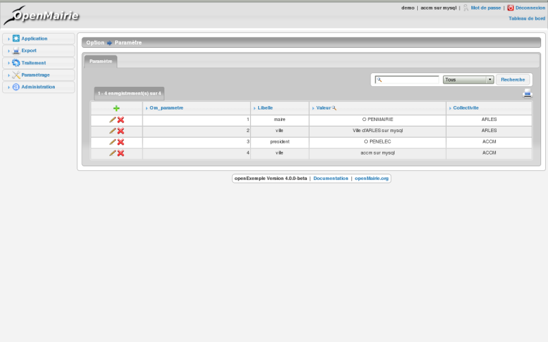

.. _affichage:

###################
Afficher les tables
###################

Il est décrit dans ce paragraphe, l'utilisation et la configuration des tableaux
d'enregistrements issus de la base de données.

La gestion des tableaux se base sur le fichier core/om_table.class.php
(classe table)

Pour chaque affichage de tableau, le script sql/DBTYPE/[objet].inc.php
correspondant est appelé. Il permet de stocker le détail des requêtes
nécessaires à l'affichage du contenu.

Les tableaux sont construits lors de l'appel aux scripts scr/tab.php et
scr/soustab.php.

=========================================
Les script scr/tab.php et scr/soustab.php
=========================================

L'appel à ces scripts permet d'afficher un tableau d'enregistrements de
l'objet passé en paramètre.

Liste des paramètres passés à l'url :

- obj : nom de l'objet pour lequel on souhaite afficher le tableau
- premier : numéro de la première ligne affichée dans le tableau
- recherche : chaîne de caractères recherchée depuis le modules de recherche
- selectioncol : numéro de la colonne sélectionnée dans le module de recherche
- tricol : numéro de colonne et orientation (+/-) du tri du tableau
- valide : (true/false) affiche ou non les enregistrements non valide

L'appel à scr/soustab.php est fait en javascript depuis un formulaire afin
d'afficher les informations liées à l'enregistrement en cours d'édition.

==========================
La requête SQL d'affichage
==========================

Elle se trouve dans sql/DBTYPE/[objet].inc.php

Les paramètres sont les suivants pour om_parametre.inc.php

.. code-block:: php

   <?php
   //Nombre d'enregistrements par page
   $serie=15;
   //Icone affiché (XXX à voir deprecated)
   $ico="../img/ico_application.png";
   //Titre du tableau
   $ent = _("option")." -> "._("om_parametre");                              
   //Table de référence (il peut y avoir une ou plusieurs jointure)
   $table=DB_PREFIXE."om_parametre";
   //Liste des champs du tableau
   $champAffiche=array('om_parametre',
                       'libelle',
                       'valeur',
                       'om_collectivite');
   //Champs pour la recherche
   $champRecherche=array('libelle','valeur');
   //Critère de tri par défaut
   $tri="";
   //édition PDF
   $edition="om_parametre";
   //sous formulaire(s) associé(s)
   $sousformulaire= array()

   //autre exemple de sous-formulaire avec om_collectivite.inc.php
   $sousformulaire=array('om_etat',
                   'om_lettretype',
                   'om_parametre',
                   'om_sousetat',
                   'om_utilisateur');
   ?>

Il est possible de surcharger les liens du tableau (voir 
:ref:`la configuration des actions<actions-form>`)

===================
Les fonctionnalités
===================

- la recherche simple
- la recherche avancée
- la pagination
- le tri
- les éléments archivés
- l'export PDF
- l'export CSV
- les actions

l'export CSV
------------

L'export CSV peut être activé seulement si la recherche avancée est configurée sur le listing. Il suffit donc de rajouter dans le tableau de paramétrage de cette dernière la clé 'export' avec la valeur array('csv', ) comme le montre l'exemple suivant :

.. code-block:: php

   $options [] = array (
   		'type' => 'search',
   		'display' => true,
   		'advanced' => $champs,
   		'export' => array('csv',),
   		'default_form' => 'advanced',
   		'absolute_object' => 'facture' 
   );

.. NOTE::
  Par défaut l'export CSV reprend la requête SQL d'affichage définie précédemment.
  Le script de paramétrage ``../sql/pgsql/<OBJ>.export_csv.inc.php`` permet
  de surcharger ses paramètres.

  Exemple d'utilisation : écraser ``$champAffiche``
  pour redéfinir les colonnes du CSV exporté.

=======================
Le composant openMairie
=======================

tab.php utilise les méthodes d'om_table.class.php qui est une classe
d'openMairie ::

    core/om_table.class.php

Les méthodes de ce composant peuvent être surchargées dans
obj/om_table.class.php
