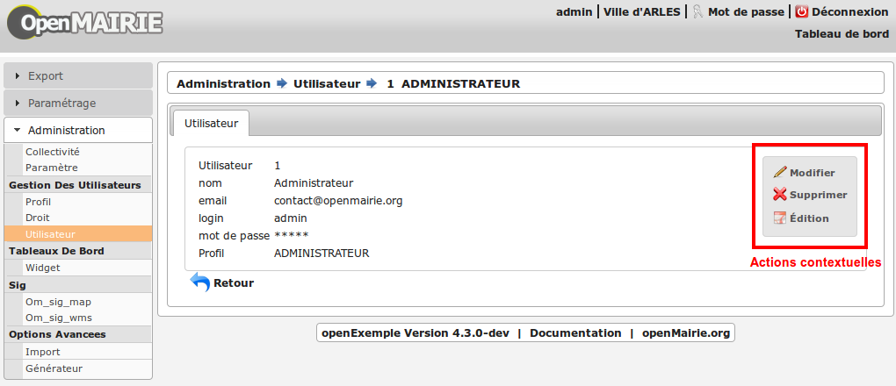
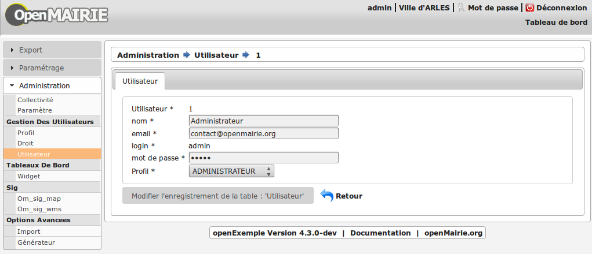

.. _formulaire:

###############
Les formulaires
###############

Les formulaires openMairie sont une visualisation d'un objet d'une classe métier.

============
Introduction
============

Les formulaires permettent la consultation, l'ajout, la modification et la 
suppression d'enregistrements des tables de la base de données.

Consultation
------------

La consultation d'un élément est construite de la même façon qu'un
formulaire. Elle contient une liste d'actions contextuelles configurable.
Les données ne sont pas éditables.

Ajout
-----

L'ajout permet l'éditions de données. Lors de la validation,
un traitement spécifique des données est effectué.
Si la clé primaire de la table est automatique alors elle est générée.

Modification
------------

L'ouverture d'un élément en modification permet l'éditions de données
déjà existantes, lors de la validation du formulaire les données sont traitées,
vérifiées puis envoyées dans la base.

Suppression
-----------

Accessible depuis la liste des actions contextuelles, une confirmation est
demandée pour chaque suppression.

Accès
-----

L'accès aux formulaires se fait depuis un :ref:`tableau d'éléments<affichage>`
ou depuis la consultation d'un élément via le menu contextuel.

Par défaut, depuis les tableaux, les actions d'ajout et consultation sont
disponible.

=====================
Description technique
=====================

La gestion des formulaires se base sur deux classes :
    - formulaire : core/om_formulaire.class.php
    - dbform : core/om_dbform.class.php

La classe "formulaire" permet la gestion de l'affichage et "dbform"
gère le traitement des données et la liaison à la base de données.

scr/form.php et scr/sousform.php
--------------------------------

Ces scripts sont appelés pour afficher un formulaire.
Ils instancient l'objet et appellent la méthode formulaire de celui-ci.

Ces scripts prennent plusieurs paramètres :

- obj : nom de la classe pour laquelle on souhaite afficher le formulaire
- action : type d'action (ajout, modification, suppression, consultation)
- idx : identifiant (dans la base de données) de l'élément sur lequel on
  souhaite effectuer l'action
- retour : deux valeurs possible tab ou form selon l'origine de l'action

Le paramètre "action" peut prendre 4 valeurs :

- 0 : affiche un formulaire d'ajout, le paramètre idx n'est donc pas nécessaire.
- 1 : affiche le formulaire de modification.
- 2 : affiche le formulaire de suppression.
- 3 : affiche le formulaire de consultation.

Les autres paramètres passés permettent de conserver la configuration du tableau
d'origine.

La fonction **verrou**
----------------------

.. note::
   Cette description correspond au fonctionnement du verrou depuis la version 4.5.0.

La fonction **verrou** a pour objectif d'empêcher la double soumission de formulaire côté serveur. Elle est active dans les VIEW ``formulaire()`` et ``sousformulaire()``. A chaque affichage de formulaire, lorsqu'un bouton est affiché alors on insère un champ caché (input de type hidden) qui contient comme valeur un identifiant généré et supposé unique, puis on stocke cet identifiant dans une liste dédiée dans la variable de session de l'utilisateur connecté. Lors de la soumission du formulaire, on vérifie que la valeur de l'identifiant postée avec le formulaire est bien présente dans la liste dédiée dans la variable de session, si c'est le cas on enlève la valeur de cette liste et on exécute le traitement. Si ce n'est pas le cas, cela signifie que le formulaire a déjà été soumis au préalable donc on affiche une erreur à l'utilisateur.

Les trois méthodes de l'ancienne implémentation ``verrouille()``, ``deverouille()`` et ``testverrou()`` ont été vidées et conservées pour la réto-compatibilité des applications. Tous les appels à ces méthodes ont été supprimés du framework. Ces méthodes sont vides dans la version 4.5.0 et seront supprimées dans la 4.6.0. 

La fonction **directlink**
--------------------------

La fonction **directlink** a pour objectif d'accéder via une URL à une vue spécifique d'un objet dans un onglet dans le contexte d'un formulaire. Ce sont les script ``spg/direct_link.php`` et ``scr/form.php`` qui sont en charge de réaliser l'opération. 

Paramètres du script ``spg/direct_link.php`` qui récupère l'identifiant de l'objet parent lié et l'identifiant de l'onglet correspondant à la classe de l'objet à afficher :

- obj (*obligatoire) : classe de l'objet contexte
- action (*obligatoire) : action sur l'objet contexte
- idx (optionnel soit idx soit direct_field) : identifiant de l'objet contexte
- direct_field  (optionnel soit idx soit direct_field) : nom du champ contenant l'identifiant de l'objet contexte 
- direct_form (*obligatoire) : nom de l'objet direct a afficher
- direct_action (*obligatoire) : action a effectuer sur l'objet direct
- direct_idx (*obligatoire) : identifiant de l'objet direct à afficher

Paramètres du script ``scr/form.php`` :

- obj
- action
- idx
- direct_form
- direct_action
- direct_idx
- identifiant de l'onglet #ui-tabs

Par exemple, pour accéder au formulaire de modification de l'utilisateur dont l'identifiant est le 1 dans le contexte de sa collectivité directement via une URL voici l'URL à appeler :

.. code-block:: php

   ../spg/direct_link.php?obj=om_collectivite&action=3&direct_field=om_collectivite&direct_form=om_utilisateur&direct_action=1&direct_idx=1

Celle ci va rediriger vers :

.. code-block:: php

   ../scr/form.php?obj=om_collectivite&action=3&idx=1&direct_form=om_utilisateur&direct_idx=1&direct_action=1#ui-tabs-1

.. note::
   *Limitations* - Ne peut fonctionner que si : 

    - la vue par défaut de l'onglet est un soustab standard et non une vue par défaut
    - l'objet doit contenir dans son modèle de données un champ contenant l'identifiant de l'objet du contexte souhaité si on utilise le paramètre direct_field

.. _class-dbform:

===============================
Description de la classe dbform
===============================

.. class:: dbform($id, &$db, $DEBUG = false)

   Cette classe est centrale dans l'application. Elle est la classe parente de
   chaque objet métier.
   Elle comprend des méthodes de gestion (initialisation, traitement,
   vérification, trigger) des valeurs du formulaire.
   Elle fait le lien entre la base de données et le formulaire.
   Elle contient les actions possibles sur les objets (ajout, modification,
   suppression, consultation).

Présentation des méthodes de la classe
--------------------------------------

Les méthodes de dbform peuvent être surchargées dans obj/om_dbform.class.php
ainsi que dans toutes les classes métier.

Méthodes d'initialisation de l'affichage du formulaire
------------------------------------------------------

  .. method:: dbform.formulaire($enteteTab, $validation, $maj, &$db, $postVar, $aff, $DEBUG = false, $idx, $premier = 0, $recherche = "", $tricol = "", $idz = "", $selectioncol = "", $advs_id = "", $valide = "", $retour = "", $actions = array(), $extra_parameters = array())

     Méthode d'initialisation de l'affichage de formulaire.

  .. method:: dbform.sousformulaire($enteteTab, $validation, $maj, &$db, $postVar, $premiersf, $DEBUG, $idx, $idxformulaire, $retourformulaire, $typeformulaire, $objsf, $tricolsf, $retour= "", $actions = array())

     Méthode d'initialisation de l'affichage de sous formulaire.

Ces méthodes instancient un objet "formulaire" et initialisent certains de ses
attributs via les méthodes suivantes :

  .. method:: dbform.setVal(&$form, $maj, $validation)

     Permet de définir les valeurs des champs en contexte formulaire

  .. method:: dbform.setValsousformulaire(&$form, $maj, $validation, $idxformulaire, $retourformulaire, $typeformulaire)

     Permet de définir les valeurs des champs en contexte sous-formulaire

  .. method:: dbform.set_form_default_values(&$form, $maj, $validation)

     Permet de définir les valeurs des champs en contextes formulaire et sous-formulaire

  .. method:: dbform.setType(&$form, $maj)

     Permet de définir le type des champs

  .. method:: dbform.setLib(&$form, $maj)

     Permet de définir le libellé des champs

  .. method:: dbform.setTaille(&$form, $maj)

     Permet de définir la taille des champs

  .. method:: dbform.setMax(&$form, $maj)

     Permet de définir le nombre de caractères maximum des champs

  .. method:: dbform.setSelect(&$form, $maj, $db, $DEBUG = false)

     Méthode qui effectue les requêtes de configuration des champs

  .. method:: dbform.init_select(&$form = null, &$db = null, $maj, $debug, $field, $sql, $sql_by_id, $om_validite = false, $multiple = false)

     Méthode qui permet la configuration des select et select multiple, elle effectue
     les requêtes et met en forme le tableau des valeurs à afficher.
     Il est possible de définir si le champ lié est affecté par une
     date de validité ou de configurer l'affichage de select_multiple.

  .. method:: dbform.setOnchange(&$form, $maj)

     Permet de définir l'attribut "onchange" sur chaque champ

  .. method:: dbform.setOnkeyup(&$form, $maj)

     Permet de définir l'attribut "onkeyup" sur chaque champ

  .. method:: dbform.setOnclick(&$form, $maj)

     Permet de définir l'attribut "onclick" sur chaque champ

  .. method:: dbform.setGroupe(&$form, $maj)

     Permet d’aligner plusieurs champs (obsolète depuis la version 4.3.0)

  .. method:: dbform.setRegroupe(&$form, $maj)

     Permet de regrouper les champs dans des fieldset (obsolète depuis la
     version 4.3.0)

  .. method:: dbform.setLayout(&$form, $maj)

     Méthode de mise en page, elle permet de gérer la hiérarchie d'ouverture et
     fermeture des balises div et fieldset avec les méthodes :

      .. method:: formulaire.setBloc($champ, $contenu, $libelle = '', $style = '')

         permet d'ouvrir/fermer ($contenu=D/F) une balise div sur un champ
         ($champ), avec un libellé ($libelle) et un attribut class ($style).

          - une liste de classes css pour fieldset est disponible : 'group' permet
            une mise en ligne des champs contenu dans le div et 'col_1 à col_12' 
            permet une mise en page simplifiée (par exemple : "col_1" permet de 
            définir une taille dynamique de 1/12ème de la page , col_6 correspond 
            à 6/12 soit 50% de l'espace disponible).

          - il est possible de créer et ajouter des classes css aux différents
            div afin d'obtenir une mise en page personnalisé.

      .. method:: formulaire.setFieldset($champ, $contenu, $libelle = '', $style = '')

         permet d'ouvrir/fermer ($contenu=D/F) un  fieldset sur un champ
         ($champ), avec une légende ($libelle) et un attribut class ($style).

          - une liste de classes css pour fieldset est disponible : 'collapsible'
            ajoute un bouton sur la légende (jQuery) afin de refermer le fieldset 
            et 'startClosed' idem à la différence que le fieldset est fermé au
            chargement de la page.

      - exemple d'implémentation de la méthode setLayout() sans utiliser les
        méthodes setGroupe() et setRegroupe() :

        .. code-block:: php

          <?php
          function setLayout(&$form, $maj) {
            //Ouverture d'un div sur une colonne de 1/2 (6/12) de la largeur du
            //conteneur parent
            $form->setBloc('om_collectivite','D',"","col_6");
              //Ouverture d'un fieldset
              $form->setFieldset('om_collectivite','D',_('om_collectivite'),
                                "collapsible");
                //Ouverture d'un div les champs compris entre
                //"om_collectivite" et "actif"
                //la classe group permet d'afficher les champs en ligne
                $form->setBloc('om_collectivite','D',"","group");
                //Fermeture du groupe
                $form->setBloc('actif','F');
              //Fermeture du fieldset
              $form->setFieldset('actif','F','');
            //Fermeture du div de 50%
            $form->setBloc('actif','F');

            //Ouverture d'un div sur une colonne de 1/2 de la largeur du
            //conteneur parent
            $form->setBloc('orientation','D',"","col_6");
              $form->setFieldset('orientation', 'D',
                                  _("Parametres generaux du document"),
                                  "startClosed");
                $form->setBloc('orientation','D',"","group");
                $form->setBloc('format','F');

                $form->setBloc('footerfont','D',"","group");
                $form->setBloc('footertaille','F');

                $form->setBloc('logo','D',"","group");
                $form->setBloc('logotop','F');
              $form->setFieldset('logotop','F','');
            $form->setBloc('logotop','F');

            //Ouverture d'un div de largeur maximum sur un seul champ
            $form->setBloc('titre','DF',"","col_12");

            //Ouverture d'un div de largeur maximum
            $form->setBloc('titreleft','D',"","col_12");
              $form->setFieldset('titreleft','D',
                                  _("Parametres du titre du document"),
                                  "startClosed");
                $form->setBloc('titreleft','D',"","group");
                $form->setBloc('titrehauteur','F');

                $form->setBloc('titrefont','D',"","group");
                $form->setBloc('titrealign','F');
              $form->setFieldset('titrealign','F','');
            $form->setBloc('titrealign','F');

            //Ouverture d'un div de largeur maximum sur un seul champ
            $form->setBloc('corps','DF',"","col_12");

            //Ouverture d'un div de largeur maximum
            $form->setBloc('corpsleft','D',"","col_12");
              $form->setFieldset('corpsleft','D',
                                  _("Parametres du corps du document"),
                                  "startClosed");
                $form->setBloc('corpsleft','D',"","group");
                $form->setBloc('corpshauteur','F');

                $form->setBloc('corpsfont','D',"","group");
                $form->setBloc('corpsalign','F');
              $form->setFieldset('corpsalign','F','');
            $form->setBloc('corpsalign','F');

            //Ouverture d'un div de largeur maximum sur un seul champ
            $form->setBloc('om_sql','DF',"","col_12");

            //Ouverture d'un div de 1/2 de la largeur du conteneur parent
            $form->setBloc('om_sousetat','D',"","col_6");
              $form->setFieldset('om_sousetat','D',
                                  _("Sous etat(s) : selection"),
                                  "startClosed");
                $form->setBloc('om_sousetat','D',"","group");
                $form->setBloc('sousetat','F');
              $form->setFieldset('sousetat','F', '');
            $form->setBloc('sousetat','F');

            //Ouverture d'un div de 1/2 de la largeur du conteneur parent
            $form->setBloc('se_font','D',"","col_6");
              $form->setFieldset('se_font','D',
                                  _("Sous etat(s) : police / marges / couleur"),
                                  "startClosed");
                $form->setBloc('se_font','D',"","group");
                $form->setBloc('se_couleurtexte','F');
              $form->setFieldset('se_couleurtexte','F','');
            $form->setBloc('se_couleurtexte','F');
          }
          ?>

Méthodes d'actions
------------------

Ces méthodes sont appelées lors de la validation du formulaire.

  .. method:: dbform.ajouter($val, &$db = NULL, $DEBUG = false)

     Cette méthode permet l'insertion de données dans la base, elle appelle
     toutes les méthodes de traitement, vérification et méthodes
     spécifiques à l'ajout.

  .. method:: dbform.modifier($val = array(), &$db = NULL, $DEBUG = false)

     Cette méthode permet la modification de données dans la base, elle appelle
     toutes les méthodes de traitement et vérification des données retournées
     par le formulaire.

  .. method:: dbform.supprimer($val = array(), &$db = NULL, $DEBUG = false)

     Cette méthode permet la suppression de données dans la base, elle appelle
     toutes les méthodes de traitement et vérification des données retournées
     par le formulaire.

Gestion des transactions lors de l'appel aux méthodes d'actions
---------------------------------------------------------------

Afin de verifier les erreurs de base de données, la méthode isError est appelée,
si la valeur true lui est passée en second paramètre elle ne stop pas l'execution
mais retour true ou false. Cela dans le but d’appeler ces méthodes sur des objets
métier instanciés manuellement dans des contextes qui n'utilise pas la classe formulaire.
Exemple : lors de la création d'un web service qui instancierait une classe,
si une erreur de base de données se produit, le script s'arrête et aucun message ne 
peut être transmis au client du web service, ce qui ne se produit pas si le second
paramètre est défini à true.

Il est important d'instancier un objet métier et d'appeler les méthodes ajouter, 
modifier ou supprimer pour effectuer un changement sur celui-ci car toutes les
méthodes de trigger seront appelées.

Méthodes appelées lors de la validation
---------------------------------------

.. _setValFAjout:

  .. method:: dbform.setValFAjout($val = array())

     Méthode de traitement des données retournées par le formulaire
     (utilisé lors de l'ajout)

.. _setValF:

  .. method:: dbform.setvalF($val = array())

     Méthode de traitement des données retournées par le formulaire

.. _verifier:

  .. method:: dbform.verifier($val = array(), &$db = NULL, $DEBUG = false)

     Méthode de vérification des données et de retour d'erreurs

.. _verifierAjout:

  .. method:: dbform.verifierAjout($val = array(), &$db = NULL)

     Méthode de vérification des données et de retour d'erreurs
     (utilisé lors de l'ajout)

  .. method:: dbform.setId(&$db = NULL)

     Initialisation de la clé primaire (si clé automatique lors de l'ajout)

  .. method:: dbform.cleSecondaire($id, &$db = NULL, $val = array(), $DEBUG = false)

     Cette méthode est appelée lors de la suppression d'un objet, elle permet
     de vérifier si l'objet supprimé n'est pas lié à une autre table pour
     en empêcher la suppression.

  .. method:: dbform.triggerajouter($id, &$db = NULL, $val = array(), $DEBUG = false)

     Permet d'effectuer des actions avant l'insertion des données dans la base

  .. method:: dbform.triggerajouterapres($id, &$db = NULL, $val = array(), $DEBUG = false)

     Permet d'effectuer des actions après l'insertion des données dans la base

  .. method:: dbform.triggermodifier($id, &$db = NULL, $val = array(), $DEBUG = false)

     Permet d'effectuer des actions avant la modification des données dans la base

  .. method:: dbform.triggermodifierapres($id, &$db = NULL, $val = array(), $DEBUG = false)

     Permet d'effectuer des actions après la modification des données dans la base

  .. method:: dbform.triggersupprimer($id, &$db = NULL, $val = array(), $DEBUG = false)

     Permet d'effectuer des actions avant la modification des données dans la base

  .. method:: dbform.triggersupprimerapres($id, &$db = NULL, $val = array(), $DEBUG = false)

     Permet d'effectuer des actions après la modification des données dans la base

===================================
Description de la classe formulaire
===================================

.. class :: formulaire($unused = NULL, $validation, $maj, $champs = array(), $val = array(), $max = array())

   Cette classe permet une gestion complète de l'affichage d'un formulaire.

Les méthodes de core/om_formulaire.class.php peuvent être surchargées dans
obj/om_formulaire.class.php

.. _méthodes-affichage-widget:

Méthodes d'affichage de widgets
-------------------------------

Les widgets sont des éléments de formulaire, ils sont composés d'un ou plusieurs
champs. Chaque méthode permet d'afficher un seul widget.

    .. method:: formulaire.text()

       champ texte (format standard)

    .. method:: formulaire.hidden()

       champ non visible avec valeur conservée

    .. method:: formulaire.password()

       champ password

    .. method:: formulaire.textdisabled()

       champ texte non modifiable (grisé)

    .. method:: formulaire.textreadonly()

       champ texte non modifiable

    .. method:: formulaire.hiddenstatic()

       champ non modifiable, la valeur est récupéré par le formulaire.

    .. method:: formulaire.hiddenstaticnum()

       champ numérique non modifiable et valeur récupérer

    .. method:: formulaire.statiq()

       Valeur affichée et non modifiable

    .. method:: formulaire.affichepdf()

       récupère un nom d'objet (un scan pdf)

    .. method:: formulaire.checkbox()

       case à cocher valeurs possibles : ``True`` ou ``False``

    .. method:: formulaire.checkboxstatic()

       affiche Oui/Non, non modifiable (mode consultation)

    .. method:: formulaire.checkboxnum()

       cochée = 1 , non cochée = 0

    .. method:: formulaire.http()

       lien http avec target = _blank (affichage dans une autre fenêtre)

    .. method:: formulaire.httpclick()

       lien avec affichage dans la même fenêtre.

    .. method:: formulaire.date()

       date modifiable avec affichage de calendrier jquery

    .. method:: formulaire.date2()

       date modifiable avec affichage de calendrier jquery pour les sous-formulaires

    .. method:: formulaire.hiddenstaticdate()

       date non modifiable Valeur récupéré par le formulaire

    .. method:: formulaire.datestatic()

       affiche la date formatée, non modifiable (mode consultation)

    .. method:: formulaire.textarea()

       affichage d un textarea

    .. method:: formulaire.textareamulti()

       textarea qui récupère plusieurs valeurs d'un select

    .. method:: formulaire.textareahiddenstatic()

       affichage non modifiable d'un textarea et récupération de la valeur

    .. method:: formulaire.pagehtml()

       affichage d'un textarea et transforme les retours charriot en </ br>

    .. method:: formulaire.select()

       champ select

    .. method:: formulaire.selectdisabled()

       champ select non modifiable

    .. method:: formulaire.selectstatic()

       affiche la valeur de la table liée, non modifiable (mode consultation)

    .. method:: formulaire.selecthiddenstatic()

       affiche la valeur de la table liée, non modifiable ainsi que la valeur
       dans un champ hidden

    .. method:: formulaire.select_multiple()

       affiche un select multiple, les valeurs passées au formulaires doivent être
       séparées par une virgule.

    .. method:: formulaire.select_multiple_static()

       affiche seulement les valeurs d'un select multiple, les valeurs passées au
       formulaires doivent être séparées par une virgule.

    .. method:: formulaire.comboG()

       permet d'effectuer une corrélation entre un groupe de champ et un
       identifiant dans les formulaires

    .. method:: formulaire.comboG2()

       permet d'effectuer une corrélation entre un groupe de champ et un
       identifiant dans les sous formulaires

    .. method:: formulaire.comboD()

       permet d'effectuer une corrélation entre un groupe de champ et un
       identifiant dans les formulaires

    .. method:: formulaire.comboD2()

       permet d'effectuer une corrélation entre un groupe de champ et un
       identifiant dans les sous formulaires

    .. method:: formulaire.upload()

       fait appel à spg/upload.php pour télécharger un fichier

    .. method:: formulaire.upload2()

       fait appel à spg/upload.php pour télécharger un fichier dans un sous
       formulaire

    .. method:: formulaire.voir()

       fait appel à spg/voir.php pour visualiser un fichier

    .. method:: formulaire.voir2()

       fait appel à spg/voir.php pour visualiser un fichier depuis un sous
       formulaire

    .. method:: formulaire.localisation()

       fait appel à spg/localisation.php

    .. method:: formulaire.localisation2()

       fait appel à spg/localisation.php

    .. method:: formulaire.rvb()

       fait appel à spg/rvb.php pour affichage de la palette couleur

    .. method:: formulaire.rvb2()

       fait appel à spg/rvb.php pour affichage de la palette couleur

    .. method:: formulaire.geom()

       ouvre une fenêtre tab_sig.php pour visualiser ou saisir une géométrie
       (selon l'action) la carte est définie en setSelect

Les widgets comboG, comboD, date, upload, voir et localisation sont à mettre
dans les formulaires.
Les contrôle comboG2, comboD2, date2, upload2, voir2 et localisation sont à
mettre dans les sous formulaires.

Les widgets font appel des scripts d'aide à la saisie stockés dans le répertoire
/spg, ils sont appelés par js/script.js. Ce script peut être surchargé dans
app/js/script.js.

**spg/combo.php**

Ce programme est appelé par le champ comboD, comboG, comboD2, comboG2,
le paramétrage se fait dans les fichiers :

- dyn/comboparametre.inc.php
- dyn/comboretour.inc.php
- dyn/comboaffichage.inc.php

**spg/localisation.php** et js/localisation.js

ce programme est liée au champ formulaire "localisation".

**spg/voir.php** 

Ce script est associé au champ "upload".
    
Ce sous programme permet de visualiser un fichier téléchargé sur le serveur
(pdf ou image).

**spg/upload.php**

Ce script utilise la classe core/upload.class.php (composant openMairie).

Le paramétrage des extensions téléchargeables se fait dans dyn/config.inc.php.
Le paramétrage de la taille maximale des fichiers téléchargeables se fait dans la classe métier de l'objet.

**spg/rvb.php** et js/rvb.js

Ce script est associé au champ "rvb" et affiche une palette de couleur pour
récupérer un code rvb.

.. _méthodes-construction-formulaire:

Les  méthodes de construction et d'affichage
--------------------------------------------

Le formulaire est constitué de div, fieldset et de champs les méthodes suivantes
permettent une mise en page structurée.

    .. method:: formulaire.entete()

       ouverture du conteneur du formulaire.

    .. method:: formulaire.enpied()

       fermeture du conteneur du formulaire.

    .. method:: formulaire.afficher()

       affichage des champs, appelle les méthodes suivante :

    .. method:: formulaire.debutFieldset()

       ouverture de fieldset.

    .. method:: formulaire.finFieldset()

       fermeture de fieldset

    .. method:: formulaire.debutBloc()

      ouverture de div.

    .. method:: formulaire.finBloc()

      fermeture de div.

    .. method:: formulaire.afficherChamp()

       affichage de champ.

.. _méthodes-assesseurs:

Les méthodes assesseurs changent les valeurs des attributs de l'objet formulaire
--------------------------------------------------------------------------------

Ces méthodes sont appelées depuis les classes métier, elles permettent la
configuration du formulaire.

    .. method:: formulaire.setType()

       type de champ

    .. method:: formulaire.setVal()

       valeur du champ

    .. method:: formulaire.setLib()

       libellé du champ

    .. method:: formulaire.setSelect()

       permet de remplir les champs select avec la table liée

    .. method:: formulaire.setTaille()

       taille du champ

    .. method:: formulaire.setMax()

       nombre de caractères maximum acceptés

    .. method:: formulaire.setOnchange()

       permet de définir des actions sur l'événement "onchange"

    .. method:: formulaire.setKeyup()

       permet de définir des actions sur l'événement "onkeyup"

    .. method:: formulaire.setOnclick()

       permet de définir des actions sur l'événement "onclick"

    .. method:: formulaire.setvalF()

       permet de traiter les données avant insert/update dans la base de données

    .. method:: formulaire.setGroupe()

       (obsolète depuis 4.3.0)

    .. method:: formulaire.setRegroupe()

       (obsolète depuis 4.3.0)

    .. method:: formulaire.setBloc($champ, $contenu, $libelle = '', $style = '')

       permet d'ouvrir/fermer ($contenu=D/F/DF) une balise div sur un champ
       ($champ), avec un libellé ($libelle) et un attribut class ($style).

    .. method:: formulaire.setFieldset($champ, $contenu, $libelle = '', $style = '')

       permet d'ouvrir/fermer ($contenu=D/F/DF) un  fieldset sur un champ ($champ),
       avec une légende ($libelle) et un attribut class ($style).
