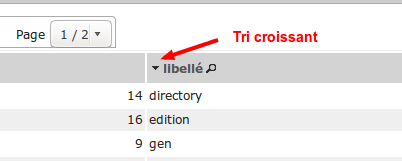
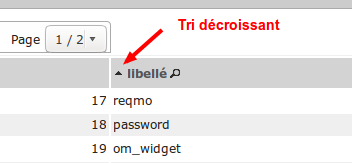
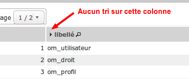

.. _listing:

############
Les listings
############

.. contents::

============
Introduction
============

Il est décrit dans ce paragraphe, l'utilisation et la configuration des tableaux d'enregistrements issus de la base de données.

.. image:: ../_static/tab_1.png
   :height: 400
   :width: 800

La gestion des tableaux se base sur le fichier core/om_table.class.php
(classe table)

Pour chaque affichage de tableau, le script sql/DBTYPE/[objet].inc.php
correspondant est appelé. Il permet de stocker le détail des requêtes
nécessaires à l'affichage du contenu.

Les tableaux sont construits lors de l'appel aux scripts scr/tab.php et
scr/soustab.php.

==============================================
Les scripts `scr/tab.php` et `scr/soustab.php`
==============================================

L'appel à ces scripts permet d'afficher un tableau d'enregistrements de
l'objet passé en paramètre.

Liste des paramètres passés à l'url :

- obj : nom de l'objet pour lequel on souhaite afficher le tableau
- premier : numéro de la première ligne affichée dans le tableau
- recherche : chaîne de caractères recherchée depuis le modules de recherche
- selectioncol : numéro de la colonne sélectionnée dans le module de recherche
- tricol : numéro de colonne et orientation (+/-) du tri du tableau
- valide : (true/false) affiche ou non les enregistrements non valide

L'appel à scr/soustab.php est fait en javascript depuis un formulaire afin
d'afficher les informations liées à l'enregistrement en cours d'édition.

=============
Configuration
=============

Un listing se configure via le script ``sql/pgsql/<OBJ>.inc.php``.

``$ent``
--------

Titre (fil d'ariane) de la page.

.. code-block:: php

  <?php
  $ent = _("administration")." -> "._("om_parametre"); 
  ?>

``$serie``
----------

Nombre d'enregistrements par page.

.. code-block:: php

  <?php   
  $serie = 15;
  ?>

``$table``
----------

Table de référence (il peut y avoir une ou plusieurs jointure). Clause FROM de la requête du listing.

.. code-block:: php

  <?php
  $table = DB_PREFIXE."om_parametre";
  ?>

``$champAffiche``
-----------------

Liste des champs du tableau

.. code-block:: php

  <?php
  $champAffiche = array(
      'om_parametre',
      'libelle',
      'valeur',
      'om_collectivite',
  );
  ?>

``$champRecherche``
-------------------

Champs pour la recherche.

.. code-block:: php

  <?php
  $champRecherche = array(
      'libelle',
      'valeur',
  );
  ?>

``$tri``
--------

Critère de tri par défaut.

.. code-block:: php

  <?php
  $tri = " ORDER BY libelle ";
  ?>

``$selection``
--------------

Gestion de la clause WHERE de la requête du listing.

.. code-block:: php

  <?php
  $selection = "";
  ?>

``$edition``
------------

Édition PDF.

.. code-block:: php

  <?php
  $edition = "om_parametre";
  ?>

``$tab_title``
--------------

Titre de l'onglet du listing. Si cette valeur n'est pas définie alors c'est <OBJ> qui est utilisé ou plutôt la traduction de <OBJ>.

.. code-block:: php

  <?php
  $tab_title = _("paramètre");
  ?>

``$tab_description``
--------------------

Description de la page. Si cette valeur n'est pas définie alors aucune description n'apparaît.

.. code-block:: php

  <?php
  $tab_description = _("Ce listing présente tous les paramètres spécifiques à l'utilisateur connecté.");
  ?>

``$tab_actions``
----------------

Voir le paragraphe dédié : :ref:`tab_actions`.

.. _tab_actions:

====================
Actions des tableaux
====================

La surcharge des actions de tableaux se fait via les scripts
``sql/sgbd/objet.inc.php``.

L'ajout d'actions se présente de cette façon :

  .. code-block:: php

    <?php
    // Actions en coin ('corner') : ajouter
    $tab_actions['corner']['ajouter'] = array(
        'lien' => 'form.php?obj='.$obj.'&amp;action=0',
        'id' => '&amp;advs_id='.$advs_id.'&amp;tricol='.$tricol.'&amp;valide='.$valide.'&amp;retour=tab',
        'lib' => ''._('Ajouter').'',
        'rights' => array('list' => array($obj, $obj.'_ajouter'), 'operator' => 'OR'),
        'ordre' => 10,
    );
    // Actions à gauche ('left'): consulter
    $tab_actions['left']['consulter'] = array(
        'lien' => 'form.php?obj='.$obj.'&amp;action=3'.'&amp;idx=',
        'id' => '&amp;premier='.$premier.'&amp;advs_id='.$advs_id.'&amp;recherche='.$recherche1.'&amp;tricol='.$tricol.'&amp;selectioncol='.$selectioncol.'&amp;valide='.$valide.'&amp;retour=tab',
        'lib' => ''._('Consulter').'',
        'rights' => array('list' => array($obj, $obj.'_consulter'), 'operator' => 'OR'),
        'ordre' => 10,
    );
    // Action sur la cinquième colonne de contenu
    $tab_actions['specific_content'][4] = array(
        'lien' => 'form.php?obj='.$obj.'&amp;action=2'.'&amp;idx=',
        'id' => '&amp;premier='.$premier.'&amp;advs_id='.$advs_id.'&amp;recherche='.$recherche1.'&amp;tricol='.$tricol.'&amp;selectioncol='.$selectioncol.'&amp;valide='.$valide.'&amp;retour=tab',
        'lib' => ''._('Consulter').'',
        'rights' => array('list' => array($obj, $obj.'_consulter'), 'operator' => 'OR'),
        'ordre' => 10,
    );
    ?>

Plusieurs emplacements d'actions existent :

- corner : actions dans la première cellule du tableau
- left : action situées dans la première colonne, disponibles pour chaque élément du tableau
- content : action sur le contenu du tableau
- specific_content : action sur une colonne de contenu du tableau

.. image:: ../_static/actions-form.png
   :height: 380
   :width: 800

Les actions par défaut
----------------------

Par défaut seules les actions ``ajouter`` et ``consulter`` sont disponibles
depuis les tableaux.

Créer de nouvelles actions
--------------------------

La création d'actions pour un tableau particulier se fait depuis le répertoire
``sql/sgbd/``.

Les actions doivent se définir dans les fichier ``objet.inc.php`` de la manière
suivante:

.. code-block:: php

   <?php
   $tab_actions['left']['modifier'] = array(
       'lien' => 'form.php?obj='.$obj.'&amp;action=1'.'&amp;idx=',
       'id' => '&amp;premier='.$premier.'&amp;advs_id='.$advs_id.'&amp;recherche='.$recherche1.'&amp;tricol='.$tricol.'&amp;selectioncol='.$selectioncol.'&amp;valide='.$valide.'&amp;retour=tab',
       'lib' => ''._('Modifier').'',
       'rights' => array('list' => array($obj, $obj.'_modifier'), 'operator' => 'OR'),
       'ordre' => 20,
   );
   ?>

Définition de l'action
......................

La première clé de ``$tab_actions`` permet choisir la position d'affichage:

- ``corner`` pour les actions en coin;
- ``left`` pour les actions de gauche.

.. note::
   Depuis la version 4.3.0 d'openMairie, il est désormais possible d'afficher
   plusieurs actions dans le coin du tableau (au niveau de l'action
   ``ajouter``).

La seconde clé de ``$tab_actions`` permet de définir la nouvelle action. Cette
clé doit être différente de: ``ajouter``, ``consulter``, ``modifier`` et
``supprimer``.

Les clés ``lien``, ``id`` et ``lib`` s'utilise de la même manière qu'avant.

Définition du mode d'affichage en sous-tableau
..............................................

La clé ``ajax`` permet d'indiquer si l'action doit être affichée en ajax ou non
dans les sous-tableaux:

- ``true``, l'action utilisera la fonction ``ajaxIt()``;
- ``false``, l'action n'utilisera pas la fonction ``ajaxIt()``.

Définition de l'ordre d'affichage
.................................

La clé ``ordre`` permet de déterminer l'ordre d'affichage par rapport aux autres
actions.

Chaque action dispose d'une valeur numérique permettant de définir sa place au
sein d'une position. L'action numéro 1 s'affichera en premier, l'action numéro
10 s'affichera après les actions de numéro inférieur, etc.

Ordre des actions par défaut d'openMairie:

- ajouter à pour ordre 10 dans la position ``corner``;
- consulter à pour ordre 10 dans la position ``left``.

Si la position ``corner`` est sélectionnée:

- 9, l'action s'affichera avant l'action ``ajouter``;
- 11, l'action s'affichera après l'action ``ajouter``.

Si la position ``left`` est sélectionnée:

- 9, l'action s'affichera avant l'action ``consulter``;
- 11, l'action s'affichera après l'action ``consulter``.

Définition des droits d'affichage
.................................

La clé ``rights`` permet de définir le ou les droits nécessaires à l'utilisateur
pour visualiser cette action. Cette clé est optionnelle. Si ``rights`` n'existe
pas, tous les utilisateurs pourront visualiser cette action s'ils peuvent
visualiser le tableau correspondant.

La clé ``list`` permet de définir le tableau des droits nécessaire.

La clé ``operator`` permet de définir l'opérateur utilisé pour pour vérifier les
droits de la liste ``list``:

- ``OR``, l'utilisateur doit avoir au moins un droit;
- ``AND``, l'utilisateur doit avoir tous les droits.

===================
Les fonctionnalités
===================

- la recherche simple
- la recherche avancée
- la pagination
- le tri
- les éléments archivés
- l'export PDF
- l'export CSV
- les actions

Le tri
------

Par défaut le listing est trié en fonction du critère ORDER BY de la requête paramétrable via la variable $tri dans le script `sql/<SGBD>/<OBJ>.inc.php` :

.. code-block:: php

   <?php
   // Critère de tri par défaut
   $tri = "";
   // Exemple de tri su la colonne libellé de la table om_droit
   $tri = " ORDER BY om_droit.libelle ";
   ?>

Une fois le listing chargé avec le tri par défaut, l'utilisateur peut choisir de trier sur une colonne en particulier en cliquant sur le titre de la colonne.

Premier clic pour le tri croissant
..................................

Marqueur représentant le tri croissant :

.. code-block:: html

    <!-- -->

Second clic pour le tri décroissant
...................................

Marqueur représentant le tri décroissant :

.. code-block:: html

    <!-- -->

Troisième clic pour aucun tri particulier
.........................................

Marqueur représentant aucun tri particulier :

.. code-block:: html

    <!-- -->

L'export CSV
------------

L'export CSV peut être activé seulement si la recherche avancée est configurée sur le listing. Il suffit donc de rajouter dans le tableau de paramétrage de cette dernière la clé 'export' avec la valeur array('csv', ) comme le montre l'exemple suivant :

.. code-block:: php

   $options [] = array (
       'type' => 'search',
       'display' => true,
       'advanced' => $champs,
       'export' => array('csv',),
       'default_form' => 'advanced',
       'absolute_object' => 'facture' 
   );

.. NOTE::
  Par défaut l'export CSV reprend la requête SQL d'affichage définie précédemment.
  Le script de paramétrage ``../sql/pgsql/<OBJ>.export_csv.inc.php`` permet
  de surcharger ses paramètres.

  Exemple d'utilisation : écraser ``$champAffiche``
  pour redéfinir les colonnes du CSV exporté.

La recherche avancée
--------------------

Les différents types de recherche
.................................

Recherche simple
;;;;;;;;;;;;;;;;

Cette recherche est celle disponible par défaut sur les tableaux d'openMairie.

Elle permet de:

- rechercher une valeur dans une colonne parmi toutes celles affichées;
- rechercher une valeur dans toutes les colonnes affichées;
- rechercher des valeurs approximatives.

.. note::
   Il est possible de modifier la liste des colonnes dans laquelle est effectuée
   la recherche. Cette liste ne correspond pas forcément aux colonnes
   affichées. Elle correspond seulement par défaut, c'est à dire lorsqu'aucune
   surcharge ne modifie les fichiers générés dans ``gen/sql/``.

Recherche avancée
;;;;;;;;;;;;;;;;;

Cette recherche est une fonctionnalité qui peut être activée et configurée
manuellement pour un ou plusieurs tableaux donnés.

Elle permet de:

- afficher un formulaire de recherche mono-critère permettant d'effectuer des
  recherches strictes ou approximatives;
- afficher un formulaire de recherche multi-critères permettant d'effectuer
  des recherches strictes ou approximatives;
- rechercher des valeurs dans des tables et des colonnes qui ne sont pas
  affichées.

Le numéro d'action (*$maj*) consacré à la recherche avancée est le 999.

Recherche avancée mono-critère
,,,,,,,,,,,,,,,,,,,,,,,,,,,,,,

Le formulaire de recherche mono-critère est un formulaire ne s'affichant que si
la recherche avancée est activée. Il permet aux utilisateurs de basculer sur un
formulaire similaire à celui de recherche simple lorsque la recherche avancée
est activée.

Ce formulaire se comporte de la même manière que celui de recherche simple, avec
quelques différences:

- il permet de rechercher des valeurs strictes ou approximatives (par défaut
  approximatives);
- il recherche dans toutes les colonnes proposées par la recherche simple;
- il conserve les valeurs recherchées après la réalisation d'une action (ajout,
  modification, etc...);
- il dispose d'un bouton ``Vider le formulaire`` permettant de vider les champs;
- il dispose d'un bouton ``+`` permettant de basculer sur le formulaire
  multi-critères.

Recherche avancée multi-critères
,,,,,,,,,,,,,,,,,,,,,,,,,,,,,,,,

Le formulaire de recherche multi-critères est un formulaire ne s'affichant que
si la recherche avancée est activée. Il permet aux utilisateurs de bénéficier de
plusieurs champs, et ainsi effectuer des recherches plus précise qu'avec le
formulaire de recherche simple.

Description du formulaire:

- il peut afficher plusieurs champs, de type texte, nombre, date ou liste à
  choix;
- il permet, pour chaque tableau, de configurer la liste des champs affichés;
- il permet, pour chaque champ, de rechercher des valeurs strictes ou
  approximatives (par défaut approximatives);
- il permet, pour chaque champ, de rechercher des valeurs dans des tables et
  des colonnes qui ne sont pas affichées;
- il conserve les valeurs recherchées après la réalisation d'une action (ajout,
  modification, etc...);
- il dispose d'un bouton ``Vider le formulaire`` permettant de vider les champs;
- il dispose d'un bouton ``+`` permettant de basculer sur le formulaire
  mono-critère.

Configuration de la recherche avancée
.....................................

Activation
;;;;;;;;;;

Exemple avec le modèle ``om_utilisateur``.

Pour activer la recherche avancée, rendez-vous dans le fichier
``sql/sgbd/om_utilisateur.inc.php`` et ajoutez la configuration suivante au
tableau d'options:

.. code-block:: php

   <?php

    $options[] =  array('type' => 'search',
                        'display' => true,
                        'advanced' => $champs,
                        'default_form' => 'advanced',
                        'absolute_object' => 'om_utilisateur');

   ?>

.. note::
   A partir de la version 4.3.0 d'openMairie, le tableau ``$options`` est
   disponible dans les fichiers ``sql/`` de l'application. Il n'est plus
   nécessaire de le déclarer manuellement.

La clé ``type`` est obligatoire. Elle permet de définir le type de l'option.
Pour une recherche il faut saisir ``search``.

La clé ``display`` est obligatoire. Elle permet d'afficher ou non la recherche,
tout en conservant sa configuration.

- ``true`` permet d'afficher la recherche;
- ``false`` permet de masquer la recherche.

La clé ``advanced`` est obligatoire (pour la recherche avancée). Elle permet de
préciser que le formulaire de recherche est un formulaire de recherche avancée
et non simple. Cette clé doit contenir le tableau des champs configurés pour la
recherche (voir plus bas pour la configuration des champs).

La clé ``default_form`` est optionnelle. Elle permet de choisir quel formulaire
de recherche est ouvert par défaut. La valeur ``advanced'`` permet d'afficher le
formulaire multi-critères. Les autres valeurs, ou si ``default_form`` n'est pas
configuré, affichent le formulaire mono-critère.

La clé ``absolute_object`` est obligatoire. Elle permet de spécifier à
openMairie le nom du modèle l'objet recherché. Ce nom est celui du fichier dans
``obj/``, ici ``om_utilisateur.class.php`` (sans son extension).

Autres paramètres
;;;;;;;;;;;;;;;;;

**Wildcard**

Le wildcard permet de rendre la recherche stricte ou approximative.

Cette option peut se configurer pour un ou plusieurs modèles particuliers dans
les fichiers correspondants du répertoire ``sql/`` de l'application. Elle peut
également être configurée de manière globale pour l'ensemble dans modèle
à partir du fichier ``dyn/tab.inc.php``.

Par défaut, il est paramétré de la manière suivante:

.. code-block:: php

   <?php

   $options[] = array('type' => 'wildcard', 'left' => '%', 'right' => '%');

   ?>

- ``left`` détermine, dans la requête SQL de recherche, le caractère ajouté au
  début (à gauche) de la valeur recherchée;
- ``right`` détermine, dans la requête SQL de recherche, le caractère ajouté en
  fin (à droite) de la valeur recherchée.

Avec cette configuration lorsque le mot « admin » est recherché dans une
colonne, toutes les valeurs contenant « admin » sont retournées.

En modifiant la configuration de cette manière:

.. code-block:: php

   <?php

   $options[] = array('type' => 'wildcard', 'left' => '', 'right' => '%');

   ?>

Seules les valeurs **commençant** par « admin » seront retournées.

Enfin avec:

.. code-block:: php

   <?php

   $options[] = array('type' => 'wildcard', 'left' => '', 'right' => '');

   ?>

Seules les valeurs égales **exactement** à « admin » seront retournées.

Configuration des critères de recherche
.......................................

La recherche avancée ne fonctionnera pas tant que la liste des champs du
formulaire multi-critères n'aura pas été créée. Ces champs sont appelés ici des
critères de recherche.

Configuration simple
;;;;;;;;;;;;;;;;;;;;

Un critère de recherche est représenté par un tableau PHP contenant sa
configuration.

.. code-block:: php

   <?php

   $champs['identifiant_utilisateur'] =
       array('colonne' => 'om_utilisateur',
             'table' => 'om_utilisateur',
             'type' => 'text',
             'libelle' => _('Identifiant'),
             'taille' => 10,
             'max' => 8));

   ?>

La clé ``identifiant_utilisateur`` est le nom du champ HTML qui sera affiché
sur le formulaire.

La clé ``colonne`` est obligatoire. Elle contient le nom de la colonne de la
base de données qui sera interrogée si la variable ``$_POST`` contient la clé
``identifiant_utilisateur``.

La clé ``table``  est obligatoire. Elle contient le nom de la table de la base
de données qui sera interrogée si la variable ``$_POST`` contient la clé
``identifiant_utilisateur``.

La clé ``'type`` est obligatoire. Elle contient le type du champ HTML à
afficher. Cela peut être ``date``, ``text``, ``select``, ou tout autre méthode
de la classe ``formulaire``. Pour les champs de type ``select``, le nom du champ
HTML doit être le même que le nom de la colonne.

La clé ``libelle`` est obligatoire. Elle contient le libellé qui sera affiché à
côté du champ dans le formulaire de recherche.

La clé ``taille`` est optionnelle. Elle contient la taille du champ HTML
(attribut HTML ``size``).

La clé ``max`` est optionnelle. Elle contient la longueur maximale de la valeur
du champ HTML (attribut HTML ``maxlength``).

Une fois tous les critères de recherche configurés, il faudra simplement
vérifier que le tableau des critères est bien utilisé par l'option de type
``search``.

Exemple de formulaire pour le tableau du modèle ``om_utilisateur``:

.. code-block:: php

   <?php

   $champs = array();

   $champs['login'] = array(
       'table' => 'om_utilisateur',
       'colonne' => 'login',
       'type' => 'text',
       'libelle' => _('Login'));
   
   $champs['email'] = array(
       'table' => 'om_utilisateur',
       'colonne' => 'email',
       'type' => 'text',
       'libelle' => _('E-mail'));
   
   $champs['om_profil'] = array(
       'table' => 'om_utilisateur',
       'colonne' => 'om_profil',
       'type' => 'select',
       'libelle' => _('Profil'));

    $options[] =  array('type' => 'search',
                        'display' => true,
                        'advanced' => $champs,
                        'default_form' => 'advanced',
                        'absolute_object' => 'om_utilisateur');

   ?>

Configuration avancée
;;;;;;;;;;;;;;;;;;;;;

Créer un intervalle de date
,,,,,,,,,,,,,,,,,,,,,,,,,,,

Exemple: recherche des utilisateurs crées entre telle et telle date.

.. code-block:: php

   <?php

   $champs['date_de_creation'] =
       array('colonne' => 'creation_date',
             'table' => 'user',
             'libelle' => _('Date de creation'),
             'type' => 'date',
             'taille' => 8,
             'where' => 'intervaldate');

   ?>

Cette configuration permet de créer deux champs HTML ``datepicker``:

- ``date_de_creation_min`` : permettra de saisir une date minimale
- ``date_de_creation_max`` : permettra de saisir une date maximale

Ces champs permettent de rechercher les utilisateurs dont la date de créations
est incluse dans l'intervalle saisi, bornes comprises. Il est possible de ne
saisir qu'une seule date afin de rechercher les utilisateurs ayant été créés
avant ou après une date particulière.

Créer un champ de recherche avec menu déroulant personnalisé
,,,,,,,,,,,,,,,,,,,,,,,,,,,,,,,,,,,,,,,,,,,,,,,,,,,,,,,,,,,,

Exemple: recherche des utilisateurs administrateurs.

Dans cet exemple, l'information se trouve directement dans la table interrogée.

.. code-block:: php

   <?php

   // soit 'user' une table contenant une colonne 'is_admin'

   $args = array();
   $args[0] = array('', 'true', 'false');
   $args[1] = array(_('Tous'), _('Oui'), _('Non'));

   $champs['administrator'] =
       array('colonne' => 'is_admin',
             'table' => 'user',
             'libelle' => _('Administrateur'),
             'type' => 'select',
             'subtype' => 'manualselect',
             'args' => $args);

   ?>

Cette configuration permet de créer un champ HTML de type ``select`` avec trois
choix:

- Tous (valeur '');
- Oui (valeur ``true``);
- Non (valeur ``false``).

Le tableau ``$args[0]`` contient les valeurs associées aux choix. Elles seront
recherchées telles quelles dans la base de données.

En sélectionnant « Oui », la requête SQL de recherche sera construite comme
suit:

.. code-block:: sql

   -- PostgresSQL
   WHERE user.is_admin::varchar like 'true'

Il est possible de saisir n'importe quelle chaîne de caractères dans
``$args[0]`` et pas seulement des valeurs booléennes.

.. attention::
   Cette recherche n'est pas sensible à la casse. Plusieurs fonctions de
   formatage sont appelées sur ``user.is_admin`` avant de tester l'égalité.

Tester si une donnée est présente ou non dans un groupe de données
,,,,,,,,,,,,,,,,,,,,,,,,,,,,,,,,,,,,,,,,,,,,,,,,,,,,,,,,,,,,,,,,,,

Exemple: recherche des utilisateurs administrateurs.

Dans cet exemple, l'information se trouve non pas dans la table utilisateur mais
dans la table administrateur disposant d'une colonne ``user_id`` (clé
étrangère). Il nous faut utiliser une sous-requête pour récupérer l'ensemble des
identifiants de la table administrateur afin de tester si un identifiant
utilisateur est effectivement présent dans cette liste.

.. code-block:: php

   <?php

   // soit 'user' une table contenant pas la colonne 'is_admin'
   // soit 'admin' une table contenant une colonne 'user_id'

   $args = array();
   $args[0] = array('', 'true', 'false');
   $args[1] = array(_('Tous'),
                    _('Administrateurs'),
                    _('Utilisateurs simples'));

   $subquery = 'SELECT user_id FROM admin';

   $champs['administrator'] =
       array('colonne' => 'id',
             'table' => 'user',
             'libelle' => _('Administrateur'),
             'type' => 'select',
             'subtype' => 'manualselect',
             'where' => 'insubquery',
             'args' => $args,
             'subquery' => $subquery);

   ?>

Cette configuration permet de créer un champ HTML de type ``select`` avec
trois choix:

- Tous (valeur '');
- Administrateurs (valeur ``true``);
- Utilisateurs simples (valeur ``false``).

Le tableau ``$args[0]`` contient les valeurs associées aux choix. La valeur
``true`` indique que les identifiants des utilisateurs doivent se
trouver dans la sous-requête. La valeur ``false`` indique qu'ils ne
doivent pas se trouver dans la sous-requête. Contrairement à l'exemple
« Créer un champ de recherche avec menu déroulant personnalisé », les valeurs ne
seront pas recherchées telles quelles dans la base de données et ne doivent
surtout pas être modifiées.

En sélectionnant « Administrateurs », la requête SQL de recherche sera
construite comme suit:

.. code-block:: sql

   WHERE user.id IN (SELECT user_id FROM admin)

=======================
Le composant openMairie
=======================

tab.php utilise les méthodes d'om_table.class.php qui est une classe
d'openMairie ::

    core/om_table.class.php

Les méthodes de ce composant peuvent être surchargées dans
obj/om_table.class.php
