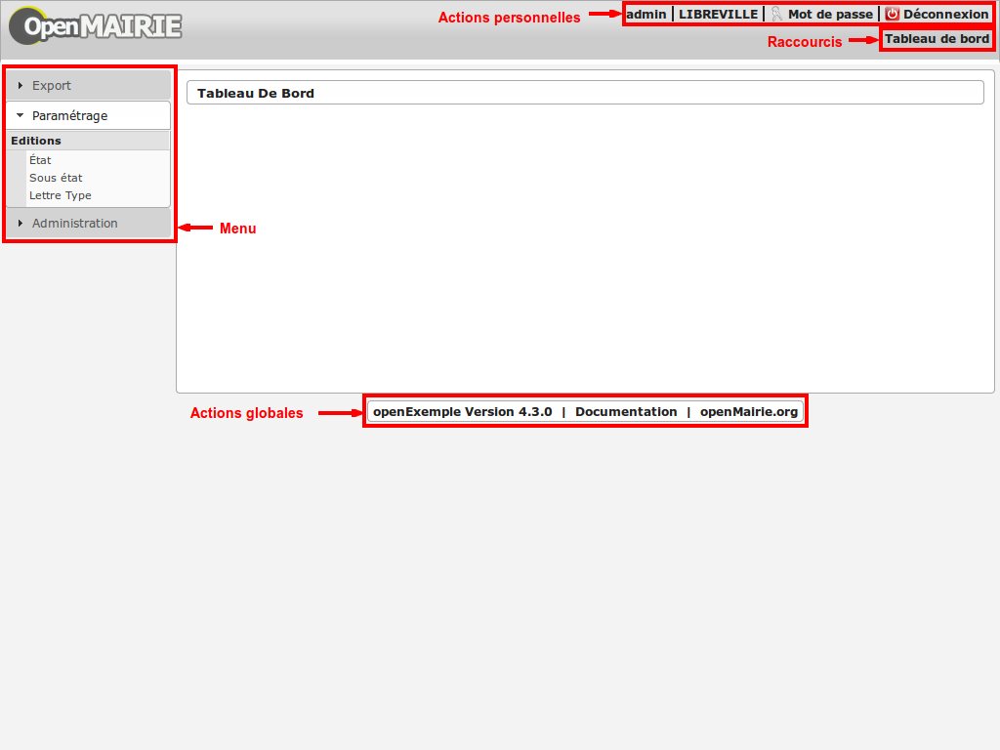
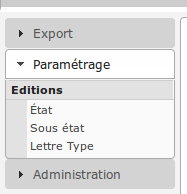
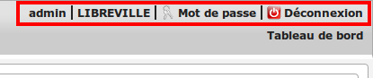
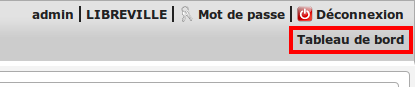
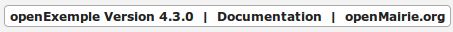

.. _parametrage:

########################
Paramétrage du framework
########################

Le paramétrage de l'application se fait dans le répertoire ``dyn/``. Il est proposé dans ce chapitre de décrire les différents scripts de paramétrage et leur utilisation. 

==========================
Les scripts de paramétrage
==========================

- ``dyn/database.inc.php`` : voir :ref:`parametrage_connexion_base_de_donnees`.

- ``dyn/config.inc.php`` : application

- ``dyn/filestorage.inc.php`` : système de stockage des fichiers 
- ``dyn/mail.inc.php`` : serveur smtp pour l'envoi de mails
- ``dyn/directory.inc.php`` : annuaire LDAP pour la synchronisation des utilisateurs

- ``dyn/custom.inc.php`` : ...

- ``dyn/menu.inc.php`` : zone de navigation 'Menu'
- ``dyn/actions.inc.php`` : zone de navigation 'Actions personnelles'
- ``dyn/shortslinks.inc.php`` : zone de navigation 'Raccourcis'
- ``dyn/footer.inc.php`` : zone de navigation 'Actions globales'

- ``dyn/locales.inc.php`` : application
- ``dyn/include.inc.php`` : chemin d'accès aux librairies
- ``dyn/debug.inc.php`` : mode debug
- ``dyn/version.inc.php`` : paramétrage de la version

* ``dyn/comboaffichage.inc.php`` : paramétrage combo
* ``dyn/comboparametre.inc.php`` : parametrage combo
* ``dyn/comboretour.inc.php`` : paramétrage combo

* ``dyn/tab.inc.php`` : variable specifique à passer dans l'url pour tab.php 
* ``dyn/soustab.php`` : variable specifique à passer dans l'url pour soustab.php
* ``dyn/form.inc.php`` : variable specifique à passer dans l'url pour form.php
* ``dyn/sousform.inc.php`` : variable specifique à passer dans l'url pour sous.php           
* ``dyn/form.get.specific.inc.php``
* ``dyn/sousform.get.specific.inc.php`` : variable spécifique sousform

* ``dyn/varetatpdf.inc`` : variable etat et sousetat pdf
* ``dyn/varlettretypepdf.inc`` : varaible lettre type
* ``dyn/varsousetatpdf.inc``: ...

* ``dyn/var.inc`` : variable application (deprecated : préférez om_parametre)
* ``dyn/var_sig.inc`` : paramétrage sig 
* ``dyn/var_adresse_postale.inc`` : parametrage sig

=======================
Les zones de navigation
=======================

Quatre zones de navigation différentes sont disponibles dans le framework :

Le menu
-------

Le but de cette zone de navigation est de rassembler les liens vers toutes les
fonctions du logiciel regroupées par rubrique et catégorie. Elle se situe à
gauche du contenu et est visible uniquement lorsque l'utilisateur est
authentifié. 

Par défaut **le menu** est composé de la manière suivante ::

    application             vide par défaut, contient l'accès à votre application
    export                  contient le script "edition" qui reprend
                                les éditions pdf des tables
                            contient le menu "reqmo" qui reprend les requêtes
                                mémorisées
    traitement              vide par défaut, cet option contient les scripts de
                                traitements
    parametrage             Cette option contient vos tables de paramétrage
                                fonctionnel. Par défaut il contient le
                                paramétrage des états / sous-états / lettres type 
    administration          Cette option contient les fonctions de configuration
                                de l'administrateur technique. Cela comprend
                                notamment le paramètrage de la collectivité,
                                om_sig  et la gestion des droits d'accès                                

La configuration des liens se fait dans le fichier :file:`dyn/menu.inc.php`.
Ce fichier de paramétrage n'est pas obligatoire. Si il n'existe pas, aucun lien
n'est affiché. Ce fichier de paramétrage doit contenir la déclaration d'un
tableau de tableaux associatifs dans la variable ``$menu``. Chaque tableau
associatif représente une rubrique. Chaque rubrique contient un tableau de
tableaux associatifs, chacun représentant un lien.

Les caracteristiques de ce tableau sont les suivantes :

    tableau rubrik ::

     title (obligatoire)
     description (texte qui s'affiche au survol de la rubrique)
     href (contenu du lien href)
     class (classe css qui s'affiche sur la rubrique)
     right (droit que l'utilisateur doit avoir pour visionner cette rubrique)
     links (obligatoire)
     open (critères de pré-ouverture de cette rubrique du menu)

    tableau links ::

     title (obligatoire) 
     href (obligatoire) (contenu du lien href)
     class (classe css qui s'affiche sur l'element)
     right (droit que l'utilisateur doit avoir pour visionner cet element)
     target (pour ouvrir le lien dans une nouvelle fenetre)
     open (critères de pré-ouverture de la rubrique du menu dans laquelle est ce
           lien, et sélection de ce lien en lien actif)

L'entrée ``open`` sert à marquer une entrée de menu comme active. La rubrique
contenant cette entrée est ouverte dès l'affichage de la page, et l'entrée active
est mise en évidence. L'entrée ``open`` peut contenir soit une chaîne soit un
``array()`` comportant plusieurs chaînes. Chaque chaîne est créée selon la syntaxe
``'script.php|obj'``, chacune des deux parties étant optionnelle. Le caractère
séparateur ``|`` est obligatoire.

Exemple : ``'\|om_collectivite'`` sélectionnera l'entrée pour toutes les url
          ayant ``obj=om_collectivite``
          
          ``'tab.php|om_collectivite'`` sélectionnera l'entrée pour l'affichage
          du tableau de la classe ``om_collectivite``
          
          ``'unecran.php|'`` sélectionnera l'entrée dès lors que le script
          ``unecran.php`` est appelé quelque soit la classe ``obj``

Les actions personnelles
------------------------

Le but de cette zone de navigation est de regrouper des liens vers des fonctions
qui concernent les informations de connexion de l'utilisateur. Elle se situe
dans le coin en haut à droite de l'écran et est visible uniquement lorsque
l'utilisateur est authentifié. 

Par défaut **les actions personnelles** sont composées de quatre éléments :

* le login de l'utilisateur,
* le libellé de la collectivité,
* un lien vers la page de modification du mot de passe,
* un lien vers la page de déconnexion du logiciel.

Le login de l'utilisateur est récupéré par la méthode ``displayActionLogin()``
de la classe ``om_application``. Cette méthode peut être surchargée dans la
classe ``utils``.

Le libellé de la collectivité est récupéré par la méthode
``displayActionCollectivite()`` de la classe ``om_application``. Cette méthode
peut être surchargée dans la classe ``utils``.

La configuration des liens se fait dans le fichier :file:`dyn/actions.inc.php`.
Ce fichier de paramétrage n'est pas obligatoire. Si il n'existe pas, aucun lien
n'est affiché. Ce fichier de paramétrage doit contenir la déclaration d'un
tableau de tableaux associatifs dans la variable ``$actions``. Chaque tableau
associatif représente un lien.

.. code-block:: php

   <?php
   //
   $actions = array();
   //
   $actions[] = array(
       "title" => _("Link"),
       "description" => _("Description"),
       "href" => "../scr/link.php",
       "target" => "_blank",
       "class" => "action-link",
       "right" => "link",
   );
   ?>

Description de chaque paramètre du tableau associatif :

+-------------+------------+---------------------------------------------------+
| Paramètre   | Requis ?   | Description                                       |
+=============+============+===================================================+
| title       | O          | Texte                                             |
+-------------+------------+---------------------------------------------------+
| description | N          | Texte qui s'affiche au survol de l'élément        |
+-------------+------------+---------------------------------------------------+
| href        | N          | Contenu du lien href                              |
+-------------+------------+---------------------------------------------------+
| target      | N          | Attribut pour ouvrir le lien dans une nouvelle    |
|             |            | fenêtre                                           |
+-------------+------------+---------------------------------------------------+
| class       | N          | Classe CSS qui s'affiche sur l'élément            |
+-------------+------------+---------------------------------------------------+
| right       | N          | Permission nécessaire à l'utilisateur pour        |
|             |            | visualiser l'élément                              |
+-------------+------------+---------------------------------------------------+

Les raccourcis
--------------

Le but de cette zone de navigation est de regrouper des liens vers des fonctions
précises utilisées très souvent. Elle se situe en haut à droite de l'écran
juste au dessous des actions personnelles et est visible uniquement lorsque
l'utilisateur est authentifié. 

Par défaut **les raccourcis** contiennent uniquement un lien vers le tableau de
bord.

La configuration des liens se fait dans le fichier :file:`dyn/shortlinks.inc.php`.
Ce fichier de paramétrage n'est pas obligatoire. Si il n'existe pas, aucun lien
n'est affiché. Ce fichier de paramétrage doit contenir la déclaration d'un
tableau de tableaux associatifs dans la variable ``$shortlinks``. Chaque tableau
associatif représente un lien.

.. code-block:: php
 
   <?php
   // On initialise le tableau conteneur
   $shortlinks = array();
   // On ajoute au tableau conteneur un tableau associatif représentant un lien
   // (à répéter autant de fois que nécessaire)
   $shortlinks[] = array(
       "title" => _("Link"),
       "description" => _("Description"),
       "href" => "../scr/link.php",
       "target" => "_blank",
       "class" => "action-link",
       "right" => "link",
   );
   ?>

+-------------+------------+---------------------------------------------------+
| Paramètre   | Requis ?   | Description                                       |
+=============+============+===================================================+
| title       | O          | Texte                                             |
+-------------+------------+---------------------------------------------------+
| description | N          | Texte qui s'affiche au survol de l'élément        |
+-------------+------------+---------------------------------------------------+
| href        | N          | Contenu du lien href                              |
+-------------+------------+---------------------------------------------------+
| target      | N          | Attribut pour ouvrir le lien dans une nouvelle    |
|             |            | fenêtre                                           |
+-------------+------------+---------------------------------------------------+
| class       | N          | Classe CSS qui s'affiche sur l'élément            |
+-------------+------------+---------------------------------------------------+
| right       | N          | Permission nécessaire à l'utilisateur pour        |
|             |            | visualiser l'élément                              |
+-------------+------------+---------------------------------------------------+

Les actions globales
--------------------

Le but de cette zone de navigation est de représenter la section "À propos" du
logiciel. Elle se situe en bas de l'écran juste au dessous du contenu de la
page et est visible lorsque l'utilisateur est authentifié ou non. 

Par défaut **les actions globales** sont composées de trois éléments :

* le nom du logiciel ainsi que son numéro de version,
* un lien vers la documentation du site openMairie,
* un lien vers le site openMairie.

Le nom du logiciel est récupéré de la variable ``$config['application']``
présente dans le fichier :file:`dyn/config.inc.php`. La version est récupérée de la
variable ``$version`` présente dans le fichier :file:`dyn/version.inc.php`.

La configuration des liens se fait dans le fichier :file:`dyn/footer.inc.php`.
Ce fichier de paramétrage n'est pas obligatoire. Si il n'existe pas, aucun lien
n'est affiché. Ce fichier de paramétrage doit contenir la déclaration d'un
tableau de tableaux associatifs dans la variable ``$footer``. Chaque tableau
associatif représente un lien.

.. code-block:: php
 
   <?php
   // On initialise le tableau conteneur
   $footer = array();
   // On ajoute au tableau conteneur un tableau associatif représentant un lien
   // (à répéter autant de fois que nécessaire)
   $footer[] = array(
       "title" => _("Link"),
       "description" => _("Description"),
       "href" => "../scr/link.php",
       "target" => "_blank",
       "class" => "action-link",
       "right" => "link",
   );
   ?>

+-------------+------------+---------------------------------------------------+
| Paramètre   | Requis ?   | Description                                       |
+=============+============+===================================================+
| title       | O          | Texte                                             |
+-------------+------------+---------------------------------------------------+
| description | N          | Texte qui s'affiche au survol de l'élément        |
+-------------+------------+---------------------------------------------------+
| href        | N          | Contenu du lien href                              |
+-------------+------------+---------------------------------------------------+
| target      | N          | Attribut pour ouvrir le lien dans une nouvelle    |
|             |            | fenêtre                                           |
+-------------+------------+---------------------------------------------------+
| class       | N          | Classe CSS qui s'affiche sur l'élément            |
+-------------+------------+---------------------------------------------------+
| right       | N          | Permission nécessaire à l'utilisateur pour        |
|             |            | visualiser l'élément                              |
+-------------+------------+---------------------------------------------------+

==================================
Les variables locales et la langue
==================================

Les variables locales sont paramétrées dans le fichier *dyn/locales.inc.php*

Ce fichier contient :

- le paramétrage du codage des caracteres (ISO-8859-1 ou UTF8)  ::

    "DEPRECATED"
    
        define('CHARSET', 'ISO-8859-1');
        ou
        define('CHARSET', 'UTF8');
        
    Dans la version 4.2.0, il y a 2 paramètres :
    
        pour la base : DB_CHARSET
        pour apache  : HTTP_CHARSET
        
        Ces 2 paramètres remplacent CHARSET
    

    Note ::
    
        Dans apache, il est possible de modifiet l'encodage 
        dans etc/apache2/apache2.conf commenter ##AddDefaultCharset = ISO-8859-1
        relancer ensuite apache : $ etc/apache2/init.d/apache2 reload
    
        A partir de la version 3.0.1, l'imcompatibilité utf8 de la bibliotheque fpdf est traitée

- le dossier ou sont installées les variables du systeme ::

    define('LOCALE', 'fr_FR');

- Le dossier contenant les locales et les fichiers de traduction ::

    define('LOCALES_DIRECTORY', '../locales');

- Le domaine de traduction ::

    define('DOMAIN', 'openmairie');

Les zones à traduire sont sous le format : _("zone a traduire")

Voir le chapitre sur les outils : *poEdit*

======================================
Le paramétrage de l application metier 
======================================

L'application métier est paramétrée dans *dyn/var.inc*

Ce script contient les paramétres globaux de l application . 
Attention les paramètres s'appliquent à toutes les bases de l'application.

Le paramétrage spécifique par collectivité doit se faire dans la table om_parametre 

La configuration générale de l'application se fait aussi dans *dyn/config.inc.php*.

Les paramètres sont récupérés avec la création d'un objet utils par :
$f->config['nom_du_parametre']

*Voir framework/utilitaire*

Exemple de paramétrage avec openCourrier ::

    $config['application'] = _("openCourrier");
    $config['title'] = ":: "._("openMairie")." :: "._("openCourrier");
    $config['session_name'] = "openCourrier";

* La configuration des extensions autorisees dans le module upload.php

Pour changer votre configuration, décommenter la ligne et modifier les extensions avec des ";" comme séparateur ::

    $config['upload_extension'] = ".gif;.jpg;.jpeg;.png;.txt;.pdf;.csv;"

* La configuration de la taille maximale des fichiers dans le module upload.php

Pour changer votre configuration, décommenter la ligne et modifier la taille. La taille maximale est en mo. ::

    $config['upload_taille_max'] = str_replace('M', '', ini_get('upload_max_filesize')) * 1024;

Le mode démonstration
---------------------

Ce paramètre permet de spécifier si l'instance de l'application se trouve en mode démonstration ou non. Ce mode permet de pré-remplir le formulaire de login avec l'identifiant 'demo' et le mot de passe 'demo'. Par défaut, ce paramètre est positionné à 'false' et peut donc éventuellement être surchargé au niveau de l'instance. Il suffit de définir dans le script ``dyn/config.inc.php`` le paramètre **demo** sur le tableau ``$config``. Important : Pour empêcher l'utilisateur ainsi connecter de changer le mot de passe, il faut supprimer la permission au profil de l'utilisateur.

.. code-block:: php

   <?php
   $config = array();
   $config["demo"] = true;
   ?>

La redéfinition du mot de passe oublié par l'utilisateur
--------------------------------------------------------

Ce paramètre permet d'activer ou non la redéfinition de son mot de passe en cas d'oubli via un lien sur le formulaire de login. Par défaut, ce paramètre est positionné à 'false' et peut donc éventuellement être surchargé au niveau de l'instance. Il suffit de définir dans le script ``dyn/config.inc.php`` le paramètre **password_reset** sur le tableau ``$config``. Important : La réinitialisation du mot de passe est effectuée par un envoi de mail, il est donc nécessaire d'avoir configuré un serveur mail au préalable.

.. code-block:: php

   <?php
   $config = array();
   $config["password_reset"] = true;
   ?>

Le nombre de colonnes du tableau de bord
----------------------------------------

Ce paramètre permet de spécifier le nombre de colonnes présentes sur le tableau de bord de l'application. Important : la modification de ce paramètre doit être suivie de la modification des données dans la base car des widgets existent peut être dans des colonnes supprimées.

Trois niveaux de configuration sont disponibles pour cet élément : framework, application et instance. Voici l'ordre de préférence si les trois niveaux sont configurés : instance > application > framework.

Pour configurer au niveau de l'instance, il faut définir dans le script ``dyn/config.inc.php`` le paramètre **dashboard_nb_column** sur le tableau ``$config``.

.. code-block:: php
   
   <?php
   $config = array();
   $config["dashboard_nb_column"] = 4;
   ?>

Pour configurer au niveau de l'application, il faut définir dans la classe ``utils`` définie dans le script ``obj/utils.class.php`` l'attribut ``$config__dashboard_nb_column``.

.. code-block:: php
   
   <?php
   ...
   class utils extends application {

       /**
        * Gestion du nombre de colonnes du tableau de bord.
        *
        * @var mixed Configuration niveau application.
        */
        var $config__dashboard_nb_column = 2;
   ...
   ?>

Une configuration par défaut est définie dans le framework, dans la classe ``application`` définie dans le script ``core/om_application.class.php`` l'attribut ``$config__dashboard_nb_column``.

.. code-block:: php
   
   <?php
   ...
   class application {

       /**
        * Gestion du nombre de colonnes du tableau de bord.
        *
        * @var mixed Configuration niveau framework.
        */
        var $config__dashboard_nb_column = 3;
   ...
   ?>

Pour récupérer la valeur du paramètre sans se préoccuper d'où vient le paramètre l'accesseur ``application::get_config__dashboard_nb_column()`` est disponible. C'est toujours cette méthode qui doit être utilisée pour accéder au paramètre. Exemple d'utilisation : 

.. code-block:: php
   
   <?php
   ...
   $f->get_config__dashboard_nb_column();
   ...
   ?>

Le favicon de l'application
---------------------------

Ce paramètre permet de spécifier l'image utilisée comme favicon de l'application.

Trois niveaux de configuration sont disponibles pour cet élément : framework, application et instance. Voici l'ordre de préférence si les trois niveaux sont configurés : instance > application > framework.

Pour configurer au niveau de l'instance, il faut définir dans le script ``dyn/config.inc.php`` le paramètre **favicon** sur le tableau ``$config``.

.. code-block:: php
   
   <?php
   $config = array();
   $config["favicon"] = "../custom/favicon.ico";
   ?>

Pour configurer au niveau de l'application, il faut définir dans la classe ``utils`` définie dans le script ``obj/utils.class.php`` l'attribut ``$html_head_favicon``.

.. code-block:: php
   
   <?php
   ...
   class utils extends application {

       /**
        * Gestion du favicon de l'application.
        *
        * @var mixed Configuration niveau application.
        */
        var $html_head_favicon = "../app/img/favicon.ico";
   ...
   ?>

Une configuration par défaut est définie dans le framework, dans la classe ``application`` définie dans le script ``core/om_application.class.php`` l'attribut ``$html_head_favicon``. Actuellement le framework ne spéficie aucun favicon par défaut.

.. code-block:: php
   
   <?php
   ...
   class application {

       /**
        * Gestion du favicon de l'application.
        *
        * @var mixed Configuration niveau framework.
        */
        var $html_head_favicon = null;
   ...
   ?>

Pour récupérer la valeur du paramètre sans se préoccuper d'où vient le paramètre l'accesseur ``application::get_config__favicon()`` est disponible. C'est toujours cette méthode qui doit être utilisée pour accéder au paramètre. Exemple d'utilisation : 

.. code-block:: php
   
   <?php
   ...
   $f->get_config__favicon();
   ...
   ?>

Le mode de gestion des permissions
----------------------------------

Ce paramètre permet de définir si la gestion des profils se fait de manière hiérarchique ou non. Si on décide d'utiliser les profils hiérarchiques alors un utilisateur qui a le profil SUPER UTILISATEUR (hiérarchie 4) peut effectuer toutes les actions possibles pour un utilisateur qui a le profil UTILISATEUR (hiérarchie 3). Par contre si on décide d'utiliser les profils non hiérarchiques, l'utilisateur qui a le profil SUPER UTILISATEUR ne peut effectuer que les actions qui lui sont permises spécifiquement. Important : la modification de cette option doit être suivie de la modification complète du paramétrage des droits.

Trois niveaux de configuration sont disponibles pour cet élément : framework, application et instance. Voici l'ordre de préférence si les trois niveaux sont configurés : instance > application > framework.

Pour configurer au niveau de l'instance, il faut définir dans le script ``dyn/config.inc.php`` le paramètre **permission_by_hierarchical_profile** sur le tableau ``$config``.

.. code-block:: php
   
   <?php
   $config = array();
   $config["permission_by_hierarchical_profile"] = true;
   ?>

Pour configurer au niveau de l'application, il faut définir dans la classe ``utils`` définie dans le script ``obj/utils.class.php`` l'attribut  ``$config__permission_by_hierarchical_profile``.

.. code-block:: php
   
   <?php
   ...
   class utils extends application {

       /**
        * Gestion du mode de gestion des permissions.
        *
        * @var mixed Configuration niveau application.
        */
        var $config__permission_by_hierarchical_profile = false;
   ...
   ?>

Une configuration par défaut est définie dans le framework, dans la classe ``application`` définie dans le script ``core/om_application.class.php`` l'attribut 'config__permission_by_hierarchical_profile'.

.. code-block:: php
   
   <?php
   ...
   class application {

       /**
        * Gestion du mode de gestion des permissions.
        *
        * @var mixed Configuration niveau framework.
        */
        var $config__permission_by_hierarchical_profile = true;
   ...
   ?>

Pour récupérer la valeur du paramètre sans se préoccuper d'où vient le paramètre l'accesseur ``application::get_config__permission_by_hierarchical_profile()`` est disponible. C'est toujours cette méthode qui doit être utilisée pour accéder au paramètre. Exemple d'utilisation : 

.. code-block:: php
   
   <?php
   ...
   $f->get_config__permission_by_hierarchical_profile();
   ...
   ?>

La valeur par défaut lorsqu'une permission n'existe pas
-------------------------------------------------------

Ce paramètre permet de spécifier la valeur retour de la méthode vérifiant si l'utilisateur possède une permission lorsque cette permission n'existe pas. Ce paramètre est défini au niveau du framework à la valeur `false` ce qui signifie que si la permission n'existe pas alors la méthode va retourner que l'utilisateur n'a pas la permission. Ce paramètre peut éventuellement être surchargé au niveau de l'instance. Il suffit de définir dans le script ``dyn/config.inc.php`` le paramètre **permission_if_right_does_not_exist** sur le tableau ``$config``. Important : il est conseillé de ne sucrharger ce paramètre que sur une instance de développement et jamais en production.

.. code-block:: php

   <?php
   $config = array();
   $config["permission_if_right_does_not_exist"] = true;
   ?>

  
=============================  
Le Parametrage des librairies
=============================

Le paramétrage de l'accès aux librairies se fait dans *dyn/include.inc.php*

 Ce fichier permet de configurer les paths en fonction de la 
 directive include_path du fichier php.ini. 
 Vous pouvez aussi modifier ces chemins avec vos propres valeurs si
 vous voulez personnaliser votre installation :
 
  PEAR ::
  
        array_push($include, getcwd()."/../php/pear");

  DB ::
  
        array_push($include, getcwd()."/../php/db");

  FPDF ::
  
        array_push($include, getcwd()."/../php/fpdf");

  OPENMAIRIE (dans CORE depuis la version 4.2.0) ::

        define("PATH_OPENMAIRIE", getcwd()."../core/openmairie/"); 

Par défaut, les librairies sont incluses dans openmairie_exemple :

- /lib : contient les librairies javascript

- /php : contient les librairies php

=============
Le mode DEBUG
=============

Dans le code, pour logger une information, il suffit de d'utiliser 
la ligne suivante :

.. code-block:: php

   $this->addToLog("requete sig_interne maj parcelle inexistante :".$sql, EXTRA_VERBOSE_MODE);

Les différents modes DEBUG présents dans l'application sont définis
dans le fichier *core/om_debug.inc.php* :

* EXTRA_VERBOSE_MODE - mode "très bavard" : affiche tous les messages

* VERBOSE_MODE - mode "bavard" : affiche tous les messages d'erreur ainsi
  que toutes les requêtes exécutées

* DEBUG_MODE - mode "debug" : affiche tous les messages d'erreur

* PRODUCTION_MODE - mode "production" : il n y a pas de message

Dans l'applicatif, on peut paramétrer le mode DEBUG grâce au fichier 
*dyn/debug.inc.php* suivant. Il suffit de commenter/décommenter l'instruction 
define souhaitée.

.. code-block:: php
   
   <?php
   /**
    * Ce fichier contient le parametrage pour le mode debug
    *
    * @package openmairie_exemple
    * @version SVN : $Id: debug.inc.php 2198 2013-03-28 17:08:33Z fmichon $
    */
   
   /**
    *
    */
   (defined("PATH_OPENMAIRIE") ? "" : define("PATH_OPENMAIRIE", ""));
   require_once PATH_OPENMAIRIE."om_debug.inc.php";
   
   /**
    *
    */
   //define('DEBUG', EXTRA_VERBOSE_MODE);
   //define('DEBUG', VERBOSE_MODE);
   //define('DEBUG', DEBUG_MODE);
   define('DEBUG', PRODUCTION_MODE);
   
   ?>

Dans le dossier tmp/error_log.txt les messages de logs de niveau DEBUG_MODE
sont écrits quelque soit le mode définit.

===============================
La version de votre application
===============================

Vous devez mettre le numéro de version et la date  de votre application
dans *dyn/version.inc*

Voir *le versionage des applications*.

==========================
Les informations generales
==========================

Les fichiers textes d'information générale sont à la racine de l'application  :

README.txt :

    ce fichier peut contenir entre autre, la liste des auteurs ayant participé au projet

HISTORY.txt : information sur chaque version :

            les (+) et les (bugs) corrigés

app/SPECIFIC.txt :

    Ici, vous décrivez la specificite de l application courante par rapport au framework

LICENCE.txt : licence libre de l application

TODO.txt : feuille de route - roadmap

INSTALL.txt : installation de l application

==========================
L'installation automatique
==========================

Lun fichier data/sql/install.sql permet d'installer rapidemment et data/sql/make_init.sh permet de constituer rapidemment des scripts sql d'installation.

=========================
Les paramétres des combos
=========================

Les paramétres des combos sont paramétrés dans les fichiers suivants (type de contrôle
de formulaire comboD et comboG (pour formulaire) ou comboD2 et comboG2 (pour sous formulaire) ::

    - comboaffichage.inc.php :
        paramétre de l'affichage dans la fenêtre combo.php
    - comboparametre.inc.php
        affecte des valeus spécifiques au formulaire parent si il y a plusieurs
        enregistrement en lien (choix en affichage)
    - comboretour.inc.php
        meme chose que comboparametre.inc si il n'y a qu un enregistrement en lien
        (pas d'affichage de la fenetre)

Voir *chapitre framework/formulaire, sous programme générique combo.php*

=======================
Les paramétres éditions
=======================

Les variables dans les éditions sont paramétrées dans ::

    - varpdf.inc                pour les pdf
    - varetatpdf.inc            pour les états et les sous états
    - varlettretypepdf.inc      pour les lettres type
    
Voir *chapitre framework/édition*

=====================
Les paramétres om_sig
=====================

var_sig.php

les paramètres sont les suivants ::

    $contenu_etendue[0]= array('4.5868,43.6518,4.6738,43.7018'
                              );
    $contenu_etendue[1]= array('vitrolles'
                              );
    $contenu_epsg[0] = array("","EPSG:2154","EPSG:27563");
    $contenu_epsg[1] = array("choisir la projection",'lambert93','lambertSud');
    $type_geometrie[0] = array("","point","line","polygon");
    $type_geometrie[1] = array("choisir le type de géométrie",'point','ligne','polygone');

ces paramétres sont utilisés pour la saisie de carte : voir chapitre sig

Les post traitements de form_sig permettent de faire des traitement apres saisie de géométries avec om_sig

    form_sig_update.inc.php

    form_sig_delete.inc.php

