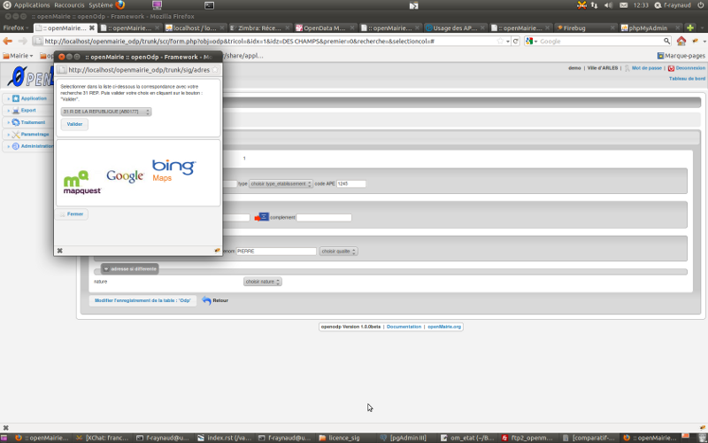

.. _sig:

#####################
Modules Géographiques
#####################

Nous présontons ici 2 modules géographiques

- le module d'affichage / saisie de données géographique : om_sig

- le module d'adresse automatique

=============
Module om_sig
=============

Ce module s'adresse aux développeurs et décrit le fonctionnement du sig interne

.. toctree::
    :numbered:
    
    sig/architecture.rst
    sig/core.rst
    sig/js.rst
    sig/base.rst
    sig/evolution.rst

================
Module d'adresse 
================

Il sagit du module permettant de récupérer une adresse

Il est basé sur le script 

Il est appelé depuis la classe métier suivant l'exemple suivant :

Exemple de openmairie_domainepublic : objet odp ::
    
    dans sql/pgsql/odp.form.inc : le champ adressepostale est implementé comme un champ vide
    $champs=array("odp", ...
                "'' as adresse_postale",  // specific
    
    dans obj/odp.class.php 
    
    dans la methode setType, le champ adresse_postale est du type httpclick
    
        function setType (&$form, $maj) {
            parent::setType ($form, $maj);
            $form->setType('adresse_postale', 'httpclick');
    
    avec la methode setVal : valoriser par défaut l'accès au script adresse_postale
                             app/js/script.js  
        
       function setVal(&$form, $maj, $validation, &$db, $DEBUG=null){
           // bouton adresse postale
           $form->setVal("adresse_postale",
            "adresse_postale('f1',f1.libelle_voie.value,f1.numero_voie.value)");
       }
    
    Initialiser une variable globale égale à 0 et qui prend la valeur 1 si la zone geometrique
    est au format wkt
    En effet le point ramené par l API externe est au format geographique (lattitude, longitude) en wkt
    il commence par POINT(x, y) et il convient de le mettre dans la projection de la zone géometrique de la table ODP
    
        class odp extends odp_gen {
    
            var $wkt=0;    

    
    dans la methode setValF, repérer une valeur wkt
            if(substr($val['geom'],0,5)== "POINT"){
                $this->wkt=1;
                $this->valF['geom'] = null;
            } ...
            
    utiliser les methodes de mise à jour après saisie pour la geometrie :
    
        function triggermodifierapres($id,&$db,$val,$DEBUG) {
            if($this->wkt==1){
                $this->sig_wkt($id,&$db,$val,$DEBUG);
            }
        }
    
        function triggerajouterapres($id,&$db,$val,$DEBUG) {
            $id=$this->valF[odp]; // id n est pas valorise en ajout
            if($this->wkt==1){
                $this->sig_wkt($id,&$db,$val,$DEBUG);
            }
        }
    
        function sig_wkt($id,&$db,$val,$DEBUG){
            // si wkt -> saisie en format binaire wkb pour postgre
            $projection = $db -> getOne("select srid from geometry_columns where f_table_name='".
            $this->table."'");
            $sql ="update ".$this->table." set geom =geometryfromtext('".$val["geom"]."', ".
            $projection." ) where ".$this->table." ='".$id."'";
            $res = $db -> query($sql);
            if (DB :: isError($res)){
                die($res->getMessage()."erreur ".$sql);
            }else{
                $this->msg = $this->msg."&nbsp;"._("le point trouvé par l'API est sauvegardé")."&nbsp;".
                $this->table."&nbsp;".$id;
            }
        }

