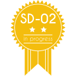
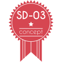

###########################
Stratégies de développement
###########################

On définit ici plusieurs stratégies de développement co-existant au sein de l'écosystème des applications openMairie :

* SD01 - haut niveau de qualité 
* SD02 - niveau de qualité intermédiaire
* SD03 - niveau de qualité pauvre (Proof of Concept)

Ces stratégies peuvent proposer des règles de contribution (qui peut contribuer, et de quelle manière), mais ne se substituent pas à celles en vigueur au sein de l'application concernée.
Elles sous-entendent également une adhésion complète au règles et aux bonnes pratiques de développement des applications openMairie présentes dans cette documentation.

====
SD01
====

Principes
_________

* Le tronc est toujours stable
* Chaque évolution / correction se fait dans une branche
* Chaque évolution / correction est documentée
* Chaque évolution / correction est testée
* Technique de développement en TDD
* Tous les tests de l'application doivent passer

TDD (Test-Driven Development)
_____________________________

Le TDD, ou développement piloté par les tests repose sur le principe suivant :

  *Chaque implémentation d'une nouvelle fonctionnalité ou chaque correction de bug commence par l'écriture de tests.*

Scénario-type de développement d'une évolution
______________________________________________

Initialisation
--------------

L'itération de développement commence par la création d'une branche dédiée sur le gestionnaire de contrôle de version (subversion, git).
Cette branche est issue du tronc, et doit être nommée explicitement selon la fonctionnalité implémentée.

Rédactions des tests
--------------------

Avant tout développement, des tests modélisant la fonctionnalité à implémenter sont rédigés. Selon le type d'évolution, il peut s'agir de :

* tests fonctionnels (on teste les scénarios utilisateur - Librairie RobotFramework)
* tests d'intégration (comment s'intègre ma fonctionnalité dans les scénarios existants - Librairie RobotFramework)
* tests unitaires (on teste méthodes et fonctions unitairement - Librairie PHPUnit)

Une fois rédigés, les tests sont lancés, et doivent être en échec (évolution non-implémentée).

Documentation
-------------

À ce stade, la nouvelle fonctionnalité doit être documentée dans le manuel utilisateur de l'application concernée, dans une branche ou un fork.

Implémentation
--------------

Par la suite, l'implémentation commence, et se poursuit jusqu'à ce que les tests rédigés intialement passent.

Intégration
-----------

Tous les tests de l'application sont relancés et doivent passer avec succès.
Dans le cas où l'un d'entre-eux échoue, il doit être corrigé.

Incorporation
-------------

L'évolution peut alors être incorporée sur le tronc de l'application. Pour ce faire, la branche est ré-actualisée avec les dernières modifications potentielles du tronc.
Dans le cas où le tronc a évolué depuis la création de la branche, l'étape d'intégration précedement décrite est conduite à nouveau.
La branche peut ensuite fusionnée dans le tronc.

A ce stade, la branche / le fork de la documentation est également intégré dans la documentation principale.

Scénario-type de correction de bug
__________________________________

Le déroulement est similaire à celui décrit ci-dessus. Seule la méthodologie d'écriture des tests diffère :

* Dans le cas où il existe des tests couvrant la fonctionnalité dans laquelle est relevé le bug, ceux-ci sont altérés pour le prendre en compte.
* Dans le cas où il n'existe pas de scénario de tests permettant de matérialiser le bug, un nouveau test dédié est rédigé.

La correction du bug s'effectue alors, jusqu'à ce que les tests altérés ou nouvellement créés passent.

Règles de contribution
______________________

Il existe 3 rôles dans le cadre du développement d'un projet respectant la SD01 :

* Développeur
* Contributeur
* Responsable de version

Cette section ne couvre pas l'aspect fonctionnel et décisionnel (choix et temporalité de la feuille de route, identification des processus métiers évolutif ou réglementaire, préservation de la cohérence de l'application, etc) qui reste la responsabilité propre de l'instance de pilotage de l'application (Comité de pilotage, communauté, etc).

Contributeur
------------

Qui ?
*****

Pour contribuer, la première étape consiste à obtenir le droit de commit sur le dépôt du code-source du projet. La procédure est la suivante :

#. Le candidat rejoint le projet (ex: compte sur adullact et demande de participation au projet).
#. Le *Chef de projet* valide la candidature.

Comment contribuer ?
********************

Le *Contributeur* doit respecter les régles de développement de la stratégie courante.

Chaque nouvelle fonctionnalité est développée dans une branche, et est accompagnée de sa documentation et de ses tests. À l'issue du développement, le *Contributeur* signale par le moyen de son choix son souhait d'intégration dans le tronc commun. À ce stade, tous les points présentés dans la check-list ci-dessous doivent avoir été couverts. 
La branche est ensuite validée puis fusionnée dans le tronc par un *Développeur*.

Checklist
*********

* La fonctionnalité est entièrement documentée - *[CTRL_DOC]*
* La fonctionnalité est testée (les nouveaux cas d'utilisation sont couverts) - *[CTRL_TEST]*
* L'intégralité des tests existants passent sur la branche à jour - *[CTRL_REGRESSION]*

Développeur
-----------

Le *Développeur* peut intégrer sur le tronc un développement fait dans une branche, par lui-même ou un tiers. Il est cependant d'usage d'éviter d'intégrer ses propres évolutions.

Qui ?
*****

Le *Développeur* acquiers sa qualité par l'un des moyens suivants :

* Il est membre fondateur du projet
* Il est *Contributeur*, et actif sur une période suffisament étendue, pour qu'un ensemble significatif de *Développeurs* puisse constater le respect des règles qui régissent la stratégie SD01. A l'issu de quoi, à sa demande et après validation du *Chef de projet*, il peut devenir *Développeur*.

Responsable de version
----------------------

Documentation en cours.

.. todo:: Documenter ce rôle

Label
_____

Les applications openMairie respectant cette stratégie de développement sont estampillées avec le logo suivant : 

====
SD02
====

Principes
_________

...

Label
_____

Les applications openMairie qui suivent cette stratégie de développement sont estampillées avec le logo suivant : 

   

====
SD03
====

Principes
_________

...

Label
_____

Les applications openMairie qui suivent cette stratégie de développement sont estampillées avec le logo suivant : 

 

