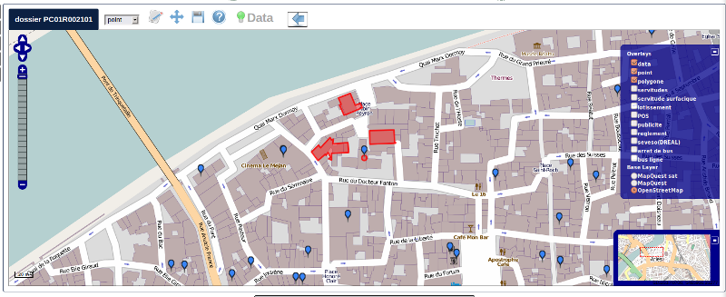
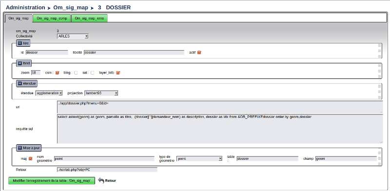
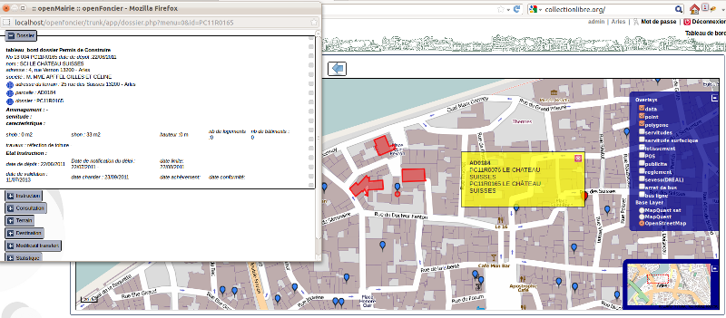
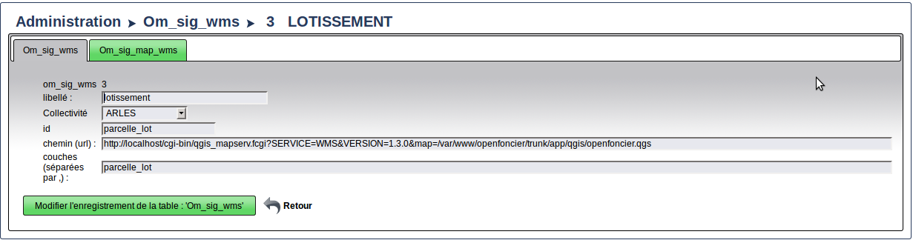
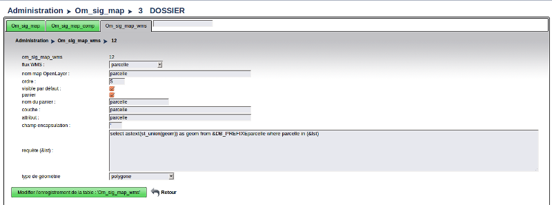
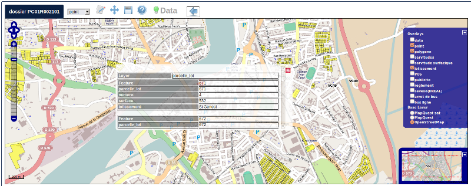
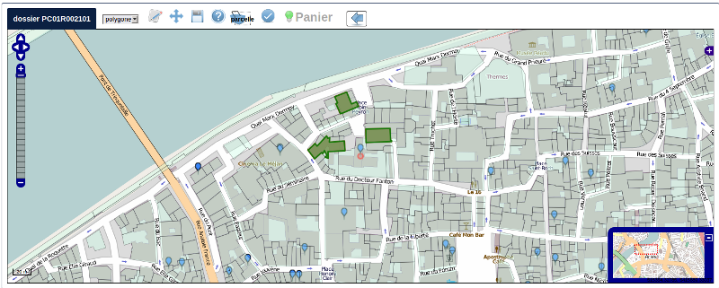
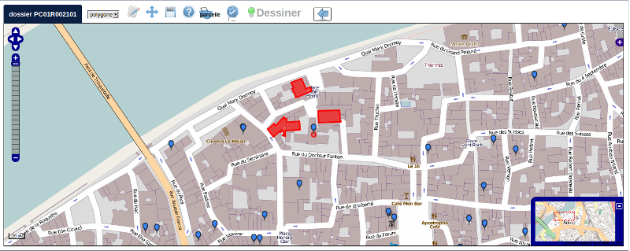
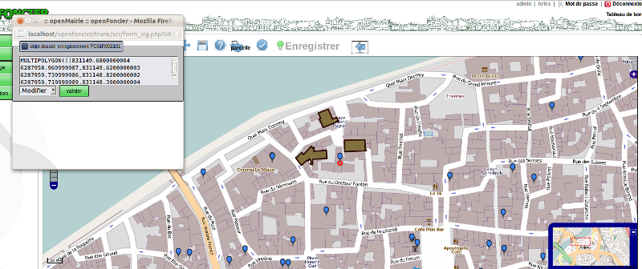
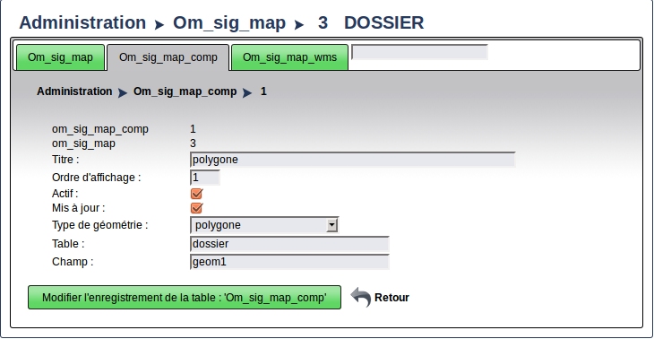

.. _layers:

###################
afficher les layers
###################

ce chapitre propose de décrire l'utilisation de l'objet layers
d'openLayers dans tab_sig.php.

Dans le lien, il est possible de définir ::

- la  carte a afficher suivant l'id : ?obj=   Obligatoire
- le fond affichable par défaut : sat, bing, osm : &fond =
- l'étendue : &etendue =
- l enregistrement à modifier : &idx=

Les cartes sont paramétrées dans om_sig_map (menu administration)

Il est possible de copier une carte et de paramétrer  les champs suivants::

    - id : identifiant unique (obligatoire)
    - libelle
    - fonds a afficher et data (osm, bing, sat(google))
    - étendue et epsg (voir sig/var_sig_point.inc)
    - url (qui pointe sur la fiche ou le formulaire de saisie)
    - requete sql qui affiche les données json et qui doit désigné :
        le titre
        la description
        l idx
    - la mise a jour si oui,
                le champ géometrique et la table maj,
                le type de géometrie et le nom de la couche openLayers (version 4.2.0) 
    - le retour de la carte

Dans tab_sig.php, il y a 3 types de layers :

- les fonds de cartes existants sur internet (base layers)
 
- les données issus de postgresql (overlays)

- les données wms (overlay)

Les fonds
=========

Il est proposé les fonds suivants :

osm : openstreetmap

sat : satelite google 

bing : satellite microsoft 

Les datas
=========

Information de la carte : layer_info 

Cette couche fait appel à sig_json.php

Il est possible de faire appel a un autre script (voir dyn/var_sig.inc)

La requête pgsql est paramétrée dans la table om_sig_map et doit définir les champs
geom, titre, description et texte.

sig_json.php présente tous les enregistrements d'un même
point (même géom) sur un  seul popup

En effet, il est constitué un popup lorsque l on clique sur l objet
et donne la possibilité à un accès URL parametrée dans om_sig_map

Les flux wms
============

Le paramètrage des flux wms est saisi dans om_sig_wms

il faut saisir ::

    - libelle du champ
    - la collectivité
    - l'identifiant (il doit être unique pour chaque couche wms)
    - le lien de la couche (http)
    - les layers de la couches séparés par une virgule
    
Exemple de lien avec qgis serveur ::

    http://localhost/cgi-bin/qgis_mapserv.fcgi
        ?SERVICE=WMS&VERSION=1.3.0
        &map=/var/www/openfoncier/trunk/app/qgis/openfoncier.qgs

L'affectation des flux wms dans une carte est saisi dans om_sig_map_wms

Il est saisi ::

    le nom du flux wms
    nom du layer sur la carte
    l ordre d affichage
    la visibilité par défaut (case à cocher)
    

Sur la carte ci dessous le flux wms est activé et affiche le lotissement (getMap)

En cliquant sur le lotissement, il est possible d'accéder aux données (getFeature)

version 4.4.0

Trois nouveaux paramètres sont disponnibles :

sqlfilter : possibilité de filtre du flux wms (attribut FILTER)

  compléter la zone avec une requête SQL qui va généré le filtre (syntaxe suivant le serveur WMS)
  
exemple d'un filtre ::

    pour produire le filtre suivant :
    layer1:"champ1" = 'valeur1',layer2:"champ2" = 'valeur2'
    
    il faut entrer la requête suivante pour selectionner les electeurs d'un bureau :
    
    select 'electeur:²bureau² = '''||bureau.bureau||''' as buffer from &DB_PREFIXEbureau where bureau = '&idx'
    
    
    select 'electeur:²bureau² = ''&idx'' as buffer from &DB_PREFIXEbureau where bureau = '&idx'
    
    ² = caractère utilisé pour les doubles quotes : "
    || concatenation sql
    ''' permet d echapper la simple quote
    '' sql remplace les deux quotes par une quote (caractere quote)

    le filtre final appliqué au flux wms est : electeur:"bureau" = '04'  pour le bureau 04
     

base_layers : possibilité d'utiliser le flux wms comme base layers (au même niveau qu'OSM)

single_tile : raméne le flux wms en une seule image pour la fenêtre et non en imagette
(permet de corriger les labels tronqués)

Attention les temps de réponses peuvent s'allonger car il n'y a pas de cache.

La notion de pannier
====================

Le pannier permet de pouvoir stocker des géométries au travers de flux wms mais attention, la géométrie est
récupérée dans une table ou une vue postgis (c'est pour l'instant une limite de la version 4.2.0)

exemple : openFoncier carte dossier :

Il est proposé dans ce cas de stocker des polygones dans le pannier et de sauvegarder un multipolygone
constitué de ces polygones récupérés dans le pannier

Choisir dans le select "polygone"; L'etat est "dessinner"

Il apparait le pannier "parcelle". Sélectionner les parcelles en cliquant dessus (elles sont vertes)

Valider une fois les parcelles choisies (elles deviennent rouge)

Appuyer sur "enregistrer", l'état devient enregistrer

Cliquer sur le jeu de parcelles de votre choix (ce jeu devient vert clair)

Il peut y avoir un ou plusieurs panniers : exemple : parcelle, batiment. par contre la géométrie récupérée ne
concerne qu une seule couche

la gestion de pannier se fait dans om_sig_map_wms ::

    panier :        option pannier activé (Oui/non)         Exemple dossier/openFoncier :
    pa_nom :        nom du pannier                          parcelle
    pa_layer :      nom du layer pannier                    parcelle
    pa_attribut:    attribut de la couche à récupérer       parcelle
    pa_encaps:      caractère d'encapsuation (la ')         '
    pa_sql:         requête de récupération                 select astext(st_union(geom)) as geom
                                                            from &DB_PREFIXEparcelle where parcelle in (&lst) 
    pa_type_geometrie:  type de géométrie                   polygone

le script de gestion de pannier est : scr/sig_pannier.php

La géométrie à modifier : couche vectors :
==========================================

Le chargement de la couche vectors se fait si dans la table om_sig_map,
la case maj est activée. 

La géométrie est récupérée par le script sig_wkt.php (appel a un script paramètrable dans var_sig.inc)
et la carte est centrée sur la géométrue

Il est possible de :
    
    - positionner manellement la géométrie
    - déplacer la géométrie
    - enregistrer la géometrie  : selectionner la géométrie, le programme
        form_sig.php est chargé en fenetre et permet de supprimer
        la géométrie (champ geometrique = null)  ou modifier cette géométrie.
    
    Les fonctions javascript et les controles sont activées suivant chaque état.
   
Dans dyn/form_sig_update.inc.php, il est possible de paramétrer des post traitements de saisie

Dans dyn/form_sig_delete.inc.php, il est possible de paramétrer des post traitements de suppression

Les géométries complémentaires
==============================
cd so   
Il peut y avoir plusieurs géométries pour un même objet.

Elles sont saisies dans om_sig_map_comp ::

    titre               polygone    nom de la nouvelle géométrie
    ordre d affichage   1           ordre d'affichage dans le select
    actif               coché       activé la nouvelle géométrie
    Mise a jour         coché       autorisé la mise à jour
    type de géométrie   polygone    polygone, point, ligne
    table               dossier     table du champ géométrique
    champ               geom1       champ géometrique concerné

Dans l exemple précédent, il apparait une fenêtre select ou l utilisateur a le choix entre une géométrie "point"
et une géométrie "polygone" du fait de la mise en place d'une géométrie complémentaire.

   
