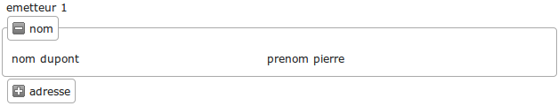

.. _modifier_base:

#############################
Modifier la base et regénérer
#############################

Le framework openMairie permet de modifier la base et prendre en
compte ces modifications en regénérant les scripts **sans** mettre en péril
la personnalisation que vous avez effectuée.

Nous vous proposons de rajouter un champ *registre* dans la table *courrier*
et de rajouter l'adresse dans la table *emetteur*.

========================================
Rajouter un champ registre dans courrier
========================================

Il est proposé de rajouter un champ *registre* dans le courrier dont le but
est de stocker le numéro de registre du courrier sous la forme *annee_numero_d_ordre*.

Nous allons d'abord créer un champ *registre* dans la table *courrier* de la manière suivante : ::

    ALTER TABLE courrier ADD registre VARCHAR( 20 ) ;

Vous devez regénérer votre application courrier dans l'option du menu **Administration -> Générateur -> Courrier**
et laisser cochées les options par défaut :

    gen/obj/courrier.class.php
    
    gen/sql/pgsql/courrier.inc.php
    
    gen/sql/pgsql/courrier.form.inc.php
    

Validez l'opération.

Vous pouvez remarquer si vous allez sur le formulaire d'ajout qu'il y a un nouveau champ *registre*.
Votre personnalisation n'est pas affectée.

Nous voulons que le numéro de registre se mette en ajout de manière automatique une fois le formulaire validé.

Il faut donc surcharger les méthodes suivantes dans *obj/courrier.class.php* : ::

    // pour que registre ne soit pas modifiable

    function setType(&$form,$maj) {
        parent::setType($form,$maj);
        $form->setType('registre', 'hiddenstatic');
    }
    
    // pour la mise à jour de la séquence avant l'ajout de l enregistrement
    
    function triggerajouter($id,&$db,$val,$DEBUG) {
        //  prochain numero de registre
        //  fonction DB pear
        $temp= $db->nextId("registre");
        // fabrication du numero annee_no_d_ordre
        $temp= date('Y')."-".$temp;
        $this->valF['registre'] = $temp;
    }

Si vous souhaitez que registre apparaisse dans l'affichage de la table, vous
devez aussi modifier la variable *champAffiche* de *sql/pgsql/courrier.inc* de la manière
suivante : ::

    $champAffiche = array(
        'courrier.courrier as "'._("courrier").'"',
        'to_char(courrier.dateenvoi ,\'DD/MM/YYYY\') as "'._("dateenvoi").'"',
        'concat(emetteur.nom,\' \',emetteur.prenom) as "'._("emetteur").'"',
        'service.libelle as "'._("service").'"',
        'registre'
    );

Votre affichage de la table courrier est modifié.
   
================================
Rajouter l'adresse dans emetteur
================================

Il est proposé de rajouter l'adresse de l'emetteur à savoir : le libellé, le code postal et
la ville.

La requête est la suivante : ::

    ALTER TABLE emetteur ADD adresse VARCHAR( 40 ) ,
    ADD cp VARCHAR( 5 ) ,
    ADD ville VARCHAR( 40 ) ;

Vous devez regénérer votre application courrier en allant dans l'option du menu :
administration -> generateur -> emetteur et laisser cochées les options par défaut :

    gen/obj/emetteur.class.php
    
    gen/sql/pgsql/emetteur.inc.php
    
    gen/sql/pgsql/emetteur.form.inc.php
    

Validez l'opération.

N'ayant pas modifié *sql/pgsql/emetteur.inc*, le framework fonctionne avec le code généré.

================================================
Améliorer la présentation du formulaire emetteur
================================================

Nous pouvons continuer à améliorer les présentations de nos formulaires 
en utilisant les méthodes setGroupe() et setRegroupe() dans le script
*obj/emetteur.class.php*.

Il vous est proposé d'insérer dans votre script obj/emetteur.class.php
le code suivant : ::

    function setLayout(&$form, $maj) {

        $form->setFieldset('nom','D',_('nom'),"collapsible");
        $form->setFieldset('prenom','F');

        $form->setFieldset('adresse','D',_('adresse'),"startClosed");
        $form->setFieldset('ville','F');
    }

Le fieldset nom est affiché par défaut, pas celui de l'adresse :

Vos formulaires sont maintenant au point.

Le paragraphe suivant vous indique les surcharges d'openCimetiere que vous
pouvez intégrer dans votre exemple, maintenant que vous avez la méthode.

=============================
Les surcharges d'openCourrier
=============================

Vous pouvez utiliser openCourrier qui est téléchargeable au lien suivant :

svn://scm.adullact.net/scmrepos/svn/opencourrier/trunk

Si les surcharges qui ont été faites dans notre exemple sont celles d'openCourrier, il y a
d'autre surcharges dans le script *courrier.class.php* d'openCimetiere  :

Les méthodes setLib, setGroupe et setRegroupe permettent **une présentation
en fieldset**  du courrier (utilisation des champs vide 1 à 5 voir *sql/pgsql/courrier.form.inc*).

Il y a d'autres objets métier qui ont des surcharges intéressantes, par exemple
l'objet *obj/dossier.class.php* où vous avez un upload pour télécharger des
fichiers.

Vous pouvez regarder également l'application openCourrier mais attention à la base de données qui est en MySQL :

    - openCourrier fonctionne avec des restrictions d’accès par service et les méthodes de login ont été modifiées dans *obj/utils.class.php* ainsi qu’*utilisateur.class.php* qui a dans openCourrier un champ service.

    - l’objet *obj/tachenonsolde.class.php* est un exemple de surcharge de *tache.class.php* qui affiche que les tâches non soldées

    - vous pouvez aussi regarder deux scripts de traitement :

        - trt/num_registre.php qui remet à 0 le numéro de registre
        - trt/archivage.php qui tranfere en archive les courriers avant une date

Vous avez également des détails sur les traitements dans le chapitre *framework/util*
notament sur la mise à jour du registre.
