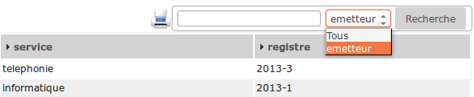
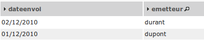

.. _personnaliser:

#############################
Personnaliser son application
#############################

Nous allons maintenant personnaliser notre application.

Pour ce faire, nous allons saisir un jeu de données.

Vous pouvez le faire avec les formulaires, l'incrémentation des séquences étant faite par le framework.
Tout comme la création des tables stockant les séquences (méthode *setId* des objets metier).

Sinon exécutez la requête PostgreSQL suivante : ::

    -- création des tables de séquence déjà faite

    -- Selection du schéma

    SET search_path TO openexemple;
    
    -- insertion de deux émetteurs avec récupération et incrémentation de la table de séquences
    
    INSERT INTO emetteur (emetteur, nom, prenom) VALUES
    (nextval('emetteur_seq'), 'dupont', 'pierre'),
    (nextval('emetteur_seq'), 'durant', 'jacques');

    -- insertion de deux services avec récupération et incrémentation de la table de séquences
    
    INSERT INTO service (service, libelle) VALUES
    (nextval('service_seq'), 'informatique'),
    (nextval('service_seq'), 'telephonie');
    
    -- insertion de deux courriers avec récupération et incrémentation de la table de séquences
    
    INSERT INTO courrier (courrier, dateenvoi, objetcourrier, emetteur, service) VALUES
    (nextval('courrier_seq'), '2010-12-01', 'Proposition de fourniture de service', 1, 1),
    (nextval('courrier_seq'), '2010-12-02', 'Envoi de devis pour formation openMairie', 2, 1);
    

==========================================
Faire un affichage courrier plus convivial
==========================================

L'affichage des courriers se fait avec des libellés générés automatiquement.

Ainsi dans le fichier *gen/sql/pgsql/courrier.inc.php* (qui est inclus dans le fichier *sql/pgsql/courrier.inc.php* que vous pourrez modifier)
vous avez la variable **$champAffiche**.

Vu que ce fichier a été créé par le générateur (et est en lecture seule) et vu que nous souhaitons modifier la variable (pour par exemple avoir le nom et le prénom de l'emetteur au lieu de simplement son nom) il nous faut ouvrir le fichier *sql/pgsql/courrier.inc.php* où nous allons (après l'*include*!) réaffecter à la variable **$champAffiche** la valeur suivante : ::

    $champAffiche = array(
        'courrier.courrier as "'._("courrier").'"',
        'to_char(courrier.dateenvoi ,\'DD/MM/YYYY\') as "'._("dateenvoi").'"',
        'concat(emetteur.nom,\' \',emetteur.prenom) as "'._("emetteur").'"',
        'service.libelle as "'._("service").'"',
    );

Il est possible que l'opération vous soit refusée (seul **www-data** ayant les droits d'écriture).

Si tel est le cas échéant il faudra se rajouter les permissions.

Le résultat est le suivant : ::

    Courrier Dateenvoi  Emetteur  	    Service
        1 	01/12/2010 	dupont pierre 	informatique
        2 	02/12/2010 	durant jacques 	informatique

De la même manière, toujours dans le même fichier, vous pouvez changer les options de la zone de recherche en réaffectant la variable **$champRecherche**.
Actuellement on peut en plus de *Tous* faire une recherche sur *courrier*, *emetteur* et *service*.

C'est parce qu'à l'orgine, dans le fichier généré, **$champRecherche** avait été affectée comme telle : ::

    $champRecherche = array(
    'courrier.courrier as "'._("courrier").'"',
    'emetteur.nom as "'._("emetteur").'"',
    'service.libelle as "'._("service").'"',
    );

Supprimez un ou plusieurs élément(s) du tableau et il disparaîtra de la zone de recherche. Par exemple... ::
    
    $champRecherche = array(
    'emetteur.nom as "'._("emetteur").'"',
    );

\...donnera :

Nous souhaitons maintenant avoir les derniers courriers au début de la page affichée.
Nous n'avons pas besoin d'aller réécrire la requête, il existe une variable texte comprenant l'instruction de tri.
Réaffectez cette variable **$tri** dans votre *courrier.inc.php* de la manière suivante : ::

    $tri= " order by dateenvoi desc";

Le résultat est le suivant :

Pour en savoir plus sur ces variables *voir framework/affichage*.

=============================
Rendre obligatoire des champs
=============================

Nous avons affiché le courrier avec une jointure de type *LEFT JOIN* ce qui ne rend pas obligatoire la saisie de l'emetteur et du service (auquel le courrier est affecté).

Nous devons surcharger la méthode **verifier()**.

Dans *obj/courrier.class.php* la méthode à insérer après le constructeur est celle-ci : ::

    function verifier($val,&$db,$DEBUG) {
        parent::verifier($val,$db,$DEBUG);

        // Les champs service et emetteur sont obligatoires
        if ($this->valF['service']==""){
            $this->correct=False;
            $this->addToMessage(_('service')."&nbsp;"._('obligatoire')."&nbsp;!");

        //    
        }
        if ($this->valF['emetteur']==""){
            $this->correct=False;
            $this->addToMessage(_('emetteur')."&nbsp;"._('obligatoire')."&nbsp;!");
        }
    }

Par défaut le premier champ (ici *dateenvoi*) est obligatoire, cette option est modifiable
dans le générateur.

La commande *parent::verifier($val,$db,$DEBUG);* permet de ne pas neutraliser la
fonction surchargée (ici dans gen/obj/courrier.class.php)

Pour plus d'informations *voir framework/methode*.

=============================
Valoriser un champ par défaut
=============================

Pour simplifier la saisie, nous souhaitons mettre la date du jour dans le
champ *dateenvoi* lors d'un ajout de courrier.

Nous allons surcharger la methode setVal() dans *obj/courrier.class.php*
de la manière suivante : ::

    function setVal(&$form, $maj, $validation, &$db, $DEBUG=null){
        parent::setVal($form, $maj, $validation, $db, $DEBUG=null);
        
        if ($validation==0) {
            if ($maj == 0){
                $form->setVal("dateenvoi", date('Y-m-d'));
            }
        }
    }

Le champ *dateenvoi* contiendra la date système *(date('Y_m-d'))* si la validation est égale à 0
(ce qui signifie que le formulaire n'a pas été validé) et si **$maj** est égal à 0 (ce qui signifie qu'il s'agit d'un ajout).

Les autres valeurs que peut prendre **$maj** sont :

    - 1 : modifier
    - 2 : supprimer
    - 3 : consulter

============================
Mettre en majuscule un champ
============================

Nous souhaitons maintenant mettre en majuscule le champ *nom* de la table emetteur.

Nous allons surcharger la méthode setOnchange() dans
*obj/emetteur.class.php* de la manière suivante : ::

    function setOnchange(&$form,$maj){
        parent::setOnchange($form,$maj);

        $form->setOnchange("nom","this.value=this.value.toUpperCase()");
    }

A la saisie ou à la modification du nom, le champ se mettra en majuscule.

==================
Principe à retenir
==================

Voila quelques exemples des possibilités de modification dans les fichiers sql
(répertoire *sql/*...) et dans les méthodes de l'objet (repertoire *obj/*...).

En aucun cas il ne faut modifier les fichiers dans *gen/* qui est l'espace de travail propre au générateur.

Nous allons dans le prochain chapitre modifier la base et regénérer les écrans sans mettre en danger
votre personnalisation.
