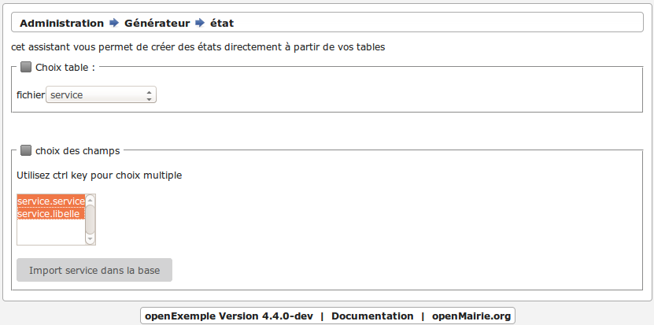
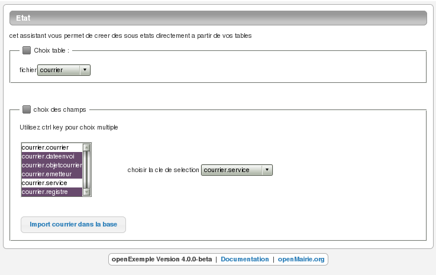
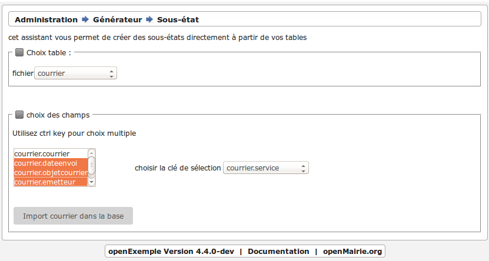
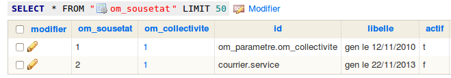
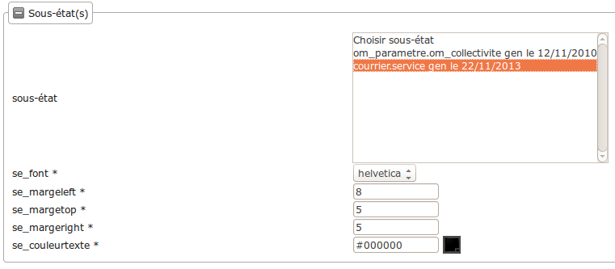
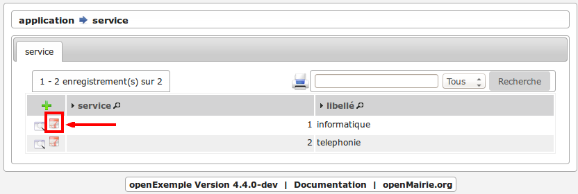
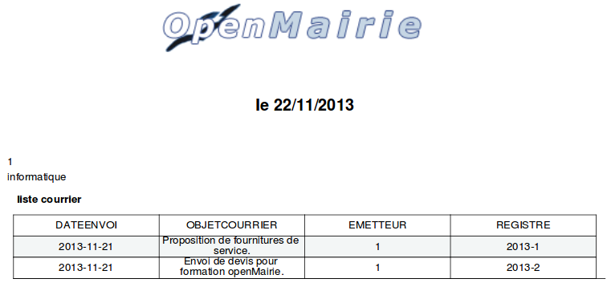
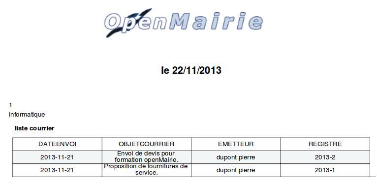

.. _utiliser_assistant:

###############
Créer ses états
###############

Il vous est proposé de créer un état des courriers par service.

Il sera utilisé dans ce chapitre l'assistant état et sous-état du générateur.

Quittez le projet openCimetiere et revenez à openExemple.

====================
Créer l'état service
====================

Nous allons utiliser l'assistant état du générateur dans le menu :

**Administration -> Générateur -> Assistants**

Choisir *Création d'état* puis choisir dans le select l'option service.

Ensuite avec la touche *CTRL* sélectionner les champs *service.service* et *service.libellé*.

Cliquer ensuite sur *Import service dans la base*.

Un message apparaît : *service enregistré*.

Vous avez créé un enregistrement qui a pour identifiant *service* dans
la table *om_etat*.

Vous devez rendre d'abord votre état service *actif* pour pouvoir y accéder.

Il faut maintenant permettre l'accès dans l'affichage du service :

    - Ouvrir le fichier *sql/pgsql/service.inc.php*

    - Ajouter le script suivant : ::

        $href[3] = array(
            "lien" => "../pdf/pdfetat.php?obj=".$obj."&amp;idx=",
            "id" => "",
            "lib" => "",
        );

Nous rajoutons la ligne 3 dans le tableau href. Vous avez un état lié
à l'affichage du service.

Il y a des exemples d'utilisation de href dans *om_collectivité*, *om_etat*,
*om_utilisateur*,...

===========================
Créer le sous-état courrier
===========================

Nous allons utiliser l'assistant sous-état du générateur dans le menu :

**Administration -> Générateur -> Assistants -> Création sous-état**

Nous choisissons la table courrier et nous surlignons les champs
*courrier.dateenvoi*, *courrier.objetcourrier*, *courrier.emetteur* et *courrier.registre*.

Nous choisissons *courrier.service* comme clé secondaire pour faire le lien
avec service.

En cliquant sur *Import courrier dans la base* vous créez un enregistrement
ayant pour identifiant *courrier.service* dans la table *om_sousetat* :

===================================================
Associer le sous-état *courrier* à l'état *service*
===================================================

Vous devez rendre d'abord votre sous-état *courrier.service* actif pour pouvoir l'associer.

Allez dans l'option **Sous Etat** du menu **Paramétrage**.

Recherchez le sous-état *courrier.service* et modifiez le en cochant actif (premier fieldset : *collectivité*).

Il vous faut maintenant associer le sous-état *courrier.service* à l'état *service*.

Allez dans l'option **Etat** du menu **Paramétrage**.

Modifiez l'état *service* et dans le fieldset à déplier
*Sous-état(s)* après l'avoir coché actif sélectionnez le sous-état *courrier.service*.

Attention la mise en place de sous etat dans un état a été modifié dans la version 4.5 du framework 
La version ci dessous est om 4.4.

Vous avez désormais un état des courriers par service (**Paramétrage -> Service -> Edition PDF**) :

==========================================================
Mettre le nom et le prénom de l'emetteur dans le sous-état
==========================================================

Nous souhaitons mettre le nom et le prénom de l'emetteur à la place de
la clé secondaire.

Vous devez modifier la requête sql du sous-état *courrier.service*
dans la table *om_sousetat* de la manière suivante : ::

    select courrier.dateenvoi as dateenvoi,
    courrier.objetcourrier as objetcourrier,
    concat(emetteur.nom,' ',emetteur.prenom) as emetteur,
    courrier.registre as registre
    from &DB_PREFIXEcourrier LEFT JOIN &DB_PREFIXEemetteur on emetteur.emetteur = courrier.emetteur
    where courrier.service='&idx'

Votre nouvel état a la forme suivante :

Pour intégrer la date du jour, il faut créer un fichier varetatpdf.inc dans le répertoire /dyn dans lequel on va mettre le code suivant :

.. code-block:: php

    <php
    // aujourdhui
    $titre=str_replace("&aujourdhui",date('d/m/Y'),$titre);
    $corps=str_replace("&aujourdhui",date('d/m/Y'),$corps);
    
    ?>
    
    
Si on souhaite intégrer les paramètres de la table om_paramètre, on rajoute dans le même fichier le code suivant :

.. code-block:: php

    // Remplacement des paramètres présents dans le tableau '$collectivite'
    // qui contient l'intégralité de la table 'om_parametre'
    if (isset($collectivite) && $collectivite != array()) {
        //
        foreach (array_keys($collectivite) as $elem) {
            //
            $temp = "&".$elem;
            $collectivite_elem = $collectivite[$elem];
            ////
            //if (DBCHARSET == 'UTF8') {
            //    //
            //    $collectivite_elem = utf8_decode($collectivite_elem);
            //}
            //
            $titre = str_replace($temp, $collectivite_elem, $titre);
            $corps = str_replace($temp, $collectivite_elem, $corps);
            $sql = str_replace($temp, $collectivite_elem, $sql);
        }
    }
    

Vous avez de nombreux exemples d'utilisation d'état et de sous-état dans
les applications openMairie.

Une utilisation originale a été faite pour le Cerfa du recensement dans
openRecensement où à la place du logo il a été mis une image du Cerfa.

On ne peut cependant pas faire tous les états et il est fort possible que vous ayez des
états spécifiques. Vous avez des exemples d'utilisation spécifique des méthodes
de fpdf dans openElec : carte électorale, liste électorale, ...

Vous pouvez compléter votre information avec le chapitre :ref:`edition` et
regarder les possibilités de :ref:`paramétrage du générateur<parametrage_generateur>` pour la réalisation
d'un état customisé.

Vous avez maintenant terminé l'exemple d'utilisation du Framework, le chapitre suivant a pour but de vous informer sur l'usage du framework...
