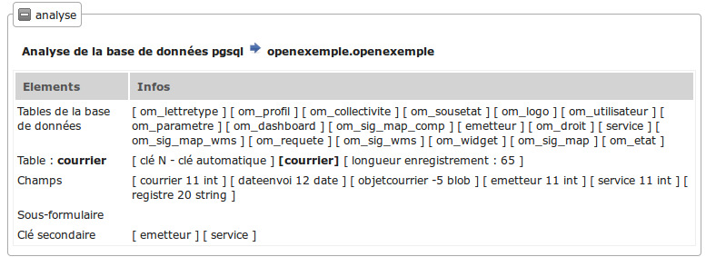
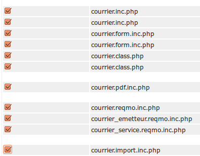
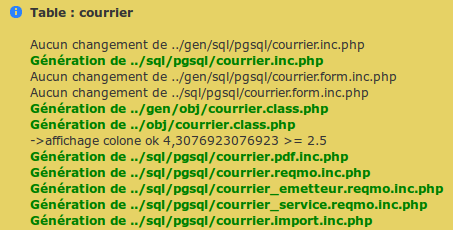
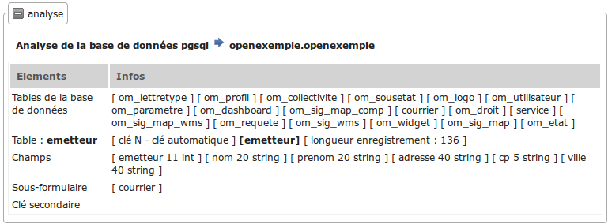
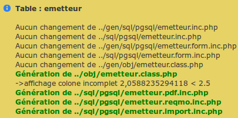
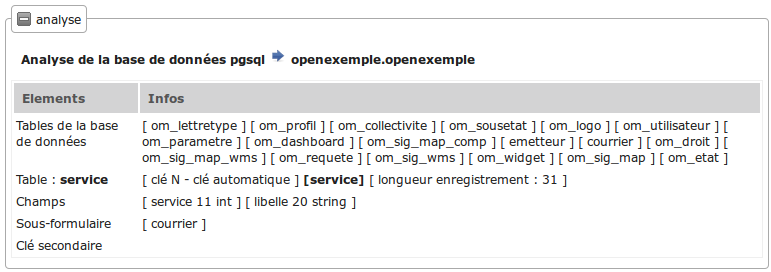
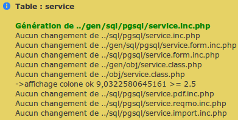

.. _utiliser_generateur:

#####################
Créer les formulaires
#####################

Nous allons maintenant créer les formulaires à l'aide du générateur.

Pour cela, il faut aller dans le menu **Administration -> Générateur**.

Vous devez avoir 3 nouveaux boutons : courrier, service et emetteur.

.. image:: ../_static/utilisation_1.png

Avant de commencer, l'utilisateur apache **www-data** doit avoir les droits
d'écriture dans les repertoires */gen* , */sql* et */obj*.

==============================================
Générer les formulaires et édition du courrier
==============================================

En appuyant sur le bouton de courrier, vous avez les choix de génération :

.. image:: ../_static/utilisation_2.png

Au préalable, le générateur a fait une analyse de la base de données :

Le générateur a donc détecté 2 clés secondaires et aucun sous-formulaire.

C'est pour cela qu'il propose 3 ":ref:`reqmos<reqmo>`" : 1 "reqmo" global et 2 "reqmos" suivant les clés secondaires.

Par défaut, seules les options du formulaire sont cochées.

Si vous le refaites plus tard, seules celles fabriquées par le générateur seront cochées.

Cochez les toutes :

En cliquant sur valider, vous avez le message :

Le paramétrage utilisé est le paramétrage standard.

Vous pouvez le modifier : voir :ref:`parametrage_generateur`.

L'affichage par colonne est "ok", ce qui veut dire que la taille des colonnes
dans le fichier pdf sera complet (attention le script ne prend pas le champ blob).

================================================
Générer les formulaires et édition de l'emetteur
================================================

Nous allons procéder de la même manière avec le bouton emetteur.

L'analyse de la base de données est la suivante :

Le générateur repère un sous formulaire courrier.
Effectivement, il y a une relation de un à plusieurs entre emetteur et courrier :
un emetteur peut avoir 0 à plusieurs courriers.

En cliquant sur toutes les options puis en validant, vous avez le message suivant :

=============================================
Générer les formulaires et édition de service
=============================================

Nous allons procéder de la même manière avec le bouton service

L'analyse de la base de données est la suivante :

Le générateur repère un sous formulaire courrier.
Effectivement, il y a une relation de un à plusieurs entre service et courrier :
un service peut avoir 0 à plusieurs courriers.

En cliquant sur toutes les options, vous avez le message suivant :

=====================================
Intégrer les formulaires dans le menu
=====================================

Pour accéder à nos formulaires, nous allons les intégrer dans le menu
(voir :ref:`paramètrage du menu<parametrage_menu>`).

Nous allons appeller le formulaire depuis le menu :

- option **Application** -> tab.php?obj=courrier

- option **Paramétrage** -> tab.php?obj=emetteur

- option **Paramétrage** -> tab.php?obj=service

Il faut ouvrir avec un éditeur le fichier *dyn/menu.inc.php* et insérer le code suivant : ::

    // {{{ Rubrique APPLICATION

        $links[] = array(
            "href" => "../scr/tab.php?obj=courrier",
            "class" => "courrier",
            "title" => _("courrier"),
            "right" => "courrier"
        );
    
    // {{{ Rubrique PARAMETRAGE
    
        $links[] = array(
            "href" => "../scr/tab.php?obj=emetteur",
            "class" => "emetteur",
            "title" => _("emetteur"),
            "right" => "emetteur"
        );

        $links[] = array(
            "href" => "../scr/tab.php?obj=service",
            "class" => "service",
            "title" => _("service"),
            "right" => "service"
        );

Il faut également bien placer le code, c'est à dire dans la bonne rubrique (précisée en commentaire) après ::

    $links = array();

et avant ::
    
    $rubrik['links'] = $links;

Enfin pour y accéder il faut soit donner les droits via le menu framework, soit
(et c'est en l’occurrence le cas) dans le fichier ``dyn/config.inc.php`` (option
utilisée que pour le développement) ajouter la ligne ::

    $config['permission_if_right_does_not_exist'] = true;

Vous pouvez maintenant accéder à vos formulaires par le menu.

====
Menu
====

**Application -> Courrier**

Cette opération affiche la table courrier :

.. image:: ../_static/utilisation_3.png

On accéde en appuyant sur **+** au formulaire d'insertion où les champs sont :

- la date du courrier avec calendrier,

- l'objet du courrier dans un champ textarea,

- deux contrôles "select" pour le service et l emetteur.

 .. image:: ../_static/utilisation_4.png   

**Paramétrage -> Emetteur**

Cette operation affiche la table emetteur :

.. image:: ../_static/utilisation_5.png

En appuyant sur **+**, on accède à la saisie.

L'onglet courrier est inactif tant que l'emetteur n'est pas saisi et validé.

.. image:: ../_static/utilisation_6.png

**Paramétrage -> Service**

Cette opération affiche la table service :

.. image:: ../_static/utilisation_7.png

En appuyant sur **+**, on accède à la saisie.

L'onglet courrier est inactif tant que le service n'est pas saisi.

.. image:: ../_static/utilisation_8.png

Vous pouvez accéder aux éditions et requêtes mémorisées :

**Export -> Edition**

Cet option affiche l'ensemble des éditions pdf :

.. image:: ../_static/utilisation_9.png

Pour en savoir plus voir :ref:`edition`

**Export -> Requêtes Mémorisées**

Cette option affiche les requêtes mémorisées :

.. image:: ../_static/utilisation_10.png

Pour en savoir plus voir :ref:`reqmo`
    
Vous pouvez accéder aux éditions grâce à l'icône d'imprimante dans les pages de
listings des courriers, services et émetteurs.

Vous pouvez accéder au fichiers d'import :

**Administration -> Import**

Cette option affiche les scripts d'imports :

.. image:: ../_static/utilisation_11.png
    

Pour en savoir plus voir :ref:`import`
