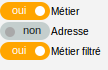

.. _couche:

===========
les fonds :
===========

.. image:: fond.png

Ils sont paramétrés dans om_sig_map.

Dans notre cas, les options OSM et Bing sont cochés et il y a 2 flux wms paramétrès dans om_sig_flux
et associé à om_sig_map (om_sig_map_flux) qui sont : cadastre, orthophoto 2003.

voir paramétrage

=============
les couches :
=============

Dans notre exemple, il y a :

- deux couches vecteurs modifiables : point et périmètre,

- une couche de marqueurs (option layerInfo d'om_sig_map),

.. image:: couche_marqueur.png

- Trois flux wms: métier, adresse et métier filtré 

Les flux sont paramétrées dans om_sig_flux et elles sont associées aux cartes dans
om_sig_map_flux.

Voir paramétrage
