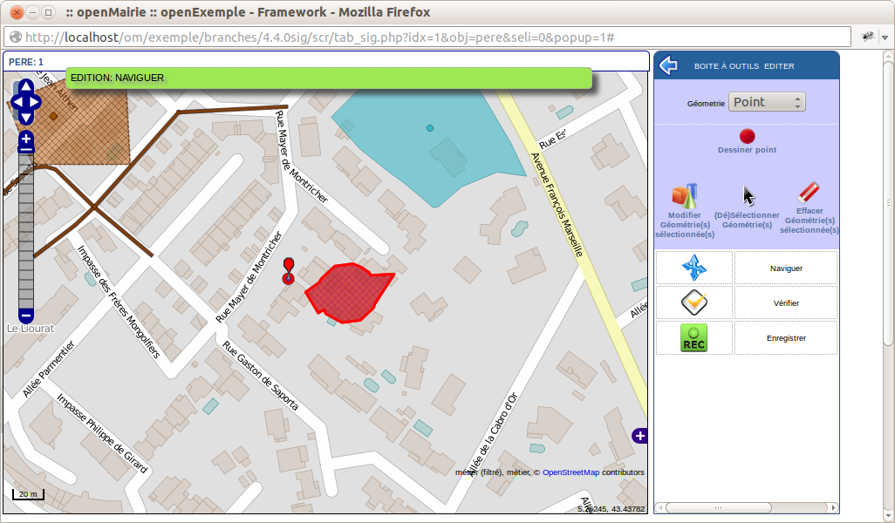
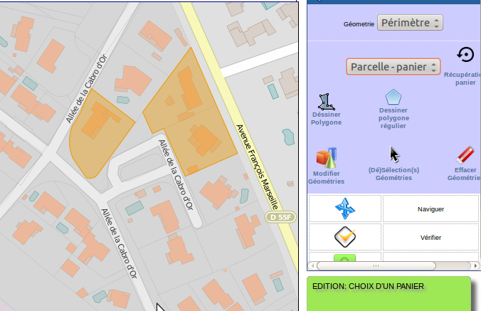

.. _administration_edition:

==============
Mode édition :
==============

En mode édition, on ne peut plus accéder aux autres onglets

Cet onglet permet de modifier la ou les géométries de l' enregistrement de l'objet courant :

ci dessous la géométrie point de pere 1

Il est possible dans la fenêtre du haut de choisir une des géométries à modifier,
ici le point ou le polygone de père 1

===================
Edition d'un point:
===================

Nous choisissons d'éditer le point :

Création d'un ou plusieurs points :
===================================

.. image:: map-edit-point.png

Après avoir sélectionner ce bouton, cliquez sur la carte à l'endroit où vous voulez le point
Vous pouvez créer un ou plusieurs points. Le point est de couleur bleu

Modifier une géométrie sélectionnées :
======================================

.. image:: map-edit-modif.png

Sélectionner un des points en cliquant dessus, il devient rouge.

Vous pouvez maintenant le déplacer

(Dé)selectionner une géométrie :
================================

Vous pouvez selectionner ou déselectionner un point :

.. image:: map-edit-select.png

- bleu : non sélectionné

- rouge sélectionné

Un point sélectionné est actif pour une modification, suppression ou enregistrement

Supprimer une géométrie selectionner :
======================================

En appuyant sur

.. image:: map-edit-erase.png

Vous effacer la ou les géométries sélectionnées

Vérifier avant enregistrement d'un point:
=========================================

Cette option vous permet de vérifier que votre géométrie est valide avant
enregistrement.

Si vous avez par exemple plusieurs points sélectionnés et que la géométrie attendu est
un seul point, un message s'affichera en observation ::
    
    Edition: Données invalides! Point: MultiPoint sélectionné, point attendu

Si dans le même cas vous avez sélectionné qu'un seul point :

- Les points construits non selectionnés seront effacés.

- le message sera le suivant ::

    Edition: vérification terminée avec succès
    
Enregistrer un point :
======================

Cette option permet d'enregistrer un point.

.. image:: map-edit-record.png

======================
Edition d'un polygone:
======================

En sélectionnant périmètre, on peut mettre à jour la géométrie polygone.

.. image:: geom_perimetre.png

Utilisation du panier pour construire une géométrie
====================================================

Dans panier, choisir un panier (ici parcelle panier)

Le fond correspondant à parcelle panier s'affiche (cadastre) 

Séléctionner une ou des géométries.

Valider l'option récupération panier en appuyant sur

.. image:: map-edit-get-cart.png

les objets récupérés sont en bleu.

.. image:: parcelle_pannier2.png

Créer un polygone
=================

Vous pouvez créer un polygone en appuyant sur :

.. image:: map-edit-draw-polygon.png

Vous pouvez construire un polygone régulier en

- en appuyant sur

.. image:: map-edit-draw-regular.png

- sélectionner le nombre de côté que vous voulez (par défaut 4)

Modifier un polygone sélectionné :
==================================

.. image:: map-edit-modif.png

Sélectionner un des polygones en cliquant dessus, il devient rouge.

Vous pouvez maintenant le modifier

(Dé)selectionner une géométrie :
================================

Vous pouvez selectionner ou déselectionner un polygone :

.. image:: map-edit-select.png

- bleu : non sélectionné

- rouge sélectionné

.. image:: parcelle_pannier3.png

Un polygone sélectionné est actif pour une modification, suppression ou enregistrement

Supprimer un polygone selectionné :
===================================

En appuyant sur

.. image:: map-edit-erase.png

Vous effacer la ou les géométries sélectionnées

Vérifier avant enregistrement d'un polygone:
============================================

Cette option vous permet de vérifier que votre géométrie est valide avant
enregistrement.

    
Enregistrer un polygone :
=========================

Cette option permet d'enregistrer un polygone.

.. image:: map-edit-record.png

=========================
Modification d'un ligne :
=========================

En sélectionnant ligne, on peut mettre à jour la géométrie ligne.

Utilisation du panier pour construire une géométrie
====================================================

Dans panier, choisir un panier (ici tronçon panier)

Le fond correspondant à troncon panier s'affiche

Séléctionner une ou des géométries.

Valider l'option récupération panier en appuyant sur

.. image:: map-edit-get-cart.png

les objets récupérés sont en bleu.

Créer une ligne :
=================

Vous pouvez créer une ligne en appuyant sur :

Modifier une ligne sélectionnée :
=================================

.. image:: map-edit-modif.png

Sélectionner une des lignes en cliquant dessus, elle devient rouge.

Vous pouvez maintenant modifier les points de la ligne

(Dé)selectionner une géométrie :
================================

Vous pouvez selectionner ou déselectionner une ligne :

.. image:: map-edit-select.png

- bleu : non sélectionnée

- rouge sélectionnée

La ligne sélectionnée est active pour une modification, suppression ou enregistrement

Supprimer une ligne selectionnée :
==================================

En appuyant sur

.. image:: map-edit-erase.png

Vous effacer la ou les géométries sélectionnées

Vérifier avant enregistrement d'une ligne:
==========================================

Cette option vous permet de vérifier que votre géométrie est valide avant
enregistrement.

    
Enregistrer une ligne :
=======================

.. image:: map-edit-record.png

Cette option permet d'enregistrer une igne.

Problèmes
