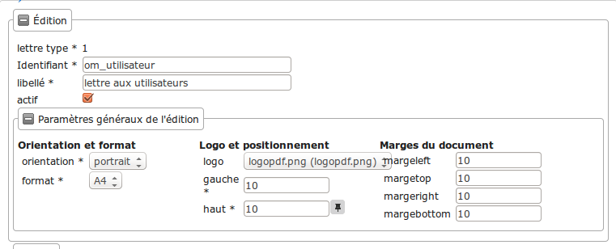
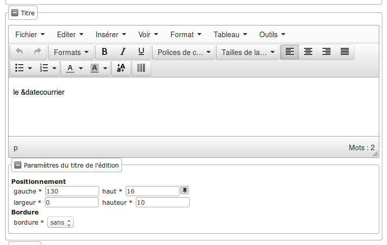
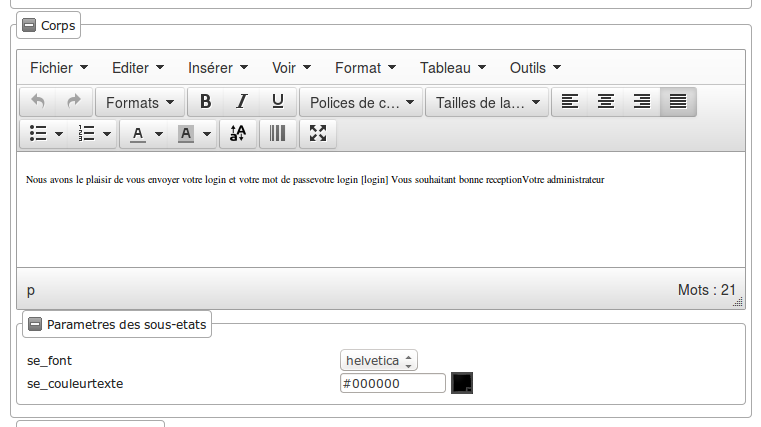
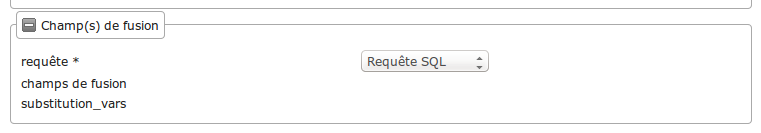

.. _administration:

##############
Administration
##############

Cette rubrique est dédiée à l'administration des fonctionnalités disponibles
depuis l'interface : les tableaux de bord, les éditions, la géolocalisation, 
...

====================
Les tableaux de bord
====================

Widget
------

...

Composition
-----------

...

============
Les éditions
============

États et lettres types
----------------------

Bloc 'édition'
==============

Les informations d'**édition** à saisir sont :

* **id** : identifiant de l'état/lettre type.
* **libellé** : libellé affiché dans l'application lors de la sélection d'une édition.
* **actif** : permet de définir si l'édition est active ou non.

.. note::

    Les champs **id** et **libellé** sont obligatoires, les **id** actif sont uniques.

--------------------------------
Paramètres généraux de l'édition
--------------------------------

Les champs de **paramètres généraux de l'édition** à saisir sont :

* **orientation** : orientation de l'édition (portrait/paysage).
* **format** : format de l'édition (A4/A3).
* **logo** : sélection du logo depuis la table des logos configurés.
* **logo haut/gauche** : position du coin haut/gauche du logo par rapport au coin
  haut/gauche de l'édition.
* **Marge gauche** : marge gauche de l'édition
* **Marge haut** : marge haute de l'édition
* **Marge droite** : marge droite de l'édition
* **Marge bas** : marge basse de l'édition

Bloc 'titre'
============

* **titre** : éditeur riche permettant une mise en page complexe.

--------------------------------
Paramètres du titre de l'édition
--------------------------------

Positionnement :

* **titre gauche** : positionnement du titre par rapport à la marge gauche de l'édition.
* **titre haut** : positionnement du titre par rapport à la marge haute de l'édition.
* **largeur de titre** : taille de la largeur du titre.
* **hauteur** : hauteur minimum du titre.

Bordure :

* **bordure** : Affichage ou non d'une bordure.

Bloc 'corps'
============

* **corps** : éditeur riche permettant une mise en page complexe.

-------------------------
Paramètres des sous-états
-------------------------

* **Police personnalisée** : sélection de la police des sous-états.
* **Couleur texte** : sélection de la couleur du texte des sous-états.

Bloc 'champs de fusion'
=======================

* **Requête** : sélection d'un jeu de champs de fusion.
* **Champs de fusion** : Liste des champs de fusion disponibles pour la requête sélectionnée.
* **Variables de remplacement** : Liste des variables de remplacements disponibles.

Aide à la saisie dans les éditeurs de texte riche
=================================================

Trois configurations différentes de l'éditeur de texte riche sont utilisées :

- configuration n°1 : corps de l'édition,

- configuration n°2 : titre de l'édition,

- configuration n°3 : blocs de texte avec une mise en forme limitée toujours destinés à être intégré dans une édition via un champs de fusion.

+----------------------------+--------+--------+--------+
| Fonction / Configuration   | N°1    | N°2    | N°3    |
+============================+========+========+========+
| Tableaux                   | x      | x      |        |
+----------------------------+--------+--------+--------+
| Saut de page               | x      |        |        |
+----------------------------+--------+--------+--------+
| Code barres                | x      | x      |        |
+----------------------------+--------+--------+--------+
| Majuscule/Minuscule        | x      | x      | x      |
+----------------------------+--------+--------+--------+
| Insertion de sous-états    | x      |        |        |
+----------------------------+--------+--------+--------+
| Plein écran                | x      | x      |        |
+----------------------------+--------+--------+--------+
| Correction orthographique  | x      | x      | x      |
+----------------------------+--------+--------+--------+
| Voir le code source        | x      | x      | x      |
+----------------------------+--------+--------+--------+

--------------------
Gestion des tableaux
--------------------

* **Créer un tableau** :

Choisir le nombre de lignes et de colonnes du tableau.

.. note::

    Il faut bien placer le curseur dans une des cellules du tableau que l'on 
    souhaite paramétrer.
    Idem pour le paramétrage des lignes et colonnes.

* **Paramétrage général du tableau** :

    - Largeur :
     
    Ce champ sert à indiquer la largeur du tableau en % (UNIQUEMENT) par rapport 
    à la largeur du PDF.
         
    Par exemple, si le PDF fait une largeur de 30 cm et que la lageur du tableau    
    est de 10%, le tableau fera 3 cm de largeur sur le PDF.
     
    - Hauteur :
         
    Ce champ sert à indiquer la hauteur du tableau en % (UNIQUEMENT) par rapport 
    à la hauteur du PDF.
         
    Par exemple, si le PDF fait une hauteur de 50 cm et que la hauteur du tableau    
    est de 25%, le tableau fera 12.5 cm de hauteur sur le PDF.
     
    - Espacement inter-cellules :
    
    Espacement entre les cellules. En pixel.
    
    - Espace interne cellule :
    
    Espacement entre les bords de la cellule et son contenu. En pixel.
    
    - Bordure :
    
    Epaisseur des bordures du tableau. En pixel.
    
    - Titre :
    
    Lorsque cette case est cochée, elle permet de rajouter un titre au tableau.
    
    - Alignement :
    
    Permet de choisir le type d'alignement du texte dans le tableau. 
    Valeurs possibles : n/a (aucun), Gauche, Centré, Droite.

* **Supprimer un tableau**

* **Paramétrage des cellules** :

    - Largeur :
    
    Ce champ sert à indiquer la largeur de la colonne en % (UNIQUEMENT) par 
    rapport à la largeur du tableau.
         
    Par exemple, si le tableau fait une largeur de 30 cm et que la largeur de la 
    colonne est de 10%, la colonne fera 3 cm de largeur.
    
    - Hauteur :
    
    Ce champ sert à indiquer la hauteur de la colonne en % (UNIQUEMENT) par 
    rapport à la hauteur du tableau.
         
    Par exemple, si le tableau fait une hauteur de 50 cm et que la hauteur de la
    colonne est de 25%, la colonne fera 12.5 cm de hauteur.
    
    - Type de cellule :
    
    Permet de définir si c'est une cellule "normale" ou une cellule qui va servir 
    d'en-tête dans le tableau.
    Valeurs possibles : Cellule, Cellule d'en-tête.
    
    - Étendue :
    
    Paramètre sur quoi doivent s'appliquer les paramètres renseignés.
    Valeurs possibles : n/a (aucun), Ligne, Colonne, Groupe de lignes, Groupe de 
    colonnes.
    
    - Alignement :
    
    Permet de choisir le type d'alignement du texte dans la cellule. 
    Valeurs possibles : n/a (aucun), Gauche, Centré, Droite.

* **Fusionner des cellules** :

En sélectionnant les cellules à fusionner et en cliquant sur 
Tableau → Cellule → Fusionner les cellules les cellules seront fusionnées.

Si aucune cellule n'est sélectionnée, un menu apparaît :

    - Colonnes :
    
    Nombre de colonnes qui vont être fusionnées à partir de la cellule dans 
    laquelle le curseur est positionné.
    
    - Lignes :
    
    Nombre de lignes qui vont être fusionnées à partir de la cellule dans 
    laquelle le curseur est positionné.

* **Diviser les cellules** :

Divise la cellule dans laquelle le curseur est positionné si elle avait été 
fusionnée avant.

* **Paramétrage des lignes** :

    - Type de ligne :
    
    Permlet de définir le type de la ligne.
    Valeurs possibles : En-tête, Corps, Pied.
    
    - Alignement :

    Permet de choisir le type d'alignement du texte dans la ligne. 
    Valeurs possibles : n/a (aucun), Gauche, Centré, Droite.

    - Hauteur : 

    Ce champ sert à indiquer la hauteur de la ligne en % (UNIQUEMENT) par 
    rapport à la hauteur du tableau.
         
    Par exemple, si le tableau fait une hauteur de 50 cm et que la hauteur de la
    ligne est de 25%, la ligne fera 12.5 cm de hauteur.

* **Insérer une ligne** :

Permet d'insérer une ligne avant ou après la ligne sur laquelle le curseur est 
positionné.

* **Effacer une ligne** :

Supprimer la ligne sur laquelle le curseur est positionné.

* **Couper une ligne** :

Coupe la ligne sur laquelle le curseur est positionné.

* **Copier une ligne** :

Copie la ligne sur laquelle le curseur est positionné.

* **Coller une ligne** :

Colle la ligne qui avait été copiée/coupée avant ou après la ligne sur laquelle 
le curseur est positionné.

* **Insérer une colonne** :

Insère une colonne avant ou après la colonne sur laquelle le curseur est 
positionné.

* **Effacer une colonne** :

Supprime la colonne sur laquelle le curseur est positionné.

-----------------------
Gestion des code-barres
-----------------------

Saisir le champ de fusion

Sélectionner le champ de fusion

Cliquer sur le bouton de génération du code-barres puis valider le formulaire 
pour enregistrer les changements

-------------------------
Gestion des sauts de page
-------------------------

...

---------------------------
Gestion du mode plein écran
---------------------------

...

-----------------------
Insertion de sous-états
-----------------------

...

Sous-états
----------

Requêtes
--------

Logos
-----

==================
La géolocalisation
==================

Ce document a pour objet de décrire le module sig interne d'openMairie dans la version om 4.4.5.

Dans sa version 4.4.5 ;

- intégration des formulaires dans le sig interne

- integration des résultats du moteur de recherche dans les cartes (cas utilisation moteur de recherche) 

- intégration dans les cartes d'un résultat dans reqmo (cas d'utilisation reqmo)

- accès multiples aux objets

- accès à des objets multi géométrie

Dans un premier, temps, il sera décrit l'ergonomie du sig interne.

Dans une deuxiéme partie, nous aborderons le paramètrage du sig interne.

Enfin dans une troisième partie nous aborderons les éléments de développement.

