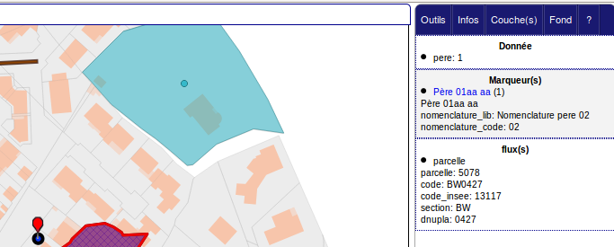

.. _info:

============
Information:
============

Cet onglet donne les informations disponnibles lorsque l'on clique sur la carte sur un
fond wms, le ou les marqueurs, une donnée vecteur.

un fond wms
===========

.. image:: info_wms.png

La couche de fond est le cadastre.

En cliquant sur le batiment 7916, le flux wms "bati" et le flux "parcelles"  sont affichés dans
l'onglet "infos"

le marqueur
===========

Lorsqu'il y a plusieurs enregistrements sur un même marqueur, exemple : plusieurs électeurs
à une même adresse, tous les enregistrements s'affichent si on est sur une recherche simple ou
sur un moteur de recherche.

Il est possible dans l'information du marqueur de mettre un pointeur vers un formulaire
de la manière suivante :

Dans om_sig_map : champ URL ::

    ../scr/sousform.php?obj=pere&action=3&idx= 

une donnée vecteur
==================

.. image:: info_donne_wms.png

les données sont paramétrables dans om_sig_map (voir paramétrage)

Les flux parcelles, pere_perim et fpere_perim sont les informations des flux wms cochés dans couche(s)

