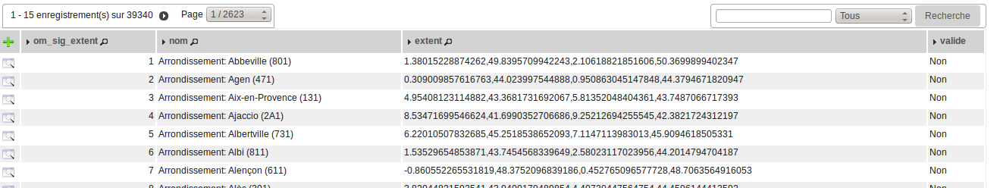
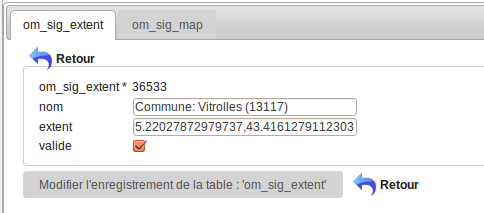
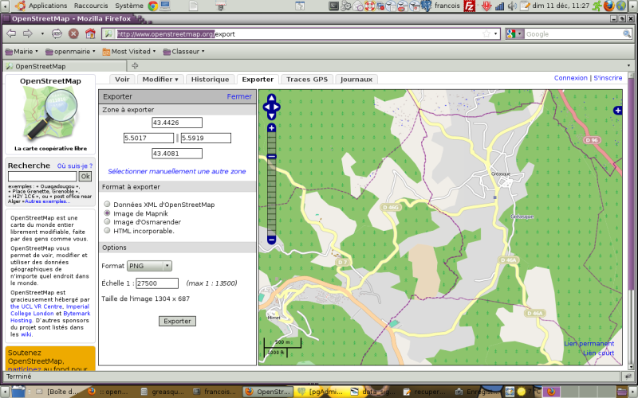

.. _om_sig_extent:

cette table permet de saisir les extends pour les cartes om_sig_map

====================
Saisie om_sig_extent
====================

Il est possible de lister les extents dans le menu  administration -> option om_sig_extent

Formulaire
==========

Il est possible de modifier / supprimer les om_sig_extents dans le formulaire de saisie om_sig_extent
en appuyant sur modifier ou supprimer

exemple d'extent (libellé) ::

    1.38015228874262,49.8395709942243,2.10618821851606,50.3699899402347
    
    Ces 4 chiffres représentent les coordonnées (x,y) de 2 points haut-gauche et bas-droit
    d'un rectangle déterminant la portion de carte à représenter

Pour acceder aux extents dans om_sig_map, cochez la case "valide" dans le formulaire.

Les extent par défaut
=====================

Par défaut, il est proposé les extent  (data/pgsql/om_extent.sql) :

- des régions françaises

- des départements

- des arrondissements

- des EPCI

- des communes françaises

Par défaut, Arles et Vitrolles sont valides.

Construction d'un extent avec openStreetMap :
=============================================

Pour adapter ses cartes à un autre  périmètre

Aller sur openstreetMap http://www.openstreetmap.org/

Chercher la ville : exemple "Gréasque"

Ajuster la carte aux frontières communales

Aller dans l onglet export et noter les coordonnées géographiques "zone à exporter"

