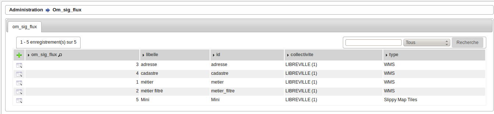
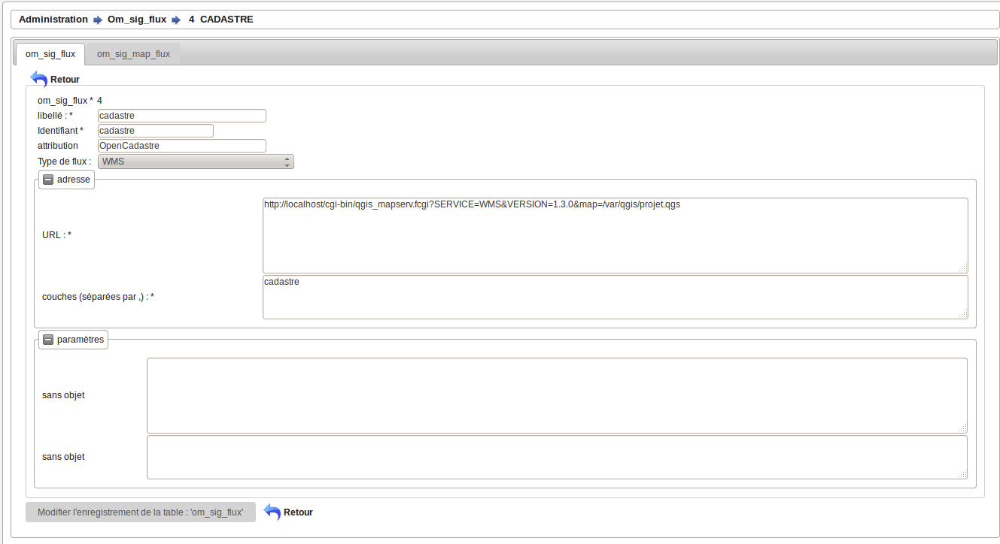
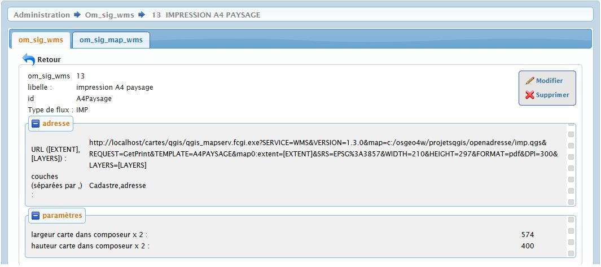

.. _om_sig_flux:

=================
Saisie des flux :
=================

Les flux permettent de créer des couches internes ou externes à l'application.
Il est traité les flux wms (web map service) et les flux de tuiles (tiles)

Il est possible de lister les flux dans le menu  administration -> option om_sig_flux

Formulaire
==========

Il est possible de modifier / supprimer les flux dans le formulaire de saisie om_sig_flux
en appuyant sur modifier ou supprimer

les champs suivants peuvent etre mis a jour :

.. note::

	Le champ *'om_sig_flux'* est un champ numerique entier non obligatoire.

	Le champ *'libelle'* est un champ libelle non obligatoire de 50 caractere(s) .

	Le champ *'om_collectivite'* est un champ numerique entier non obligatoire.

	Le champ *'id'* est un champ libelle non obligatoire de 50 caractere(s) .

	Le champ *'attribution'* est un champ libelle obligatoire de 150 caractere(s) .

	Le champ *'cache_type'* est un champ libelle obligatoire de 3 caractere(s) .

	Le champ *'chemin'* est un champ libelle non obligatoire de 255 caractere(s) .

	Le champ *'couches'* est un champ libelle non obligatoire de 255 caractere(s) .

	Le champ *'cache_gfi_chemin'* est un champ libelle obligatoire de 255 caractere(s) .

	Le champ *'cache_gfi_couches'* est un champ libelle obligatoire de 255 caractere(s) .

	Il y a une contrainte  de cle primaire  dont le nom est *'om_sig_flux_pkey'*.

	Il y a une contrainte  de cle scondaire  dont le nom est *'om_sig_flux_om_collectivite_fkey'*.

Description des champs :
========================

- om_sig_flux est la clé primaire automatique

- id est l'identifiant unique du flux

- attribution : permet d'afficher sur la carte l'attribution des données(copyright ou copyleft)

- type de flux ::

    wms (vide) : exemple qgis
    tilecache (TCF): tuiles
    sleepy map tile (SMT)
    impression (IMP): envoi d'un getPrint ?
    
- URL : url du flux 

- Couches: saisir les couches séparées par des virgules

- Paramètres varie suivant le type de flux ::

    si c'est un flux wms = vide
    si c'est une impression
        largeur carte dans composeur x 2 :
        hauteur carte dans composeur x 2
    si c'est des tuiles (TCF ou SMT)
        URL pour GetFeatureInfo :
        couches pour GetFeatureInfo :

Exemple d'url de flux wms (sur linux avec qgis) ::

    http://localhost/cgi-bin/qgis_mapserv.fcgi
    ?SERVICE=WMS&VERSION=1.3.0
    &map=/var/www/openfoncier/trunk/app/qgis/openfoncier.qgs

Exemple d'une requete impression : getprint

Le getprint ne fonctionne que pour qgis.

https://hub.qgis.org/wiki/17/QGIS_Server_Tutorial

