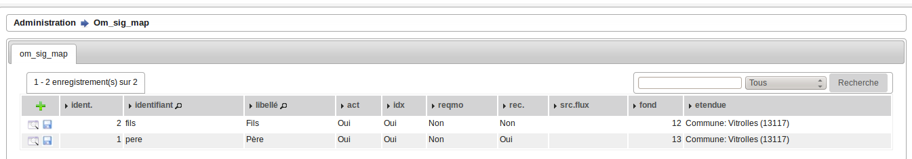
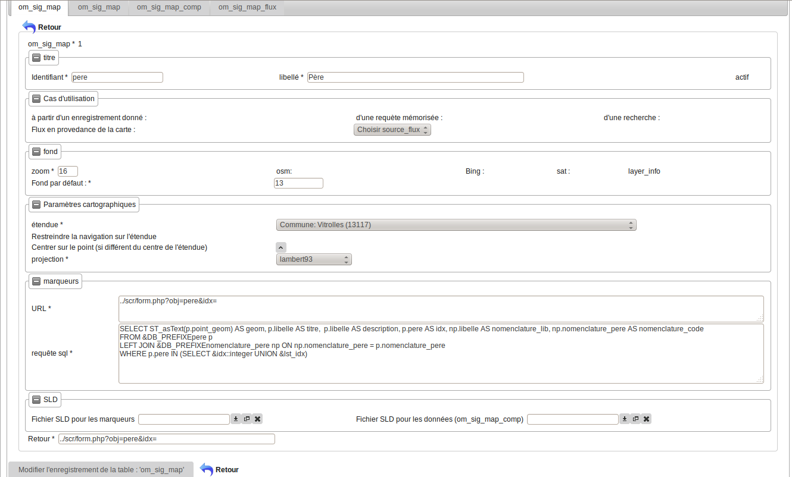

.. _om_sig_map:

===================
Saisie des cartes :
===================

Il est possible de lister les cartes disponnibles dans le menu  administration -> option om_sig_map

Formulaire
==========

Il est possible de modifier / supprimer les cartes dans le formulaire de saisie om_sig_map
en appuyant sur modifier ou supprimer

Description des champs :
========================

L'id est un identifiant unique permettant de d'identifier la carte dans les
formulaires de saisie ou d'affichage.

Il est noté que quand le formulaire de saisie est généré par le générateur, il porte
automatiquement comme identifiant le nom de la table.

Les cas d'utilisation de la carte peuvent être : à partir d'un enregistrement (cas des formulaires),
suite à une requête mémorisée (voir export), dans le cadre d'une recherche (cas affichage)

Source flux permet de récupérer les flux wms d'une carte om_sig_map 'et d'éviter d'avoir à les
resaisir.

Pour modifier une carte, il est possible de créer la carte avec actif = non (éventuellement par copie)
et ensuite la rendre active 'et désactiver l'ancienne). Cette méthode permet de retourner en arrière

Le zoom est le zoom d'affichage en fonction du centre

Les fonds externes affichés sont les suivants : OSM, Bing , Google ,sat

Il est possible d'afficher un om_sig_map_flux par défaut en donnant son numéro.

Il faut que le flux soit déclarer comme fond (???) dans om_sig_map_flux 

On affiche un fond en indiquant ::
    
        osm pour osm
        sat pour google
        bing pour bing

Le "layer info" est constitué de marqueurs  issu de la requête SQL

L'etendue est la possibilité d'étendue par défaut de la carte

Il est possible de restreindre la navigation à l'étendue

Il est possible de centrer sur un point différent que le centre de l'étendue en utilisant la carte
om_sig_map. (vérifier)

Les choix de projection sont définis dans dyn/var_sig.inc.php

Pour les marqueurs, l'url d'affichage de donnés est paramétré dans le champ url,
la requête dans le champ requête sql.

Les marqueurs sont constitués à partir d'une requête et sont stockés dans un format geo json.

Les fichiers SLD pour les marqueurs (données json) et les données (données vecteurs) sont
téléchargeables dans le module SLD dans le cadre du filesystem choisi. 

Exemple de requête SQL pour affichage des marqueurs ::

    SELECT  ST_asText(p.point_geom) AS geom,
            p.libelle AS titre,
            p.libelle AS description,
            p.pere AS idx,
            np.libelle AS nomenclature_lib,
            np.nomenclature_pere AS nomenclature_code
        FROM &DB_PREFIXEpere p 
            LEFT JOIN &DB_PREFIXEnomenclature_pere np
            ON np.nomenclature_pere = p.nomenclature_pere
        WHERE p.pere IN (SELECT &idx::integer UNION &lst_idx)

        -- variables
        &DB_PREFIXE = shema
        &idx = géométrie courante
        &lst_idx = liste des géométries courantes

    -- marqueur(s)
        Père 01aa aa (1)  titre + idx
        Père 01aa aa      description   
        nomenclature_lib: Nomenclature pere 02
        nomenclature_code: 02

