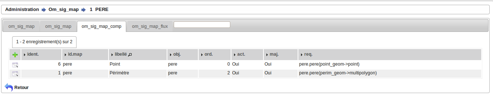
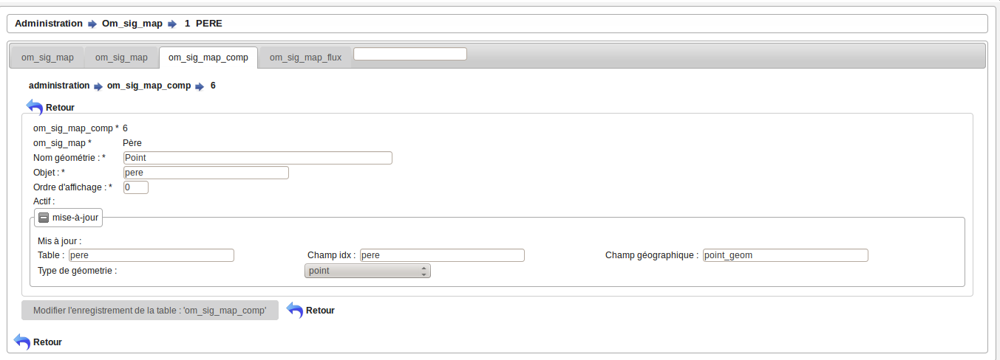

.. _om_sig_map_comp:

======================
Saisie des géométries:
======================

om_sig_map_comp permet d'associer un ou plusieurs champs géométriques lié à la table
correspondante au formulaire concernés.

Ces champs géométriques peuvent être mis à jour dans l'interface.

Ces champs constituent la couche vectorielle (modifiable) de la carte.

Il est possible de lister les géométries concernés dans le menu  administration ->
option om_sig_map onglet, om_sig_map_comp.

Le champ géométrique à mettre à jour se fait dans un sous formulaire d'om_sig_map 

Formulaire
==========

Il est possible de modifier / supprimer les géeométries dans le sous formulaire de saisie om_sig_map_comp
en appuyant sur modifier ou supprimer

Description des champs :
========================

Le champ om_sig_map_comp est la clé primaire numérique automatique

om_sig_map est la clé primaire de la carte concernée

Il faut saisir le nom de la géométrie (champ géométrique) et l'objet concerné

Si la mise à jour est autorisée (vrai), il faut saisir

- la table du champ géométrique à modifier

- le nom de champ correspondant à la clé primaire de l'enregistrement à modifier

- le champ géographique à modifier

- le type de géométrie

