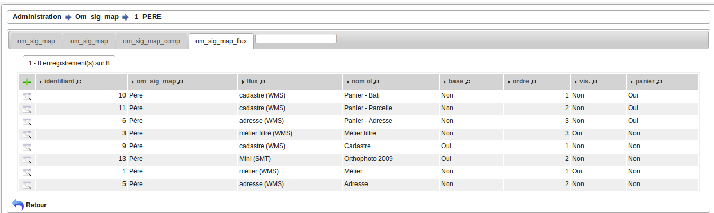
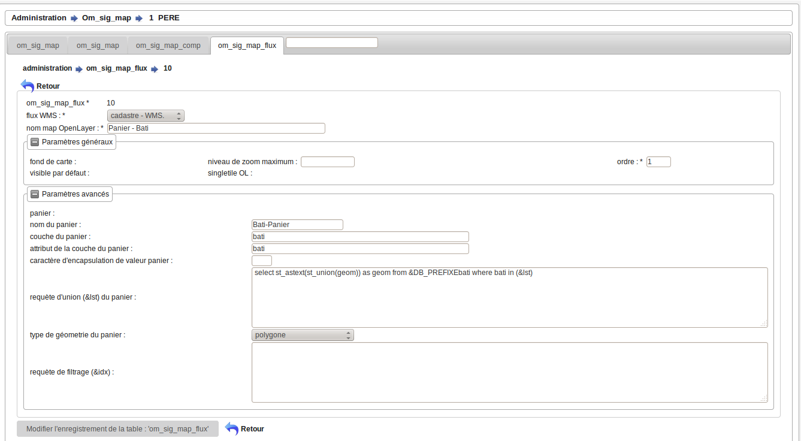

.. _om_sig_map_flux:

=============================
Saisie des flux de la carte :
=============================

om_sig_map_flux permet d'associer un flux à une carte.

Il est possible de lister les flux d'une carte dans le menu  administration -> option om_sig_map, 
onglet om_sig_map_flux.

Le flux associé est dans un sous formulaire d'om_sig_map 

Formulaire :
============

Il est possible de modifier / supprimer les fluxs dans le sous formulaire de saisie om_sig_map_flux
en appuyant sur modifier ou supprimer

les champs suivants peuvent etre mis a jour :

.. note::

	Le champ *'om_sig_map_flux'* est un champ numerique entier non obligatoire.

	Le champ *'om_sig_flux'* est un champ numerique entier non obligatoire.

	Le champ *'om_sig_map'* est un champ numerique entier non obligatoire.

	Le champ *'ol_map'* est un champ libelle non obligatoire de 50 caractere(s) .

	Le champ *'ordre'* est un champ numerique entier non obligatoire.

	Le champ *'visibility'* est un champ booleen obligatoire.

	Le champ *'panier'* est un champ booleen obligatoire.

	Le champ *'pa_nom'* est un champ libelle obligatoire de 50 caractere(s) .

	Le champ *'pa_layer'* est un champ libelle obligatoire de 50 caractere(s) .

	Le champ *'pa_attribut'* est un champ libelle obligatoire de 50 caractere(s) .

	Le champ *'pa_encaps'* est un champ libelle obligatoire de 3 caractere(s) .

	Le champ *'pa_sql'* est un champ texte obligatoire.

	Le champ *'pa_type_geometrie'* est un champ libelle obligatoire de 30 caractere(s) .

	Le champ *'sql_filter'* est un champ texte obligatoire.

	Le champ *'baselayer'* est un champ booleen obligatoire.

	Le champ *'singletile'* est un champ booleen obligatoire.

	Le champ *'maxzoomlevel'* est un champ numerique entier obligatoire.

	Il y a une contrainte  de cle primaire  dont le nom est *'om_sig_map_flux_pkey'*.

	Il y a une contrainte  de cle scondaire  dont le nom est *'om_sig_map_flux_om_sig_map_fkey'*.

	Il y a une contrainte  de cle scondaire  dont le nom est *'om_sig_map_flux_om_sig_flux_fkey'*.

Description des champs :
========================

- om_sig_map_flux est la clé primaire numérique

- flux wms permet d'associer un flux wms (om_sig_wms) à la carte (om_sig_map)

- le nom map openLayers sera le nom qui apparaitra sur la carte dans l'onglet "couche" ou "fond"

- fond de carte permet d'associer le flux comme un fond

- ordre : permet de gérer l'ordre d'apparition des couches (ou fond) dans l'onglet correspondand

- visible par défaut : affiche la couche si c'est vrai à l'ouverture de la carte

- singletile : raméne le flux wms en une seule image pour la fenêtre et non en une série
d'imagette, ce qui permet de résoudre le problème des étiquettes tronquées. ATTENTION les
temps de réponses peuvent s'allonger car le cache ( du serveur wms ou du navigateur ???)
n'est pas utilisé

- pannier : le pannier permet de stocker des géométries en vue de définir la géométrie de
l'objet en cours : exemple : un permis de construire est un ensemble de parcelles

En cas d'utilisation du pannier, il faut :

    donner un nom au pannier : exemple  : pannier parcelle
     
    désigner la couche (layer) à utiliser : parcelle
    
    désigner l'attribut à récupérer : ex: parcelle
    
    définir le caractère d'encapsulation (en général la ' si alpha numérique ??? et vide si numérique)
    
    construire la requête d'union qui va être la nouvelle géométrie :

    donner le type de géométrie : le plus souvant un polygone
    
    définir la requête de filtrage qui va permettre de filter le flux wms
    

    
exemple d'une requête construisant une géométrie faisant une union des parcelles
séléctionnées dans le pannier ::    

    select st_astext(st_union(geom)) as geom from &DB_PREFIXEparcelle
        where parcelle in (&lst)

    &DB_PREFIXE = schéma
    &lst = liste des géométrie du pannier
    

Exemple d'une requête filtrée ::

    pour produire le filtre suivant :
    layer1:"champ1" = 'valeur1',layer2:"champ2" = 'valeur2'

    il faut entrer la requête suivante pour selectionner les electeurs d'un bureau :
    
    select 'electeur:²bureau² = '''||bureau.bureau||''' as buffer
        from &DB_PREFIXEbureau where bureau = '&idx'
    
    
    select 'electeur:²bureau² = ''&idx'' as buffer from &DB_PREFIXEbureau
        where bureau = '&idx'
    
    -- parametres
    ² = caractère utilisé pour les doubles quotes : "
    || concatenation sql
    ''' permet d echapper la simple quote
    '' sql remplace les deux quotes par une quote (caractere quote)
    
    le filtre final appliqué au flux wms est : electeur:"bureau" = '04'  pour le bureau 04

    autre exemple le père et tous ses fils

    SELECT 'fpere_point:²pere² IN ( '||pere||' );fpere_perim:²pere² IN ( '||pere||' );ffils_point:²pere²
    IN ( '||pere||' );ffils_point:²pere² IN ( '||pere||' );ffils_perim:²pere² IN ( '||pere||' )'
    AS buffer FROM ( SELECT array_to_string(array_agg(pere), ' , ') AS pere FROM &DB_PREFIXEpere
    WHERE pere IN (SELECT &idx::integer UNION &lst_idx) ) a

