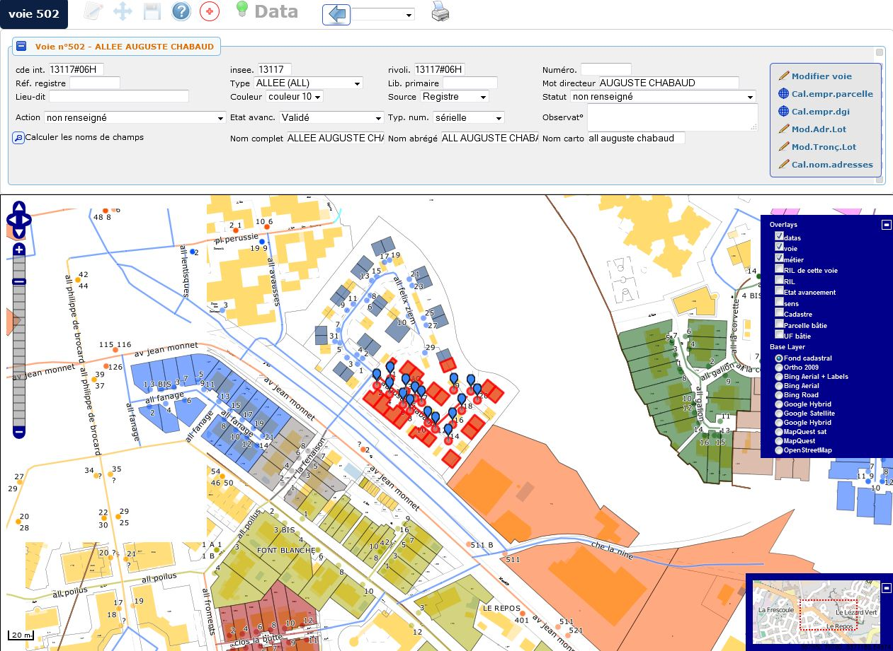
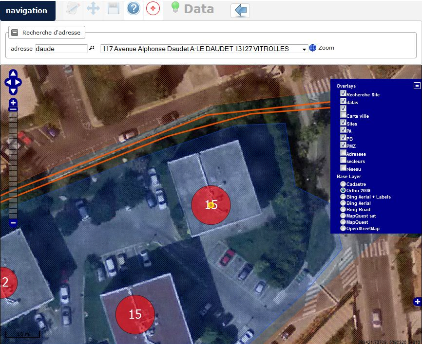
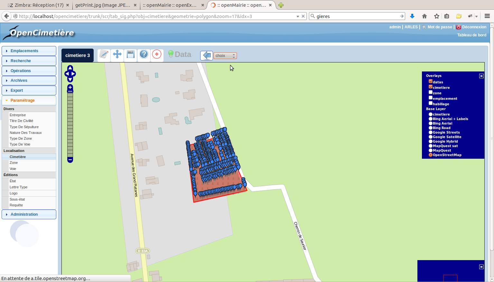

.. _principe:

Il est necessaire que l'API openLayers soit dans le framework (il y est de base):

lib/openlayers

=========
Principes
=========

Il est proposé dans ce chapitre de decrire le module sig interne
qui permet la geo localisation d'objet dans openMairie

Depuis la version 4.4.0, le sig interne est accessible dans le framework en mettant
le paramètre option_localisation d'om_parametre à la valeur "sig_interne".

L'objectif de sig interne est de permettre une saisie le plus souvent automatique 
de géométries. Cette saisie est  stockée dans la base métier postgresql.
Elle est affichée sur des fonds existants sur internet : google sat, openStretmap
ou bing (pour l instant). Elle peut être affichée sur un flux (wms ou tiles)

Il n'est donc pas nécessaire de disposer d'un SIG pour utiliser le sig interne;

Le format de stockage des données pgsql est celui de l'OGC et il est accessible aux
clients libres où propriétaires qui respectent ce format. Par exemple qgis (outil libre)
peut accéder aux données de la base postgres "métier".

Pré requis
==========

- base postgres 9.x

- postgis > 2.x

Géo localisation automatique sur une adresse postale
====================================================

L'enjeu est de limiter au maximum la géo localisation manuelle dès
qu'il y a une possibilité de géo localisation automatique.

Elle se fait au travers de 4 programmes :

- adresse_postale.php : positionnement suivant le numero et rue

- adresse_postale_google.php : positionnement suivant le numero et rue avec google

- adresse_postale_bing.php : positionnement suivant le numero et rue avec bing

- adresse_postale_mapquest.php : positionnement suivant le numero et rue avec mapquest

La géolocalisation automatique peut se faire sur une base externe
postgresql (eventuellement via une vue)

Le paramétrage se fait dans dyn/adresse_postale.inc.php.

Affichage de carte
==================

L'affichage se fait avec openLayers dont le composant est de base
dans le framework openMairie : lib/openLayers. (le composant est
installé de manière a être optimisé avec une css openmairie)

La librairie proj4 inclus dans lib/openLayers permet de pouvoir utiliser
les projections lambert sud et lambert 93.

La projection géographique et Mercator est de base dans openLayers

L'enjeu est donc de projeter les données stockées dans la base "métier"
postgresql - postgis (les communes devant utiliser le lambert93) en mercator
pour être lisible avec les cartes accessibles sur internet.

L'affichage des marqueurs est fait au travers d'une requête postgresql
qui alimente un tableau json lu comme une couche openLayers.

La data à modifier est fourni par requete postgresql au format wkt à openLayers.

le sig interne permet ::

    - l affichage de/des  fond(s)
    - l'affichage de marqueurs (data)
    - l affichage du geométries qui peut être créé ou déplacé (couche wkt)

dans la version 4.2.0, il permet  ::

    - l'affichage de flux wms et wfs (getmap) et de recuperer les données (getfeature)
    - la collation de géométrie dans un pannier et son enregistrement en multi géométries

dans la version 4.4.5 il a été rajouté ::

    - la boite à outils : édition du formulaire, édition, outils de mesure, géolocalisation
    - l'outil de saisie a été amélioré
    - les cartouche info, couche et fond
    
Dans cette dernière version, le module est intégré dans openMairie et utilise les formulaires
de saisie, le moteur de recherche et les requêtes mémorisées lors de l'affichage.

L'intégration dans openMairie
=============================

Le module est intégré à openMairie :

Le module SIG est accessible depuis le formulaire d'affichage (tab), par le bouton suivant :

Il prend en compte la recherche simple ou avancée du formulaire d'affichage.

Le module SIG est accessible depuis le module de requête mémorisée.

Il est possible d'éditer les attributs d'un objet sélectionné et de les modifier via le formulaire.

Paramétrage de la carte
=======================

Le paramétrage général  des cartes  est modifiable dans  dyn/var_sig.inc ::

    //$cle_google = "xxxxxxxxxxxxxxxxxxxx";
    //$http_google="http://maps.google.com/maps?file=api&amp;v=2&amp;key=";
    //$http_bing='http://ecn.dev.virtualearth.net/mapcontrol/mapcontrol.ashx?v=6.2&amp;mkt=en-us'; // 6.3c au lieu de 6.2
    //$fichier_jsons="sig_json.php?obj=";
    //$fichier_wkt="sig_wkt.php";
    // *** zoom par couche : zoom standard permettant un passage de zoom a l autre
    //$zoom_osm_maj=18;
    //$zoom_osm=14;
    //$zoom_sat_maj=8;
    //$zoom_sat=4;
    //$zoom_bing_maj=8;
    //$zoom_bing=4;
    // *** popup data contenuHTML
    //$width_popup=200;
    //$cadre_popup=1;
    //$couleurcadre_popup="black";
    //$fontsize_popup=12;
    //$couleurtitre_popup="black";
    //$weightitre_popup="bold";
    //$fond_popup="yellow";
    //$opacity_popup="0.7";
    // *** localisation maj ou consultation
    //$img_maj="../img/punaise_sig.png";
    //$img_maj_hover="../img/punaise_hover.png";
    //$img_consult="../img/punaise_point.png";
    //$img_consult_hover="../img/punaise_point_hover.png";
    //$img_w=14;
    //$img_h=32;
    //$img_click="1.3";// multiplication hauteur et largeur image cliquee

Toutes ces variables ne sont plus accessible dans la version 4.5.0 (à verifier)

Le paramétrage de la projection qui est proposé dans le formualaire de saisie
om_sig_map se paramètre dans var_sig.inc.php.

Il est décrit ci dessous son paramétrage par défaut ::
  
    $contenu_epsg[0] = array("","EPSG:2154","EPSG:27563");
    $contenu_epsg[1] = array("choisir la projection",'lambert93','lambertSud');
        

Il est à noter que les étendues ne sont plus dans var_sig dans la version 4.4.5 et qu'elles
sont stockées dans la table om_sig_extent.

Autre point d'entrée
====================

Il est créé un om_map.class.php dans obj pour pouvoir mettre les points d'entrée

Nous décrivons ici les anciens points d'entrés de form_sig.php et de tab_sig.php

Dans dyn/form_sig_update.inc.php, il est possible de paramétrer
des post traitements de saisie de géométrie

Dans dyn/form_sig_delete.inc.php, il est possible de paramétrer
des post traitements de suppression de géométrie

Dans dyn/tab_sig_barre.inc.php, il est possible de personnaliser la fenêtre

La barre permet de modifier des champs exemple openAdresse

La barre permet d'afficher les attributs d'un regard, et permet d'aller sur le point aval ou
le point amont.

.. image:: openReseau.jpg

La barre permet une recherche d adresse dans openFFTH

La barre permet de changer de cimetiere dans openCimetiere

