.. _ergonomie:

#########
Ergonomie
#########

.. _ergonomie_generale:

******************
Ergonomie générale
******************

L'application, sur la grande majorité des écrans, conserve ses composants
disposés exactement au même endroit. Nous allons décrire ici le fonctionnement
et l'objectif de chacun de ces composants. Cette structuration de l'application
permet donc à l’utilisateur de toujours trouver les outils au même endroit
et de se repérer rapidement.

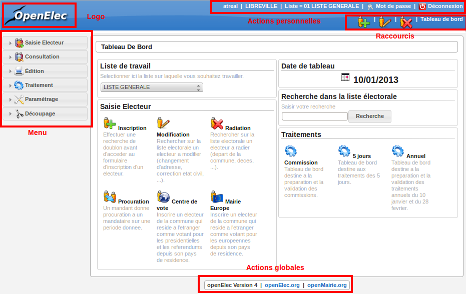
    
    Ergonomie générale

.. note::

    Les actions et affichages de l'application diffèrent en fonction du profil
    de l'utilisateur. Il se peut donc que dans les paragraphes qui suivent
    des actions soient décrites et n'apparaissent pas sur votre interface
    ou inversement que des actions ne soient pas décrites mais apparaissent sur
    votre interface.

=======
Le logo
=======

C'est le logo de l'application, il vous permet en un seul clic de revenir
rapidement au tableau de bord.

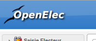
    
    Logo

========================
Les actions personnelles
========================

Cet élément affiche plusieurs informations importantes.

La première information est l'identifiant de l'utilisateur actuellement
connecté ce qui permet de savoir à tout moment si nous sommes bien connectés
et avec quel utilisateur. Ensuite est noté le nom de la collectivité sur
laquelle nous sommes en train de travailler. En mode multi, une action est
disponible sur cette information pour permettre de changer de collectivité.
Ensuite la liste sur laquelle nous sommes en train de travailler, une action
est disponible sur cette information pour permettre de changer de liste.
Enfin l'action pour permettre de changer de mot de passe et pour se déconnecter
sont disponibles en permanence.

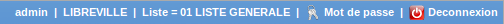
    
    Actions personnelles

==============
Les raccourcis
==============

Cet élément permet d'afficher des raccourcis vers des écrans auxquels nous
avons besoin d'accéder très souvent. Par exemple, ici nous avons des
raccourcis directs vers les formulaires d'inscription, de modification et de
radiation d'un électeur ainsi qu'un lien vers le tableau de bord.

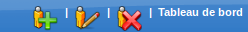
    
    Raccourcis

=======
Le menu
=======

Cet élément permet de classer les différents écrans de l'application en
rubriques. En cliquant sur l'entête de rubrique, nous accédons à la liste des
écrans auxquels nous avons accès dans cette rubrique.

Le nombre de rubriques disponibles dans le menu peut varier en fonction du
profil des utilisateurs. Un utilisateur ayant le profil Consultation n'aura
probablement pas accès aux six rubriques présentes sur cette capture. 

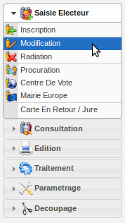
    
    Menu

====================
Les actions globales
====================

Cet élément permet d'afficher en permanence le numéro de version du logiciel.
Ensuite les différentes actions sont des liens vers le site officiel du
logiciel ou vers la doucmentation.

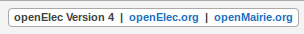
    
    Actions globales

.. _ergonomie_sig:

**********************
Usage du module om_sig
**********************

Ce document a pour objet de décrire le module sig interne d'openMairie dans la version om 4.4.5.

Dans sa version 4.4.5 ;

- intégration des formulaires dans le sig interne

- integration des résultats du moteur de recherche dans les cartes (cas utilisation moteur de recherche) 

- intégration dans les cartes d'un résultat dans reqmo (cas d'utilisation reqmo)

- accès multiples aux objets

- accès à des objets multi géométrie

La nouveauté est la mise en place d'une nouvelle ergonomie avec un cartouche où sont accessibles toutes les commandes.

=====================================
Ergonomie de l'interface SIG interne:
=====================================

Nous allons décrire l'ergonomie d'om_sig qui se présente en plusieurs zones

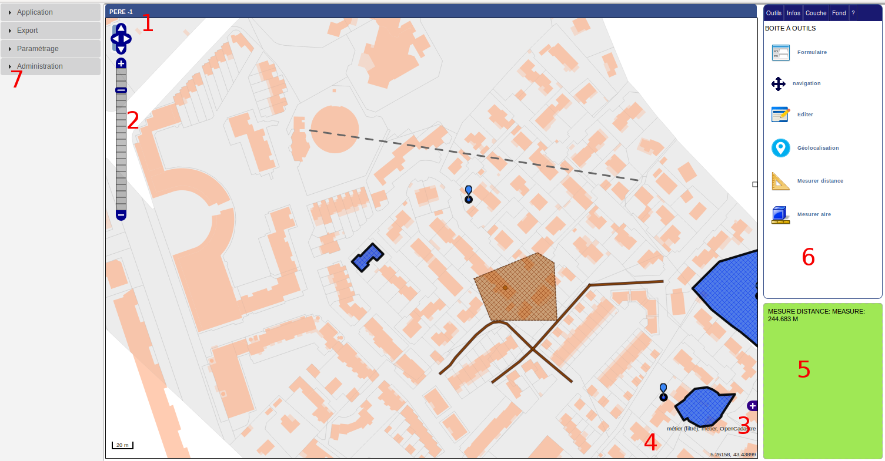

Les éléments de l'interface sont les suivants :

1 En haut à gauche , il est noté l'objet et enregistrement concernés :
    objet PERE et enregistrement -1
    
    Quand l enregistrement est -1, cela veut dire qu'il n'y a a pas d'objet sélectionné.

2 la barre de zoom

3 la fenêtre de navigation rapide

4 l'attribution : openCadastre

5 fenetre message : mesure distance = 244 683 m 

6 Outils disponnibles : boite à outil, édition, information, couches et fonds

7 Menu

===========
les fonds :
===========

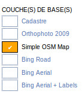

Ils sont paramétrés dans om_sig_map.

Dans notre cas, les options OSM et Bing sont cochés et il y a 2 flux wms paramétrès dans om_sig_flux
et associé à om_sig_map (om_sig_map_flux) qui sont : cadastre, orthophoto 2003.

voir paramétrage

=============
les couches :
=============

Dans notre exemple, il y a :

- deux couches vecteurs modifiables : point et périmètre,

.. image:: couche_vecteur.png

- une couche de marqueurs (option layerInfo d'om_sig_map),

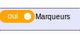

- Trois flux wms: métier, adresse et métier filtré 

.. image:: couche_flux.png

Les flux sont paramétrées dans om_sig_flux et elles sont associées aux cartes dans
om_sig_map_flux.

Voir paramétrage

============
Information:
============

Cet onglet donne les informations disponnibles lorsque l'on clique sur la carte sur un
fond wms, le ou les marqueurs, une donnée vecteur.

un fond wms
===========

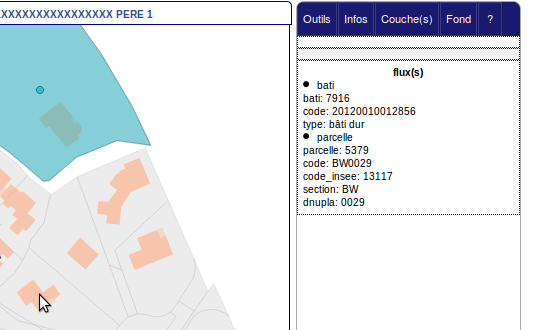

La couche de fond est le cadastre.

En cliquant sur le batiment 7916, le flux wms "bati" et le flux "parcelles"  sont affichés dans
l'onglet "infos"

le marqueur
===========

.. image:: info_marqueur_flux.png

Lorsqu'il y a plusieurs enregistrements sur un même marqueur, exemple : plusieurs électeurs
à une même adresse, tous les enregistrements s'affichent si on est sur une recherche simple ou
sur un moteur de recherche.

Il est possible dans l'information du marqueur de mettre un pointeur vers un formulaire
de la manière suivante :

Dans om_sig_map : champ URL ::

    ../scr/sousform.php?obj=pere&action=3&idx= 

une donnée vecteur
==================

.. image:: info_donne_wms.png

les données sont paramétrables dans om_sig_map (voir paramétrage)

Les flux parcelles, pere_perim et fpere_perim sont les informations des flux wms cochés dans couche(s)

================
Boite à outils : 
================

La boite à outil est accessible dans l'onglet outil du menu cartographique

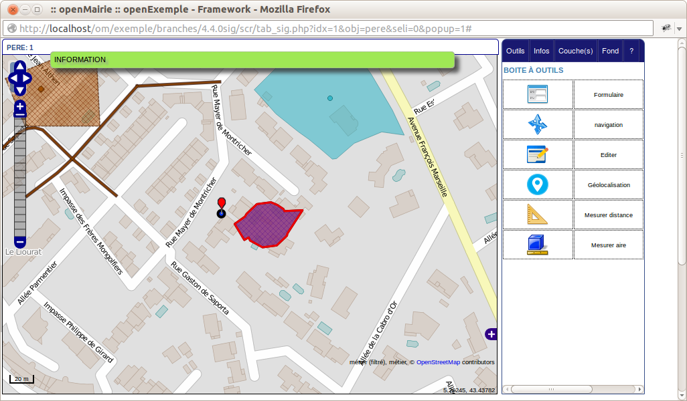

Accès au formulaire de saisie de données
========================================

.. image:: map-form.png

Il est possible d'accéder au formulaire de saisie de l'enregistrement courant (sous formulaire)

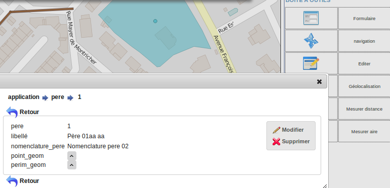

En appuyant sur modifier, vous pouvez modifier les données de l'enregistrement.

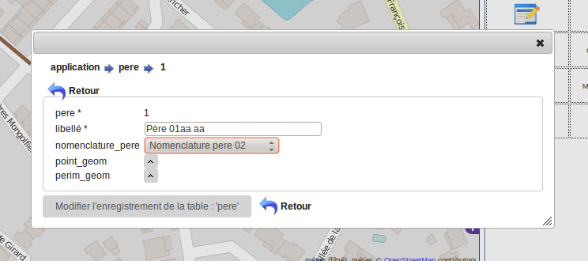

La suppression de l'enregistrement n'est pas gérer dans la carte, par contre il est effectif
dans la base :

- le point reste sur la carte et n'est pas supprimer

- les données du marqueurs restent visualisables

En cas de rafraischissement de la carte, les données ont disparues.

CONSEIL : ne pas utiliser l'option supprimer dans le formulaire

De même le champ geom du formulaire renvoie par défaut sur la carte. Il vaut mieux éviter
d'afficher le champ geom sur les formulaires de cartes.

Navigation
==========

.. image:: map-nav.png

Ce bouton sert à sortir des options de mesure et à revenir à la navigation.

Se géolocaliser dans la carte
=============================

Ce bouton sert a se géolocaliser dans la carte

.. image:: map-geoloc.png

Mesurer une distance
====================

Il est possible de mesurer une distance avec l'outil

.. image:: map-distance.png

Cliquer sur les points à mesurer, cliquez 2 fois pour obtenir la mesure qui s'affiche
dans la fenêtre observation

Appuyer sur le bouton "Navigation" pour sortir de l'outil de mesure.

Mesurer une aire
================

Il est possible de mesurer une aire avec l'outil

.. image:: map-area.png

cliquer sur les angles du polygone à mesurer, cliquez 2 fois pour obtenir la mesure qui s'affiche
dans la fenêtre observation

Appuyer sur le bouton "Navigation" pour sortir de l'outil de mesure.

==============
Mode édition :
==============

En mode édition, on ne peut plus accéder aux autres onglets

Cet onglet permet de modifier la ou les géométries de l' enregistrement de l'objet courant :

ci dessous la géométrie point de pere 1

.. image:: geom_point.png

Il est possible dans la fenêtre du haut de choisir une des géométries à modifier,
ici le point ou le polygone de père 1

===================
Edition d'un point:
===================

Nous choisissons d'éditer le point :

Création d'un ou plusieurs points :
===================================

Après avoir sélectionner ce bouton, cliquez sur la carte à l'endroit où vous voulez le point
Vous pouvez créer un ou plusieurs points. Le point est de couleur bleu

Modifier une géométrie sélectionnées :
======================================

Sélectionner un des points en cliquant dessus, il devient rouge.

Vous pouvez maintenant le déplacer

(Dé)selectionner une géométrie :
================================

Vous pouvez selectionner ou déselectionner un point :

.. image:: map-edit-select.png

- bleu : non sélectionné

- rouge sélectionné

Un point sélectionné est actif pour une modification, suppression ou enregistrement

Supprimer une géométrie selectionner :
======================================

En appuyant sur

.. image:: map-edit-erase.png

Vous effacer la ou les géométries sélectionnées

Vérifier avant enregistrement d'un point:
=========================================

.. image:: map-edit-valid.png

Cette option vous permet de vérifier que votre géométrie est valide avant
enregistrement.

Si vous avez par exemple plusieurs points sélectionnés et que la géométrie attendu est
un seul point, un message s'affichera en observation ::
    
    Edition: Données invalides! Point: MultiPoint sélectionné, point attendu

Si dans le même cas vous avez sélectionné qu'un seul point :

- Les points construits non selectionnés seront effacés.

- le message sera le suivant ::

    Edition: vérification terminée avec succès
    
Enregistrer un point :
======================

Cette option permet d'enregistrer un point.

.. image:: map-edit-record.png

======================
Edition d'un polygone:
======================

En sélectionnant périmètre, on peut mettre à jour la géométrie polygone.

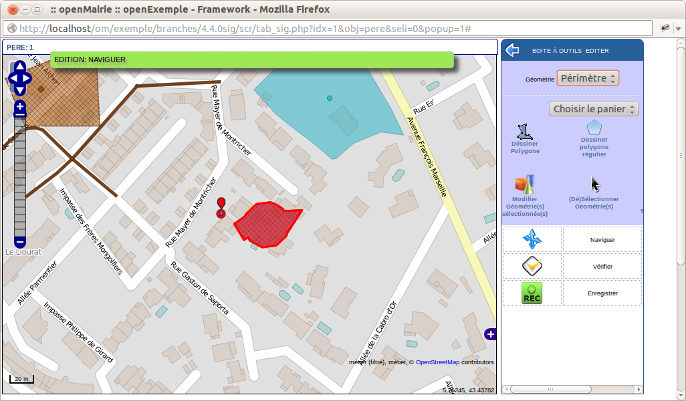

Utilisation du panier pour construire une géométrie
====================================================

Dans panier, choisir un panier (ici parcelle panier)

Le fond correspondant à parcelle panier s'affiche (cadastre) 

Séléctionner une ou des géométries.

.. image:: parcelle_pannier.png

Valider l'option récupération panier en appuyant sur

les objets récupérés sont en bleu.

.. image:: parcelle_pannier2.png

Créer un polygone
=================

Vous pouvez créer un polygone en appuyant sur :

.. image:: map-edit-draw-polygon.png

Vous pouvez construire un polygone régulier en

- en appuyant sur

- sélectionner le nombre de côté que vous voulez (par défaut 4)

Modifier un polygone sélectionné :
==================================

Sélectionner un des polygones en cliquant dessus, il devient rouge.

Vous pouvez maintenant le modifier

(Dé)selectionner une géométrie :
================================

Vous pouvez selectionner ou déselectionner un polygone :

.. image:: map-edit-select.png

- bleu : non sélectionné

- rouge sélectionné

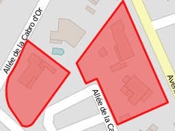

Un polygone sélectionné est actif pour une modification, suppression ou enregistrement

Supprimer un polygone selectionné :
===================================

En appuyant sur

.. image:: map-edit-erase.png

Vous effacer la ou les géométries sélectionnées

Vérifier avant enregistrement d'un polygone:
============================================

.. image:: map-edit-valid.png

Cette option vous permet de vérifier que votre géométrie est valide avant
enregistrement.

    
Enregistrer un polygone :
=========================

Cette option permet d'enregistrer un polygone.

.. image:: map-edit-record.png

=========================
Modification d'un ligne :
=========================

En sélectionnant ligne, on peut mettre à jour la géométrie ligne.

Utilisation du panier pour construire une géométrie
====================================================

Dans panier, choisir un panier (ici tronçon panier)

Le fond correspondant à troncon panier s'affiche

Séléctionner une ou des géométries.

Valider l'option récupération panier en appuyant sur

les objets récupérés sont en bleu.

Créer une ligne :
=================

Vous pouvez créer une ligne en appuyant sur :

.. image:: map-edit-draw-line.png

Modifier une ligne sélectionnée :
=================================

Sélectionner une des lignes en cliquant dessus, elle devient rouge.

Vous pouvez maintenant modifier les points de la ligne

(Dé)selectionner une géométrie :
================================

Vous pouvez selectionner ou déselectionner une ligne :

.. image:: map-edit-select.png

- bleu : non sélectionnée

- rouge sélectionnée

La ligne sélectionnée est active pour une modification, suppression ou enregistrement

Supprimer une ligne selectionnée :
==================================

En appuyant sur

.. image:: map-edit-erase.png

Vous effacer la ou les géométries sélectionnées

Vérifier avant enregistrement d'une ligne:
==========================================

.. image:: map-edit-valid.png

Cette option vous permet de vérifier que votre géométrie est valide avant
enregistrement.

    
Enregistrer une ligne :
=======================

.. image:: map-edit-record.png

Cette option permet d'enregistrer une ligne.

