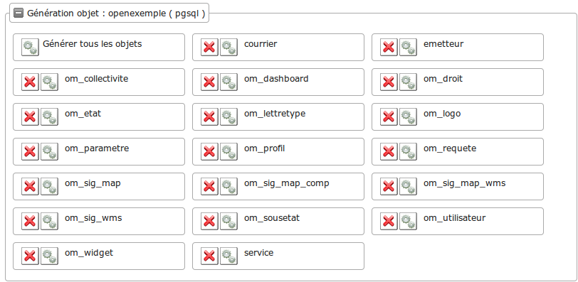
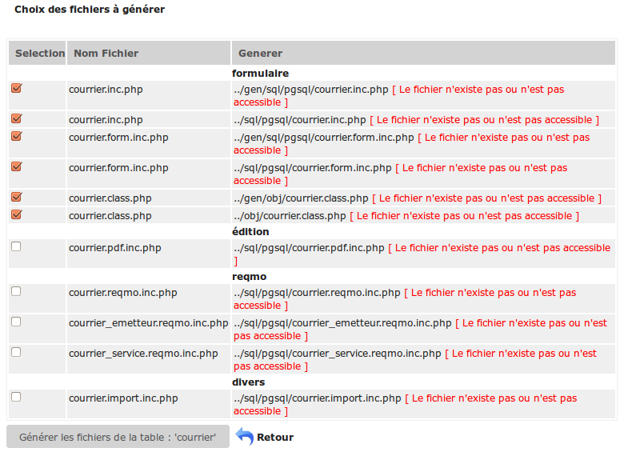
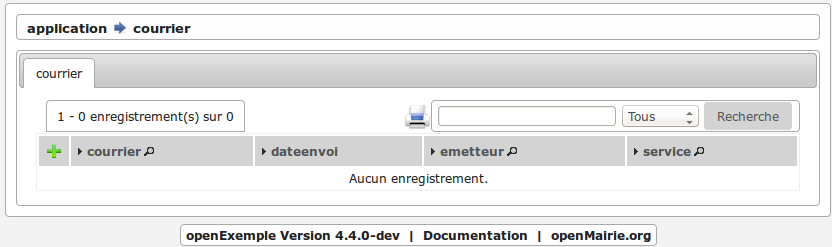
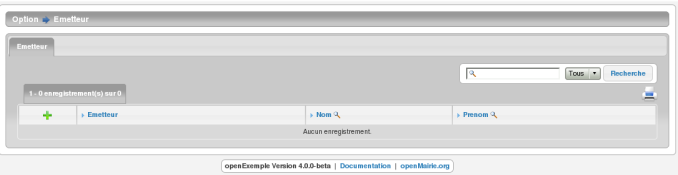
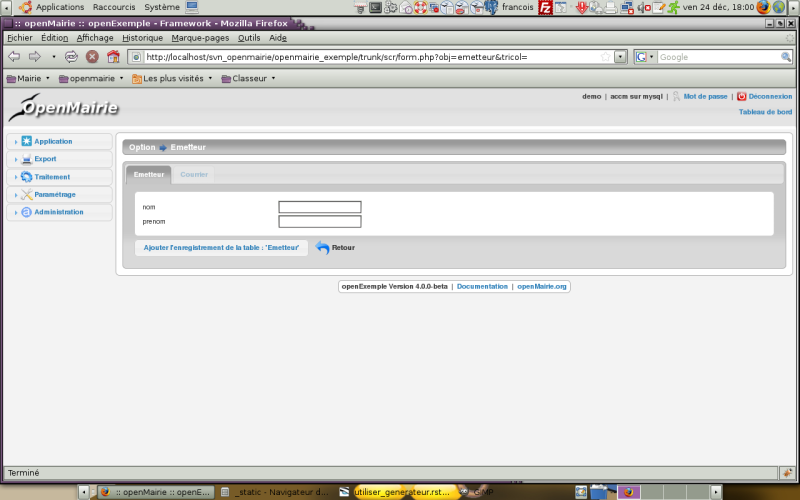
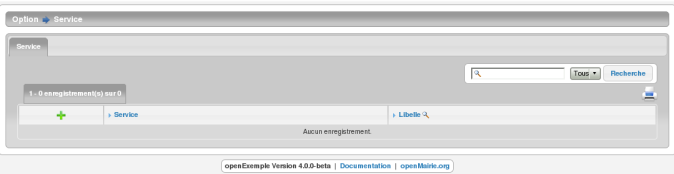
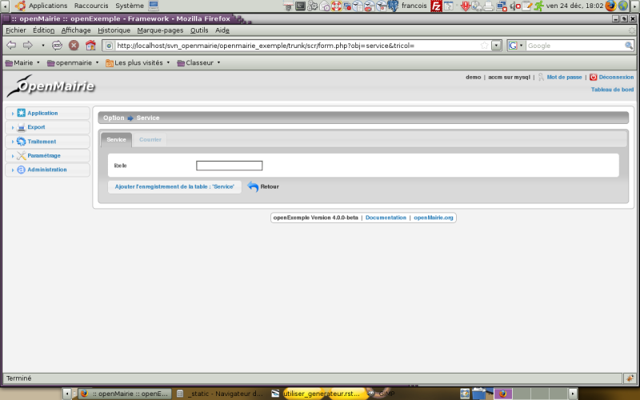
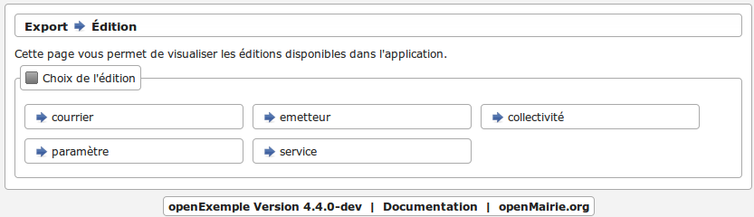
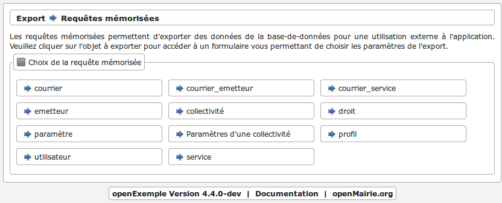
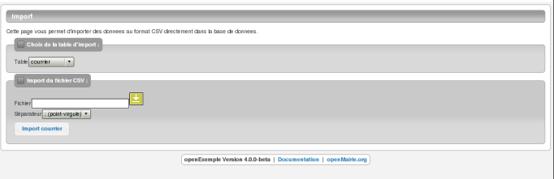

.. _utiliser_generateur:

#####################
Creer les formulaires
#####################

Nous allons maintenant créer les formulaires à l'aide du générateur

Pour cela, il faut aller dans le menu administration -> generateur 

Vous devez avoir 3 nouveaux boutons : courrier, service, emetteur

Avant de commencer, l'utilisateur apache (www-data) doit avoir les droits
d'écriture dans les repertoires /gen , /sql et /obj

=================================================
Generation des formulaires et edition du courrier
=================================================

En appuyant sur le bouton de courrier, vous avez les choix de génération

Au préalable, le générateur fait une analyse de la base de données  ::

    Tables de la base de donnees
                [ emetteur ] [ service ] et les tables om..
    
    Table :
                courrier
                [ cle N - cle automatique ]
                [ longueur enregistrement : 34 ]
    
    Champs
                [ courrier 8 int ]
                [ dateenvoi 10 date ]
                [ objetcourrier 65535 blob ]
                [ emetteur 8 int ]
                [ service 8 int ]
    Sous formulaire 	
    Cle secondaire
                [ emetteur ] [ service ] 

Le generateur a detecté 2 clés secondaires et aucun sous formulaire

C'est pour cela qu il propose 3 reqmo : 1 "reqmo" global et 2 "reqmos" suivant la clé secondaire

Par défaut, 3 options sont cochées, ce sont les 3 fichiers fabriqués par le générateur

Cochez toutes les options ::

    formulaire
        courrier.inc.php 	        ../gen/sql/mysql/courrier.inc.php 
        courrier.inc 	                ../sql/mysql/courrier.inc 
        courrier.form.inc.php 	        ../gen/sql/mysql/courrier.form.inc.php 
        courrier.form.inc 	        ../sql/mysql/courrier.form.inc 
        courrier.class.php 	        ../gen/obj/courrier.class.php 
        courrier.class.php 	        ../obj/courrier.class.php
    edition
        courrier.pdf.inc 	        ../sql/mysql/courrier.pdf.inc
    reqmo
        courrier.reqmo.inc 	        ../sql/mysql/courrier.reqmo.inc 
        courrier_emetteur.reqmo.inc ../sql/mysql/courrier_emetteur.reqmo.inc 
        courrier_service.reqmo.inc 	../sql/mysql/courrier_service.reqmo.inc 
    divers
        courrier.import.inc 	    ../sql/mysql/courrier.import.inc 

En cliquant sur valider, vous avez le message ::

    Parametrage utilise : standard

    * ecriture fichier ../gen/sql/mysql/courrier.inc.php
    * ecriture fichier ../sql/mysql/courrier.inc
    * ecriture fichier ../gen/sql/mysql/courrier.form.inc.php
    * ecriture fichier ../sql/mysql/courrier.form.inc
    * ecriture fichier ../gen/obj/courrier.class.php
    * ecriture fichier ../obj/courrier.class.php
    ->affichage colone ok 8,23529411765 >= 2.5
    * ecriture fichier ../sql/mysql/courrier.pdf.inc
    * ecriture fichier ../sql/mysql/courrier.reqmo.inc
    * ecriture fichier ../sql/mysql/courrier_emetteur.reqmo.inc
    * ecriture fichier ../sql/mysql/courrier_service.reqmo.inc
    * ecriture fichier ../sql/mysql/courrier.import.inc

Le paramétrage utilisé est le paramétrage standard.

Vous pouvez le modifier : *voir generateur/parametrage*

L'affichage par colone est "ok", ce qui veut dire que la taille des colones
dans le fichier pdf sera complet. (attention le script ne prend pas le champ blob)

===================================================
Generation des formulaires et edition de l"emetteur
===================================================

Nous allons procéder de la même manière avec le bouton emetteur.

L'analyse de la base de données est la suivante ::

    Tables de la base de donnees
                    [ courrier ] [ service ] et les tables om ...
                    
    Table :
                    emetteur
                    [ cle N - cle automatique ]
                    [ longueur enregistrement : 48 ]
    
    Champs
                    [ emetteur 8 int ]
                    [ nom 20 string ]
                    [ prenom 20 string ]
    
    Sous formulaire
                    [ courrier ]
    
    Cle secondaire 	

Le générateur repère un sous formulaire courrier.
Effectivement, il y a une relation de un à plusieurs entre emetteur et courrier :
un emetteur peut avoir 0 à plusieurs courriers

En cliquant sur toutes les options, vous avez le message suivant ::

    Parametrage utilise : standard
    
    * ecriture fichier ../gen/sql/mysql/emetteur.inc.php
    * ecriture fichier ../sql/mysql/emetteur.inc
    * ecriture fichier ../gen/sql/mysql/emetteur.form.inc.php
    * ecriture fichier ../sql/mysql/emetteur.form.inc
    * ecriture fichier ../gen/obj/emetteur.class.php
    * ecriture fichier ../obj/emetteur.class.php
    ->affichage colone ok 5,83333333333 >= 2.5
    * ecriture fichier ../sql/mysql/emetteur.pdf.inc
    * ecriture fichier ../sql/mysql/emetteur.reqmo.inc
    * ecriture fichier ../sql/mysql/emetteur.import.inc

================================================
Generation des formulaires et edition de service
================================================

Nous allons procéder de la même manière avec le bouton service

L'analyse de la base de données est la suivante ::

    Tables de la base de donnees
                [ courrier ] [ emetteur ] et les tables om ..
                
    Table :
            service
            [ cle N - cle automatique ] [ longueur enregistrement : 28 ]
            
    Champs
            [ service 8 int ]
            [ libelle 20 string ]
    
    Sous formulaire
            [ courrier ]
    
    Cle secondaire

Le générateur repère un sous formulaire courrier.
Effectivement, il y a une relation de un à plusieurs entre service et courrier :
un service peut avoir 0 à plusieurs courriers

En cliquant sur toutes les options, vous avez le message suivant ::

    Parametrage utilise : standard
    
    * ecriture fichier ../gen/sql/mysql/service.inc.php
    * ecriture fichier ../sql/mysql/service.inc
    * ecriture fichier ../gen/sql/mysql/service.form.inc.php
    * ecriture fichier ../sql/mysql/service.form.inc
    * ecriture fichier ../gen/obj/service.class.php
    * ecriture fichier ../obj/service.class.php
    ->affichage colone ok 10 >= 2.5
    * ecriture fichier ../sql/mysql/service.pdf.inc
    * ecriture fichier ../sql/mysql/service.reqmo.inc
    * ecriture fichier ../sql/mysql/service.import.inc

========================================
Integration des formulaires dans le menu
========================================

Pour accéder à nos formulaires, nous allons les intégrer dans le menu
( voir *framework/parametrage/menu gauche*)

Nous allons appeller le formulaire depuis

option application -> tab.php?obj=courrier

option parametrage -> tab.php?obj=emetteur

option parametrage -> tab.php?obj=service

Ouvrir avec un éditeur le fichier dyn/menu.inc.php et insérer le code suivant ::

        // *** APPLICATION ***
        // inserez ici les tables de votre application
          array_push($links,
            array(
                "href" => "../scr/tab.php?obj=courrier",
                "class" => "courrier",
                "title" => _("courrier"),
                "right" => "courrier"
            ));
    
    
    
    // *** TABLES DE PARAMETRAGE ***
    // inserer ici vos tables de parametres
    
      array_push($links,
        array(
            "href" => "../scr/tab.php?obj=emetteur",
            "class" => "emetteur",
            "title" => _("emetteur"),
            "right" => "emetteur"
        ));
      
        array_push($links,
        array(
            "href" => "../scr/tab.php?obj=service",
            "class" => "service",
            "title" => _("service"),
            "right" => "service"
        ));

 
 Vous pouvez accéder à vos formulaires par le menu
 
**application -> courrier**

Cette opération affiche la table courrier :

On accéde en appuyant sur + au formulaire d'insertion ou les champs sont :

- la date du courrier avec calendrier

- l'objet du courrier dans un champ textarea

- deux controles "select" pour le service et l emetteur

 .. image:: ../_static/utilisation_4.png   

**parametrage -> emetteur**

Cette opetion affiche la table emetteur :

En appuyant sur +, on accede à la saisie

L'onglet courrier est inactif tant que l'emetteur n est pas saisi et validé

**parametrage -> service**

Cette opération affiche la table service :

En appuyant sur +, on accede à la saisie

L'onglet courrier est inactif tant que le service n est pas saisi    

Vous pouvez accéder aux éditions et requêtes mémorisées :

**export -> edition**

Cet option affiche l'ensemble des éditions pdf :

pour en savoir plus voir *framework/edition*

**export -> reqmo**

Cette option affiche les requêtes mémorisées :

pour en savoir plus voir *framework/reqmo*
    
    
Vous pouvez accéder aux éditions en appuyant dans le formulaire d'affichage sur l'imprimante

Vous pouvez accéder au fichiers d'import

**administration -> import**

Cette option affiche les scripts d'imports :

    

pour en savoir plus voir *framework/import* 
